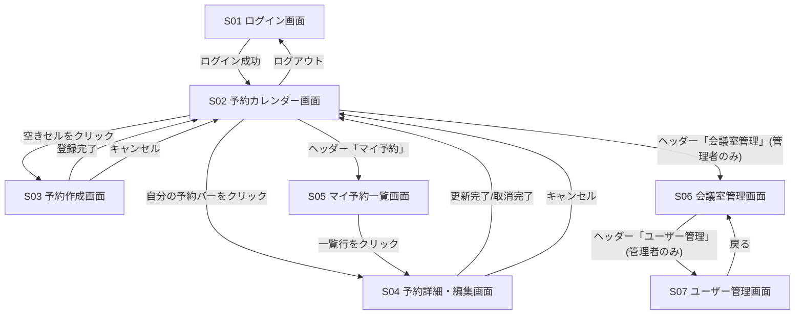

# システム要件定義書 — 会議室予約システム

> 本書は `spec-driven-dev` Skill フェーズ1の成果物です。
> 内容はレビュー済み・確定済みです(`docs/.inprogress` はフェーズ2に更新済み)。

## アプリケーションの概要

* **何のためのアプリか**: 社内の会議室予約を一元管理し、空き状況の確認から予約・変更・取消までをオンラインで完結させる。
* **誰が使うか**: 社員(一般ユーザー / 予約者)、および会議室・ユーザーを管理する管理者(総務・情シス想定)。
* **どんな課題を解決するか**: Excelや口頭連絡による会議室管理で発生していた二重予約、空き状況が分からないことによる確認の手間、予約変更・取消の連絡漏れを解消する。

## システムの前提

* **想定ユーザー数・規模**: 従業員数300名程度、会議室10室程度の中規模オフィスを想定。
* **デプロイ先**: 社内向けWebアプリケーションとしてクラウド環境(例: AWS)にデプロイ。
* **認証要否**: 必要。社内アカウント(ID/パスワード)によるログインを必須とする。将来的に社内SSO(SAML/OIDC)連携を検討。
* **連携・参考にする既存システムの有無**: 既存の予約管理システムなし(Excel運用からの移行)。Googleカレンダー/Outlookカレンダーとの連携は本バージョンでは対象外、将来検討。

## フロントエンドで使う技術

* **技術**: React 18 + TypeScript + Vite
* **選定理由**: SPA(カレンダーのようなインタラクティブなUI)構築の実績が豊富で、コンポーネント分割による画面再利用性が高いため。状態管理は画面数が少ないためReact標準のみ(Redux等は導入しない)。

## バックエンドで使う技術

* **技術**: Python + FastAPI
* **選定理由**: 型ヒントベースの実装で仕様との整合を取りやすく、OpenAPI仕様が自動生成されるためフロントエンドとのAPI契約を明確化しやすい。予約の重複チェックなどの業務ロジックをテストしやすい。
* **データストア**: SQLite

## 画面一覧

| 画面ID | 画面名 | 概要 |
| --- | --- | --- |
| S01 | ログイン画面 | ID/パスワードで認証する |
| S02 | 予約カレンダー画面(トップ) | 会議室×日時の空き状況を一覧表示し、予約作成の起点となる |
| S03 | 予約作成画面 | 会議室・日時・件名などを入力して新規予約を登録する |
| S04 | 予約詳細・編集画面 | 既存予約の内容確認、編集、取消を行う |
| S05 | マイ予約一覧画面 | ログインユーザー自身の予約を一覧表示する |
| S06 | 会議室管理画面(管理者用) | 会議室の登録・編集・削除を行う |
| S07 | ユーザー管理画面(管理者用) | ユーザーアカウントの登録・編集・削除を行う |

## 画面遷移図

## 各画面の入出力項目

### S01 ログイン画面

| 種別 | 項目名 | 内容 |
| --- | --- | --- |
| 入力 | ユーザーID | 社員ID(必須) |
| 入力 | パスワード | 必須、マスク表示 |
| 表示 | エラーメッセージ | 認証失敗時に表示 |

### S02 予約カレンダー画面

| 種別 | 項目名 | 内容 |
| --- | --- | --- |
| 入力 | 表示日付/週 | カレンダーの表示対象期間(前後移動可) |
| 入力 | 会議室フィルタ | 表示する会議室の絞り込み(任意) |
| 表示 | 会議室×時間帯グリッド | 会議室を列、時間帯を行とした空き/予約状況 |
| 表示 | 予約サマリ(予約者名・件名) | 予約済みセルに表示する簡易情報 |

### S03 予約作成画面

| 種別 | 項目名 | 内容 |
| --- | --- | --- |
| 入力 | 会議室 | プルダウン選択、必須 |
| 入力 | 日付 | 必須 |
| 入力 | 開始時刻/終了時刻 | 必須、終了 > 開始のバリデーションあり |
| 入力 | 件名 | 必須、最大100文字 |
| 入力 | 参加者(社員) | 任意、複数選択 |
| 入力 | 備考 | 任意、最大500文字 |
| 表示 | 重複エラーメッセージ | 選択した会議室・時間帯が既に予約済みの場合に表示 |

### S04 予約詳細・編集画面

| 種別 | 項目名 | 内容 |
| --- | --- | --- |
| 表示 | 予約内容(会議室/日時/件名/参加者/備考/予約者) | S03と同項目を表示 |
| 入力 | 編集用の各項目 | 予約者本人または管理者のみ編集可 |
| 操作 | 取消ボタン | 予約者本人または管理者のみ取消可 |

### S05 マイ予約一覧画面

| 種別 | 項目名 | 内容 |
| --- | --- | --- |
| 入力 | 期間フィルタ(今後の予約/過去の予約) | 任意 |
| 表示 | 予約一覧(日付/会議室/時間帯/件名) | ログインユーザー自身の予約のみ表示 |

### S06 会議室管理画面(管理者用)

| 種別 | 項目名 | 内容 |
| --- | --- | --- |
| 表示 | 会議室一覧(会議室名/収容人数/設備/有効・無効) | |
| 入力 | 会議室名・収容人数・設備・有効フラグ | 新規登録/編集時に入力 |
| 操作 | 削除ボタン | 論理削除(無効化)とする |

### S07 ユーザー管理画面(管理者用)

| 種別 | 項目名 | 内容 |
| --- | --- | --- |
| 表示 | ユーザー一覧(社員ID/氏名/権限/有効・無効) | |
| 入力 | 社員ID・氏名・権限(一般/管理者)・有効フラグ | 新規登録/編集時に入力 |
| 操作 | 削除ボタン | 論理削除(無効化)とする |

## 入出力に紐づくバックエンドAPI

| 画面 | 入出力項目 | 呼び出すAPI |
| --- | --- | --- |
| S01 | ログイン | `POST /api/auth/login` |
| S02 | 会議室×時間帯グリッド表示 | `GET /api/rooms`, `GET /api/reservations` |
| S02 | ログアウト | `POST /api/auth/logout` |
| S03 | 会議室プルダウン | `GET /api/rooms` |
| S03 | 予約登録 | `POST /api/reservations` |
| S04 | 予約内容表示 | `GET /api/reservations/{reservation_id}` |
| S04 | 予約更新 | `PUT /api/reservations/{reservation_id}` |
| S04 | 予約取消 | `DELETE /api/reservations/{reservation_id}` |
| S05 | マイ予約一覧表示 | `GET /api/reservations/mine` |
| S06 | 会議室一覧表示 | `GET /api/rooms` |
| S06 | 会議室登録/編集/削除 | `POST /api/rooms`, `PUT /api/rooms/{room_id}`, `DELETE /api/rooms/{room_id}` |
| S07 | ユーザー一覧表示 | `GET /api/users` |
| S07 | ユーザー登録/編集/削除 | `POST /api/users`, `PUT /api/users/{user_id}`, `DELETE /api/users/{user_id}` |
| 共通 | ログインユーザー情報取得 | `GET /api/me` |

## バックエンドAPI一覧

| メソッド | パス | 用途 |
| --- | --- | --- |
| POST | `/api/auth/login` | ID/パスワードでログインし、セッション/トークンを発行する |
| POST | `/api/auth/logout` | ログアウトし、セッション/トークンを無効化する |
| GET | `/api/me` | ログイン中ユーザー自身の情報を取得する |
| GET | `/api/rooms` | 会議室一覧を取得する |
| POST | `/api/rooms` | 会議室を新規登録する(管理者のみ) |
| PUT | `/api/rooms/{room_id}` | 会議室情報を更新する(管理者のみ) |
| DELETE | `/api/rooms/{room_id}` | 会議室を無効化(論理削除)する(管理者のみ) |
| GET | `/api/reservations` | 指定期間・会議室の予約一覧を取得する(カレンダー表示用) |
| GET | `/api/reservations/mine` | ログインユーザー自身の予約一覧を取得する |
| GET | `/api/reservations/{reservation_id}` | 予約の詳細を取得する |
| POST | `/api/reservations` | 予約を新規登録する(重複チェックを行う) |
| PUT | `/api/reservations/{reservation_id}` | 予約内容を更新する(重複チェックを行う) |
| DELETE | `/api/reservations/{reservation_id}` | 予約を取消(削除)する |
| GET | `/api/users` | ユーザー一覧を取得する(管理者のみ) |
| POST | `/api/users` | ユーザーを新規登録する(管理者のみ) |
| PUT | `/api/users/{user_id}` | ユーザー情報を更新する(管理者のみ) |
| DELETE | `/api/users/{user_id}` | ユーザーを無効化(論理削除)する(管理者のみ) |

認証方式(セッション/JWT等)や重複チェックの厳密な仕様(同時リクエスト時の排他制御など)は、次フェーズ(バックエンド詳細設計、`docs/03-backend-spec.md`)で確定する。

## 非機能要件

* **性能**: カレンダー画面の表示は3秒以内を目標とする。
* **可用性**: 平日日中(9:00-18:00)の可用率99%以上を目標とする。夜間・休日の計画メンテナンスは許容。
* **セキュリティ**: 通信は全てHTTPSとする。パスワードはハッシュ化して保存する。管理者機能へのアクセスは権限チェックを必須とする。
* **スケーラビリティ**: 想定ユーザー数(300名規模)の範囲では単一サーバー構成で十分と想定。将来的な多拠点展開時はスケールアウトを検討。
* **想定同時利用者数**: ピーク時(始業直後・昼休み前後)で同時30接続程度を想定。
* **ログ出力先とその監視方法**: アプリケーションログは標準出力経由でクラウドのログ管理サービス(例: CloudWatch Logs)に集約し、エラーログを監視する。

## テスト方針

* 単体テストはバックエンドの業務ロジック(特に予約の重複チェック)を重点的にカバーする。
* 結合テストでは、画面一覧に挙げた全画面の主要操作(予約の作成・編集・取消、会議室/ユーザー管理のCRUD)を対象にシナリオベースで検証する。
* 権限まわり(一般ユーザーが管理者専用画面・APIにアクセスできないこと)は結合テストで必ず確認する。
* 詳細なテスト計画(テスト項目・観点・スケジュール)はフェーズ5(`docs/05-test-plan.md`)で定める。本フェーズでは方針レベルに留める。
