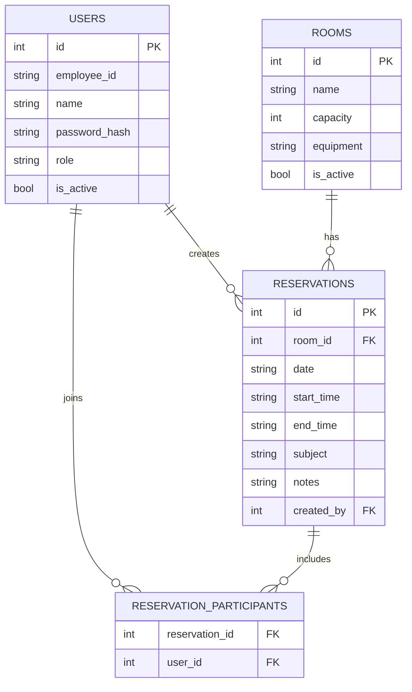
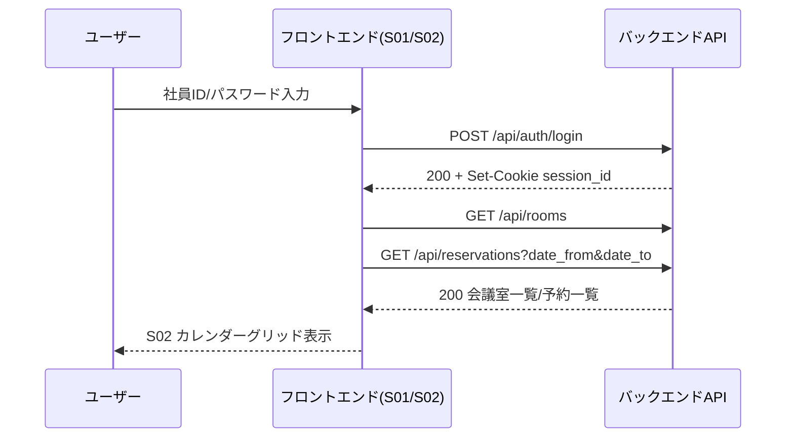
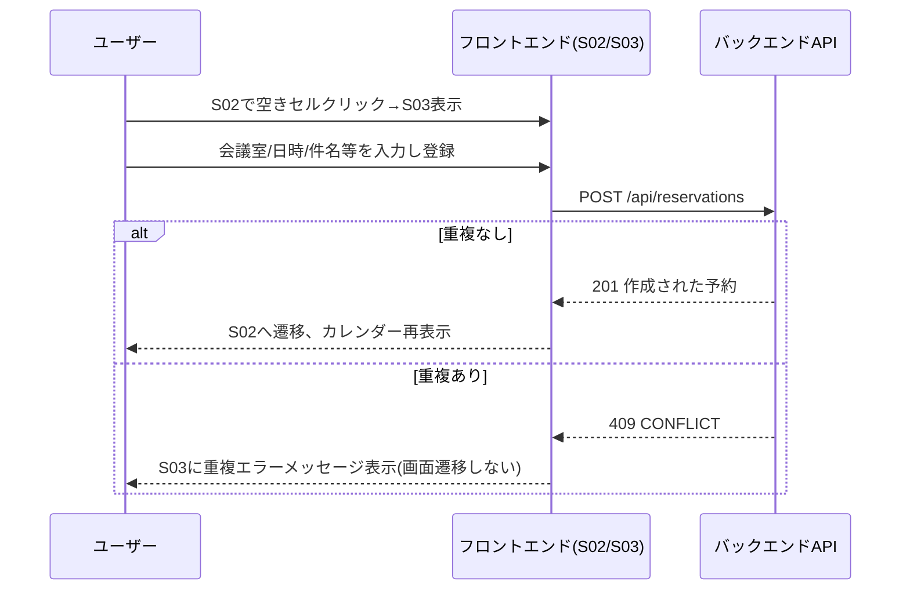

# ユーザインタフェース設計書 — 会議室予約システム

> 本書は `spec-driven-dev` Skill フェーズ2の成果物です(V0.3ルールで再生成)。
> インプット: `docs/01-requirement.md`

## 1. 入力項目バリデーションルール

### S01 ログイン画面

| 項目名 | ルール |
| --- | --- |
| ユーザーID(社員ID) | 必須。半角英数字、1〜20文字。 |
| パスワード | 必須。8〜72文字。マスク表示(`type=password`)。 |
| エラーメッセージ | 認証失敗時に「ユーザーIDまたはパスワードが違います」を表示。個別の失敗理由(ID不存在/パスワード不一致)は区別して表示しない(アカウント存在の推測を防止するため)。 |

### S02 予約カレンダー画面

| 項目名 | ルール |
| --- | --- |
| 表示日付/週 | 必須(初期値は当日を含む週)。前後移動は週単位。過去・未来とも移動可能(範囲制限なし)。 |
| 会議室フィルタ | 任意。未選択時は全会議室(有効なもののみ)を表示。 |

### S03 予約作成画面

| 項目名 | ルール |
| --- | --- |
| 会議室 | 必須。有効な会議室のみ選択可能。 |
| 日付 | 必須。過去日付は選択不可(当日以降のみ)。 |
| 開始時刻/終了時刻 | 必須。共に営業時間内(08:00〜20:00)。終了時刻 > 開始時刻。15分単位。 |
| 件名 | 必須。1〜100文字。 |
| 参加者(社員) | 任意。複数選択可。有効なユーザーのみ選択可能。予約者本人は自動的に参加者に含める。 |
| 備考 | 任意。最大500文字。 |
| 重複エラーメッセージ | 選択した会議室・日付・時間帯が既存予約と重複する場合に「指定の時間帯は既に予約されています」を表示し、登録をブロックする。 |

### S04 予約詳細・編集画面

| 項目名 | ルール |
| --- | --- |
| 編集用の各項目 | S03と同一バリデーション。 |
| 編集・取消可能条件 | ログインユーザーが予約者本人(`reservations.created_by`)、または管理者(`role=admin`)であること。それ以外は編集項目・取消ボタンを非活性にし、画面には閲覧のみを許可する。 |

### S05 マイ予約一覧画面

| 項目名 | ルール |
| --- | --- |
| 期間フィルタ | 任意。「今後の予約」(既定値)/「過去の予約」の2択。 |

### S06 会議室管理画面(管理者用)

| 項目名 | ルール |
| --- | --- |
| 会議室名 | 必須。1〜50文字。同名(有効な会議室内)は不可。 |
| 収容人数 | 必須。1以上の整数。 |
| 設備 | 任意。カンマ区切り文字列、最大200文字(例: プロジェクタ,ホワイトボード)。 |
| 有効フラグ | 必須。既定値: 有効。 |
| 削除ボタン | 有効フラグを false にする論理削除。物理削除はしない。 |

### S07 ユーザー管理画面(管理者用)

| 項目名 | ルール |
| --- | --- |
| 社員ID | 必須。半角英数字、1〜20文字、一意。 |
| 氏名 | 必須。1〜50文字。 |
| 権限 | 必須。`一般` / `管理者` のいずれか。 |
| 初期パスワード | 新規登録時必須、8〜72文字。編集時は空欄なら変更しない。 |
| 有効フラグ | 必須。既定値: 有効。 |
| 削除ボタン | 有効フラグを false にする論理削除。無効化されたユーザーはログイン不可。 |

## 2. バックエンドAPI 外部仕様

共通事項:
* 特記なきレスポンスは `Content-Type: application/json`。
* 認証が必要なAPIは、ログイン時に発行されるセッションをHTTP Cookie(`session_id`, HttpOnly)で送信する。Cookie が無効/未送信の場合は `401 Unauthorized` を返す。
  * ここで確定するのは外部から見える契約(Cookie方式であること・Cookie名・HttpOnly属性・Cookieが無効な場合に401を返すこと)までである。セッションIDの生成方式、保存先(メモリ/RDB等)、有効期限といった**内部実現はフェーズ3(`docs/03-backend-spec.md` 2章・3章)で確定する**。
* 管理者専用APIに一般ユーザーが呼び出した場合は `403 Forbidden` を返す(権限判定の内部実現はフェーズ3で確定。この項目は役割分担が明確なため、フェーズ2/3間の相互参照は付けない)。
* 共通エラーレスポンス形式: `{"error": {"code": "string", "message": "string"}}`

### POST /api/auth/login

* リクエスト: `{"employee_id": string, "password": string}`
* レスポンス 200: `{"user": {"id": int, "employee_id": string, "name": string, "role": "general"|"admin"}}` + `Set-Cookie: session_id=...; HttpOnly`
* レスポンス 401: 認証失敗(ID不存在、パスワード不一致、無効化ユーザーいずれも同一メッセージ)

### POST /api/auth/logout

* リクエスト: なし(Cookie必須)
* レスポンス 204: セッション無効化。Cookie失効。
* レスポンス 401: 未ログイン

### GET /api/me

* レスポンス 200: `{"id": int, "employee_id": string, "name": string, "role": "general"|"admin"}`
* レスポンス 401: 未ログイン

### GET /api/rooms

* クエリ: `include_inactive`(任意, bool, 既定 false。管理者のみ true 指定可、一般ユーザーが true を指定した場合は無視して false 扱い)
* レスポンス 200: `[{"id": int, "name": string, "capacity": int, "equipment": string, "is_active": bool}]`
* レスポンス 401: 未ログイン

### POST /api/rooms (管理者のみ)

* リクエスト: `{"name": string, "capacity": int, "equipment": string}`
* レスポンス 201: 作成された会議室オブジェクト
* レスポンス 400: バリデーションエラー(名称重複含む) `{"error": {"code": "VALIDATION_ERROR", "message": "..."}}`
* レスポンス 403: 管理者以外

### PUT /api/rooms/{room_id} (管理者のみ)

* リクエスト: `{"name": string, "capacity": int, "equipment": string, "is_active": bool}`
* レスポンス 200: 更新後の会議室オブジェクト
* レスポンス 400: バリデーションエラー
* レスポンス 404: 会議室不存在
* レスポンス 403: 管理者以外

### DELETE /api/rooms/{room_id} (管理者のみ)

* レスポンス 204: `is_active=false` に更新(論理削除)
* レスポンス 404: 会議室不存在
* レスポンス 403: 管理者以外

### GET /api/reservations

* クエリ: `date_from`(必須, YYYY-MM-DD), `date_to`(必須, YYYY-MM-DD), `room_id`(任意)
* レスポンス 200: `[{"id": int, "room_id": int, "room_name": string, "date": string, "start_time": string, "end_time": string, "subject": string, "created_by": int, "created_by_name": string}]`
* レスポンス 400: 日付パラメータ不正(`date_from` > `date_to` など)
* レスポンス 401: 未ログイン

### GET /api/reservations/mine

* クエリ: `period`(任意, `future`|`past`, 既定 `future`)
* レスポンス 200: 予約一覧(GET /api/reservationsと同じ要素形式)
* レスポンス 401: 未ログイン

### GET /api/reservations/{reservation_id}

* レスポンス 200: `{"id", "room_id", "room_name", "date", "start_time", "end_time", "subject", "notes", "created_by", "created_by_name", "participant_ids": [int]}`
* レスポンス 404: 予約不存在
* レスポンス 401: 未ログイン

### POST /api/reservations

* リクエスト: `{"room_id": int, "date": string, "start_time": string, "end_time": string, "subject": string, "notes": string, "participant_ids": [int]}`
* レスポンス 201: 作成された予約オブジェクト(GET詳細と同形式)
* レスポンス 400: バリデーションエラー(時刻矛盾、必須項目欠如など)
* レスポンス 404: 指定した会議室が存在しない、または無効
* レスポンス 409: 会議室・日付・時間帯が既存の予約と重複(`{"error": {"code": "CONFLICT", "message": "指定の時間帯は既に予約されています"}}`)
* レスポンス 401: 未ログイン

### PUT /api/reservations/{reservation_id}

* リクエスト: POSTと同形式
* レスポンス 200: 更新後の予約オブジェクト
* レスポンス 400: バリデーションエラー
* レスポンス 403: 予約者本人でも管理者でもない
* レスポンス 404: 予約不存在
* レスポンス 409: 重複(自分自身の予約は重複判定から除外する)
* レスポンス 401: 未ログイン

### DELETE /api/reservations/{reservation_id}

* レスポンス 204: 取消(物理削除)
* レスポンス 403: 予約者本人でも管理者でもない
* レスポンス 404: 予約不存在
* レスポンス 401: 未ログイン

### GET /api/users (管理者のみ)

* レスポンス 200: `[{"id": int, "employee_id": string, "name": string, "role": string, "is_active": bool}]`
* レスポンス 403: 管理者以外

### POST /api/users (管理者のみ)

* リクエスト: `{"employee_id": string, "name": string, "role": "general"|"admin", "password": string}`
* レスポンス 201: 作成されたユーザーオブジェクト(パスワードは含まない)
* レスポンス 400: バリデーションエラー(社員ID重複含む)
* レスポンス 403: 管理者以外

### PUT /api/users/{user_id} (管理者のみ)

* リクエスト: `{"name": string, "role": string, "is_active": bool, "password": string|null}`(`password`がnull/空なら変更しない)
* レスポンス 200: 更新後のユーザーオブジェクト
* レスポンス 400: バリデーションエラー
* レスポンス 404: ユーザー不存在
* レスポンス 403: 管理者以外

### DELETE /api/users/{user_id} (管理者のみ)

* レスポンス 204: `is_active=false` に更新(論理削除)
* レスポンス 404: ユーザー不存在
* レスポンス 403: 管理者以外

## 3. データモデル(ER図・テーブル定義)

### テーブル定義

**users**

| カラム | 型 | 制約 |
| --- | --- | --- |
| id | INTEGER | PK, AUTOINCREMENT |
| employee_id | TEXT | NOT NULL, UNIQUE |
| name | TEXT | NOT NULL |
| password_hash | TEXT | NOT NULL |
| role | TEXT | NOT NULL, CHECK IN ('general','admin') |
| is_active | INTEGER(bool) | NOT NULL, DEFAULT 1 |

**rooms**

| カラム | 型 | 制約 |
| --- | --- | --- |
| id | INTEGER | PK, AUTOINCREMENT |
| name | TEXT | NOT NULL |
| capacity | INTEGER | NOT NULL, CHECK > 0 |
| equipment | TEXT | NULL可 |
| is_active | INTEGER(bool) | NOT NULL, DEFAULT 1 |

**reservations**

| カラム | 型 | 制約 |
| --- | --- | --- |
| id | INTEGER | PK, AUTOINCREMENT |
| room_id | INTEGER | NOT NULL, FK → rooms.id |
| date | TEXT | NOT NULL (YYYY-MM-DD) |
| start_time | TEXT | NOT NULL (HH:MM) |
| end_time | TEXT | NOT NULL (HH:MM), > start_time |
| subject | TEXT | NOT NULL |
| notes | TEXT | NULL可 |
| created_by | INTEGER | NOT NULL, FK → users.id |

**reservation_participants**

| カラム | 型 | 制約 |
| --- | --- | --- |
| reservation_id | INTEGER | NOT NULL, FK → reservations.id, PK(複合) |
| user_id | INTEGER | NOT NULL, FK → users.id, PK(複合) |

## 4. シーケンス図

### 4.1 ログイン〜カレンダー表示

### 4.2 予約作成(重複エラーあり)

## 5. 未確定事項(次フェーズへの申し送り)

* 認証方式の内部実現(セッションID生成方式、保存先、有効期限)は、2章「認証が必要なAPIは...」の箇所に明記のとおり `docs/03-backend-spec.md` で確定する。
* 予約重複チェックの排他制御(同時リクエスト時のロック方式)は `docs/03-backend-spec.md` で確定する。
