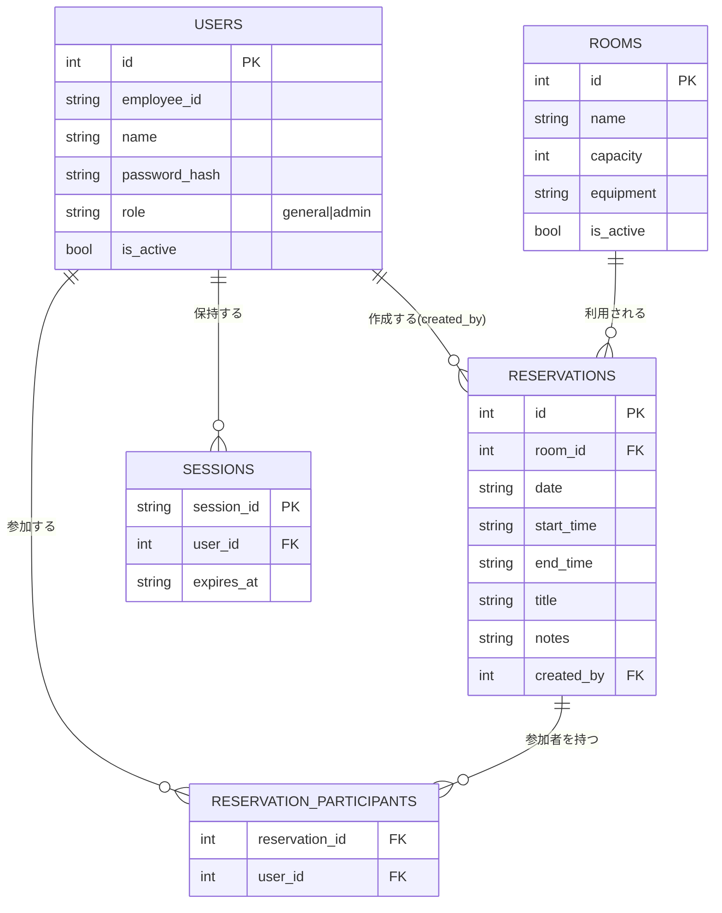

# ArchitectureHandbook.md — 会議室予約システム

このドキュメントは、P021フェーズで作成・更新する。目的は、後続のAgent(Executor・Reviewer Loop・Refactor)が `docs/P001-requirement.md` 〜 `docs/P009-acceptance-direction.md` を毎回読み直さなくても、アプリケーションの技術的側面を短時間で把握できるようにすることである。

* 詳細な仕様そのものはここに書かない。詳細は `docs/P002-frontend-spec.md` `docs/P003-backend-spec.md` などの原本を参照させ、ここには「どこに何が書いてあるか」と「実装・運用にあたって知っておくべき技術的な要点」だけをまとめる。
* 仕様が変わるたびに全面書き直しするのではなく、差分だけを更新する。矛盾が出た場合は原本(`docs/P00N-*.md`)を正とする。
* 記載内容が古くなっていないかは、P020(実装構造生成/修正)・P022(ADR整理)と合わせて確認する。
* 本版は初回作成(P020〜P022同時実行、Executor着手前)であり、`client/` `server/` 配下にはまだソースコードが存在しない。§4以降の記述は `docs/P005-impl-plan.md` 〜 `docs/P009-acceptance-direction.md` に定義された「これから作る」計画にもとづく。

## 1. アプリケーション概要

* アプリケーション名: 会議室予約システム
* 一言で言うと何のアプリか: 社内の会議室予約を一元管理し、空き状況の確認から予約・変更・取消までをオンラインで完結させる社内向けWebアプリケーション(Excel運用・二重予約・確認の手間の解消が目的)。
* 想定規模: 従業員300名程度、会議室10室程度、ピーク時同時30接続程度。
* 参照元: `docs/P001-requirement.md`

## 2. 全体構成図

```mermaid
graph TD
    User[利用者(一般社員/管理者)] -->|HTTPS| Client[client/ React18+TS+Vite SPA]
    Client -->|HTTP/REST + Cookie(session_id)| API[server/ FastAPI]
    API --> Handler[API Handler層(FastAPIルーター)]
    Handler --> Service[Service層(業務ロジック)]
    Service --> Repository[Repository層(SQLite CRUD)]
    Repository --> DB[(SQLiteファイル)]
```

* クライアント/サーバ型構成。外部サービス連携(Googleカレンダー/Outlookカレンダー等)は本バージョン対象外(`docs/P001-requirement.md`)。
* バックエンド内部はレイヤードアーキテクチャ(API Handler層 → Service層 → Repository層 → SQLite、`docs/P003-backend-spec.md` §1)。

## 3. 技術スタック

| レイヤ | 技術 | バージョン | 選定理由の参照先 |
| --- | --- | --- | --- |
| フロントエンド | React + TypeScript + Vite | React 18 | ADR-001 |
| バックエンド | Python + FastAPI(レイヤードアーキテクチャ) | (`docs/P007-impl-direction/U001-foundation-auth.md`で確定) | ADR-002 |
| データベース | SQLite(ファイルベース、`server/`配下に配置) | - | ADR-003 |
| 認証 | Cookieベースのサーバーサイドセッション認証(JWT不採用) | - | ADR-004 |
| セッション永続化 | SQLiteの`sessions`テーブル(インメモリ不採用) | - | ADR-005 |
| 同時実行制御 | `BEGIN IMMEDIATE`トランザクション(予約重複チェック) | - | ADR-006 |
| インフラ/デプロイ | 未確定(P302 `docs/P302-deliver.md`でdocker compose化を予定。`docs/P005-impl-plan.md` §5参照) | - | (P302で決定後にADR追記予定) |

* パスワードハッシュ: bcrypt(cost factor 12、`docs/P003-backend-spec.md` §3)。専用ADRは設けず、ADR-004(認証方式)の実装詳細として扱う。

## 4. ディレクトリ構成の方針

* コード格納先: クライアント・サーバ型のため `client/`(フロントエンド)・`server/`(バックエンド)の2ソースツリーとする(`docs/P005-impl-plan.md` §3.1、`docs/P007-impl-direction.md`冒頭)。単一アプリ用の `app/` 規約は使わない。
* 各ソースツリー直下に `INDEX.md` を置く(P020で作成済みの空の目次: `client/INDEX.md` `server/INDEX.md`)。現時点(Executor着手前)ではいずれも「(実装前)」のプレースホルダであり、`docs/P007-impl-direction/U001-foundation-auth.md`実施後にP104で実体化された内容に更新される。
* ビルドツール: フロントエンドはnpm(Vite)、バックエンドはuv(`docs/P005-impl-plan.md` §3.1)。
* バックエンド内部の想定レイヤー構成(`docs/P003-backend-spec.md` §1、実装時のディレクトリ名はU001実装時に確定):
  * API Handler層(FastAPIルーター) — リクエストのパース・レスポンス整形・HTTPステータス決定
  * Service層 — 業務ロジック(重複チェック、権限チェック、論理削除等)
  * Repository層 — SQLiteへのCRUD、SQL文をここに閉じ込める
  * 認証・認可ミドルウェア — `Depends`による依存関数(`require_admin()`等)

## 5. データモデルの要点

* 主要テーブル: `USERS`、`ROOMS`、`RESERVATIONS`、`RESERVATION_PARTICIPANTS`、`SESSIONS`(全5テーブル)。
* ER図(UI観点+内部拡張分の統合。詳細は `docs/P002-frontend-spec.md` §5、内部専用カラムは `docs/P003-backend-spec.md` §6を参照):



* 状態を持つ場合のスコープと実現方法: セッション状態はSQLiteの`SESSIONS`テーブル(DB永続化、ADR-005)に保持する。インメモリ状態は持たない。
* 論理削除(`is_active`)は`USERS`・`ROOMS`のみに適用。`RESERVATIONS`は取消時に物理削除する(ADR-007)。全テーブルに`created_at`/`updated_at`(監査目的)を付与する(`docs/P003-backend-spec.md` §6.3)。
* 詳細は `docs/P002-frontend-spec.md` §5(UI観点のテーブル定義)、`docs/P003-backend-spec.md` §6(内部拡張分)を参照。

## 6. API/画面構成の要点

* 画面7件(S01〜S07)・API17エンドポイント。全画面・全APIの一覧、入出力項目、遷移図は `docs/P001-requirement.md`(画面一覧・画面遷移図・API一覧)、詳細な外部仕様(バリデーション・レスポンス形式・エラーコード)は `docs/P002-frontend-spec.md` §3・§4を参照。
* 外部契約(P002) vs 内部実現(P003)の役割分担: P002はフロントエンドから見える契約(リクエスト/レスポンス形式・Cookie使用有無・ステータスコード)を確定し、P003はその契約を成立させる内部実装(認証・セッション内部設計、権限チェック実装、重複チェックロジック、非機能要件のインフラ切り分け)を確定する。両者は互いに矛盾しない前提(`docs/P010-design-review.md`で参照整合性を確認済み、矛盾0件)。
* 共通エラーレスポンス形式・エラーコード一覧(`VALIDATION_ERROR`/`AUTH_INVALID_CREDENTIALS`/`AUTH_REQUIRED`/`FORBIDDEN`/`NOT_FOUND`/`RESERVATION_CONFLICT`/`INTERNAL_ERROR`)は `docs/P002-frontend-spec.md` §2に定義済み。

## 7. 実装・テストの単位

* スプリント構成(4スプリント、`docs/P005-impl-plan.md` §1〜§2):
  1. `foundation-auth` — プロジェクト基盤(client/server初期化、全テーブルのスキーマ)+ ログイン画面 + 認証・セッションAPI
  2. `admin-management` — 会議室管理・ユーザー管理(マスタデータCRUD)
  3. `reservation-core` — 予約カレンダー表示・予約作成(重複チェックの排他制御を含む)
  4. `reservation-detail-mine` — 予約詳細・編集・取消・マイ予約一覧
* テストレベルの方針(`docs/P006-test-plan.md` §1):
  * 単体テスト(P007配下) — スプリント内、Executor(P102)で実施
  * 結合テスト・スプリント内/モジュール間(P008配下) — Executor(P103)で実施
  * システムテスト・受入テスト・スプリント横断(P009配下) — Reviewer Loop(P201)で実施
* 権限まわり(一般ユーザーの管理者専用機能アクセス不可)は結合テストで必ず確認する方針(`docs/P001-requirement.md`テスト方針、`docs/P006-test-plan.md` §2.2)。

## 8. 横断的関心事

* **認証・認可の方式**: Cookieベースセッション認証(ADR-004)。全リクエストで認証・認可ミドルウェアがCookieからセッションを解決し`request.state.user`に設定する。管理者専用APIは`require_admin()`依存関数でチェック(`403 FORBIDDEN`)。予約の編集・取消は本人または管理者のみ(`docs/P003-backend-spec.md` §4)。
* **エラーハンドリングの方針**: 全APIエラーを共通JSON形式(`error.code`/`error.message`/`error.details`)に統一(`docs/P002-frontend-spec.md` §2)。SQLインジェクション対策としてRepository層でのプレースホルダ使用を必須とし、文字列連結によるSQL組み立てを禁止する(`docs/P003-backend-spec.md` §8)。
* **ログ出力・監視の方針**: 構造化ログ(JSON Lines)を標準出力に出力し、デプロイ環境側でクラウドのログ管理サービス(例: CloudWatch Logs)へ収集する想定(`docs/P003-backend-spec.md` §8、具体化は `docs/P302-deliver.md`)。
* **設定値・環境変数の管理方針**: 本フェーズ時点では未確定。SQLiteファイルパス等の設定値の管理方針は `docs/P007-impl-direction/U001-foundation-auth.md`(プロジェクト初期化)および `docs/P302-deliver.md`(docker compose化)で具体化される想定。★FIXME★ Plan Loop Step(P002〜P009)のいずれの文書にも環境変数の一元管理方針(`.env`ファイルの要否、シークレット管理)が明記されていないため、本項目はExecutor着手時にAgent自身の想定で補完する必要がある。
* **同時実行制御**: 予約重複チェックは`BEGIN IMMEDIATE`トランザクションで排他制御する(ADR-006)。

## 9. 既知の制約・技術的負債

* **SQLiteのスケーラビリティ制約**: 単一SQLiteファイルへの書き込みシリアライズは、将来的な複数サーバーへのスケールアウトの制約になる。本バージョンの想定規模(300名・同時30接続)では単一サーバー構成で要件を満たすと判断しているが、将来の多拠点展開等でスケールアウトが必要になった場合はサーバー型RDB(PostgreSQL等)への移行が必要になる(ADR-003備考、`docs/P003-backend-spec.md` §8)。
* **予約の物理削除**: 予約取消時に履歴を残さない設計(ADR-007)としているが、これはP001に監査要件の明記がないことに基づく仮定であり、将来的に監査ログ・履歴保持要件が判明した場合は見直しが必要(★FIXME★、`docs/P002-frontend-spec.md` §4.13参照)。
* **社内SSO(SAML/OIDC)連携**: 本バージョンでは未対応。将来検討事項として`docs/P001-requirement.md`に記載あり(ADR-004備考)。
* **Googleカレンダー/Outlookカレンダー連携**: 本バージョン対象外(`docs/P001-requirement.md`)。
* **環境変数・設定値の一元管理方針が未確定**: §8参照。Executor着手時に確定させる必要がある。

## 10. 関連ドキュメントへのリンク

* `docs/P001-requirement.md`(システム要件定義)
* `docs/P002-frontend-spec.md`(ユーザインタフェース設計、外部契約)
* `docs/P003-backend-spec.md`(システム詳細設計、内部実現)
* `docs/P004-traceability-matrix.md`(要求トレーサビリティマトリクス、全30件OK)
* `docs/P005-impl-plan.md`(実装計画、4スプリント構成)
* `docs/P006-test-plan.md`(テスト計画)
* `docs/P007-impl-direction.md`(プログラム実装定義、U001〜U004)
* `docs/P008-test-direction.md`(結合テスト定義、T001〜T020)
* `docs/P009-acceptance-direction.md`(受け入れ結合テスト定義、A001〜A010)
* `docs/ADR.md`(本ハンドブックのADR-NNN参照先)
* `client/INDEX.md` / `server/INDEX.md`(実装前のため現時点は空の目次)
