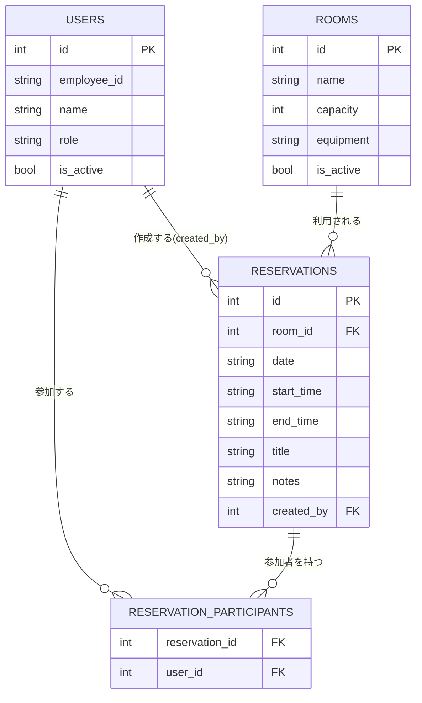
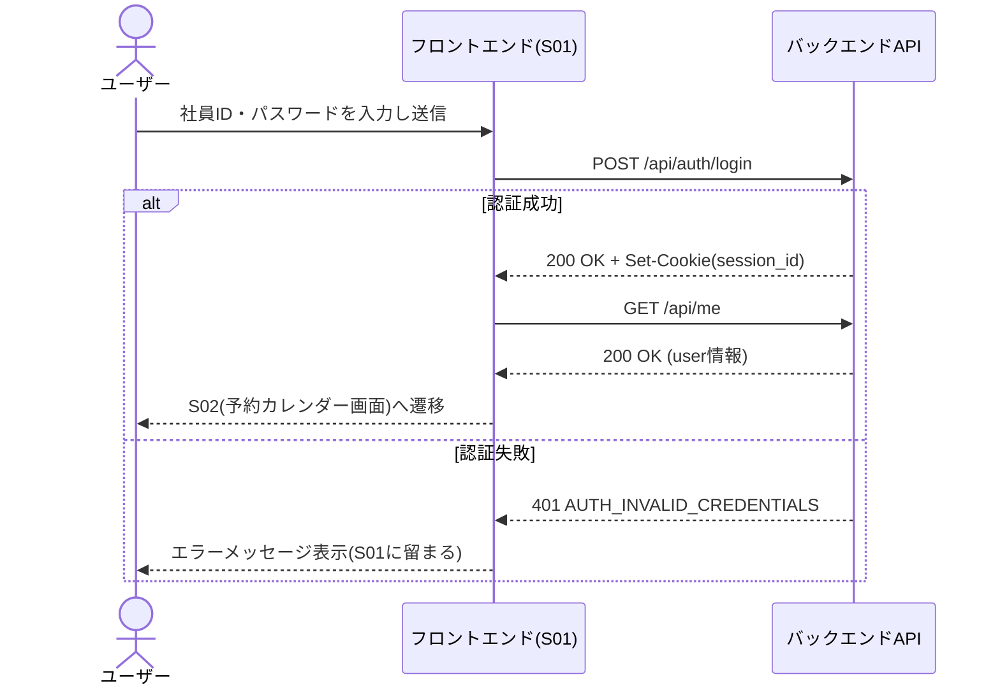
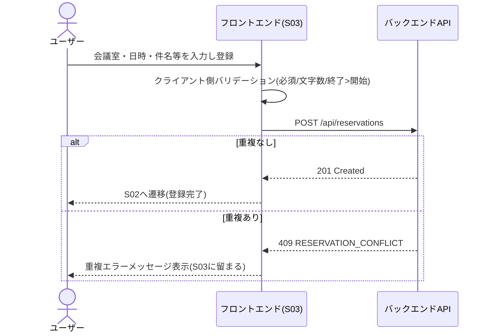
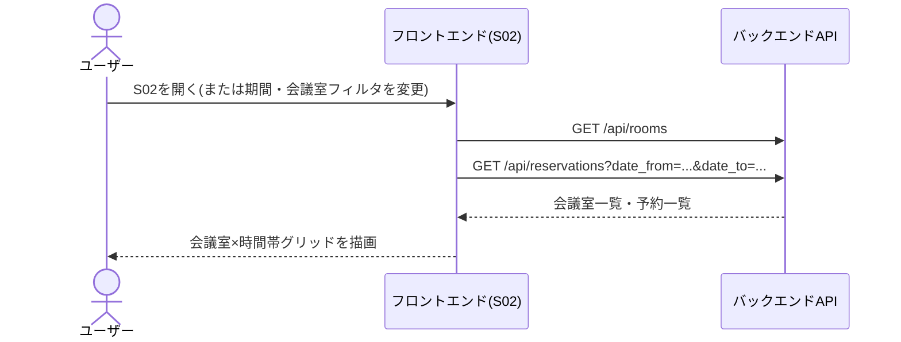

# ユーザインタフェース設計書 — 会議室予約システム

> 本書は `spec-driven-dev` Skill フェーズP002の成果物です。インプット文書: `docs/P001-requirement.md`。既存のADR/CRはなし(新規作成のため)。

## 0. 本書の役割と前提

* 本書は `docs/P001-requirement.md` に記載された画面・APIの**外部仕様**(利用者・フロントエンドから見える契約)を確定する。
* 内部実現方法(パスワードのハッシュ方式、セッションの保存先・有効期限、DBアクセス方法等)は `docs/P003-backend-spec.md` で確定する。本書では該当箇所に「→P003で内部実現方法を確定」と注記する。
* P001にない画面・APIをここで新たに追加していない。詳細化の過程でP001の記述だけでは決定できなかった項目は、Agent自身の想定で補い、末尾に ★FIXME★ を付けている(SKILL.md 共通指示)。

## 1. 認証方式(外部契約)

* ログイン成功時、サーバーはセッションCookie(`session_id`、HttpOnly / Secure / SameSite=Lax)を発行する。フロントエンドはCookieの中身を意識しない(自動送信に任せる)。レスポンスボディにトークンは含めない(Cookieベース認証を採用)。
* ログアウト時、サーバーはCookieを失効させる(`Set-Cookie: session_id=; Max-Age=0`)。
* 認証が必要なAPIで有効なセッションが無い場合は `401 Unauthorized` を返す。
* 管理者専用API(会議室・ユーザー管理系)に一般ユーザーが呼び出した場合は `403 Forbidden` を返す。
* セッションの保存先・有効期限・Cookie発行の内部実装は `docs/P003-backend-spec.md` §2(認証・セッション内部設計)で確定する。
* パスワードの保存方式(ハッシュアルゴリズム等)は `docs/P003-backend-spec.md` §3 で確定する。

## 2. 共通エラーレスポンス形式

すべてのAPIエラーは次のJSON形式に統一する。

```json
{
  "error": {
    "code": "VALIDATION_ERROR",
    "message": "終了時刻は開始時刻より後である必要があります",
    "details": [
      { "field": "end_time", "reason": "must be after start_time" }
    ]
  }
}
```

* `details` はフィールド単位のバリデーションエラーがある場合のみ付与する(任意)。
* 共通エラーコード一覧:

| コード | HTTPステータス | 意味 |
| --- | --- | --- |
| `VALIDATION_ERROR` | 400 | リクエストの形式・値が不正 |
| `AUTH_INVALID_CREDENTIALS` | 401 | ID/パスワードが一致しない |
| `AUTH_REQUIRED` | 401 | 未ログイン、またはセッション失効 |
| `FORBIDDEN` | 403 | 権限不足(管理者専用機能への一般ユーザーアクセス等) |
| `NOT_FOUND` | 404 | 指定したリソースが存在しない |
| `RESERVATION_CONFLICT` | 409 | 会議室・時間帯が既に予約済み |
| `INTERNAL_ERROR` | 500 | サーバー内部エラー |

## 3. 画面別バリデーションルール

### S01 ログイン画面

| 項目 | ルール |
| --- | --- |
| ユーザーID(社員ID) | 必須。半角英数字 1〜20文字。★FIXME★ P001に文字種・桁数の指定がないため、社員ID体系として一般的な半角英数字20文字以内と仮定した。実際の社員ID体系確定後に見直すこと。 |
| パスワード | 必須。入力欄はマスク表示(`type=password`)。フロントエンド側での文字数チェックは行わない(サーバー側の認証結果のみで判定する)。 |
| エラーメッセージ | 認証失敗時、`AUTH_INVALID_CREDENTIALS` を受けて「社員IDまたはパスワードが正しくありません」を表示する。ID/パスワードのどちらが誤りかは表示しない(認証情報の推測防止)。 |

### S02 予約カレンダー画面(トップ)

| 項目 | ルール |
| --- | --- |
| 表示日付/週 | 必須(未指定時は当日を含む週)。形式 `YYYY-MM-DD`。 |
| 会議室フィルタ | 任意。有効な会議室IDの配列。無効化済み会議室は選択肢に表示しない。 |
| 会議室×時間帯グリッド | 表示専用。9:00〜18:00を30分刻みで表示する。★FIXME★ P001に営業時間・表示粒度の指定がないため、非機能要件の想定利用時間帯(9:00-18:00)から30分刻みを仮定した。 |
| 予約サマリ | 表示専用。予約者氏名・件名を表示する。他人の予約も含め全予約者に表示する(社内共有カレンダーのため)。 |

### S03 予約作成画面

| 項目 | ルール |
| --- | --- |
| 会議室 | 必須。有効な会議室から選択(無効化済み会議室は選択不可)。 |
| 日付 | 必須。形式 `YYYY-MM-DD`。★FIXME★ 過去日付を許可するかP001に指定がないため、本日以降のみ許可すると仮定した。 |
| 開始時刻/終了時刻 | 必須。形式 `HH:MM`。終了時刻 > 開始時刻(P001に明記)。営業時間内(9:00〜18:00)を推奨するが、時間外予約(残業対応等)を妨げないため入力自体は禁止しない。★FIXME★ |
| 終日チェックボックス | 任意。ONにした瞬間に開始時刻へ`09:00`、終了時刻へ`18:00`をクライアント側で自動入力する。自動入力後も開始時刻・終了時刻の各入力欄は手動で編集可能で、その場合は手動編集後の値を優先する(チェックボックスは値を継続的にロックしない、一度きりの入力補助)。本項目はAPIリクエストボディに独立フィールドとして送信されない(既存の`start_time`/`end_time`を経由する)(※CR-001により追加)。 |
| 件名 | 必須。最大100文字。 |
| 参加者(社員) | 任意。複数選択。有効なユーザーのみ選択可。 |
| 備考 | 任意。最大500文字。 |
| 重複エラーメッセージ | サーバーから `RESERVATION_CONFLICT`(409)を受けたとき「選択した会議室・時間帯は既に予約されています」を表示する。 |

### S04 予約詳細・編集画面

| 項目 | ルール |
| --- | --- |
| 予約内容表示 | S03と同一項目(会議室/日付/時刻/件名/参加者/備考)に加え、予約者(作成者)氏名を表示する。 |
| 編集用の各項目 | S03と同一バリデーション。編集可能なのは予約者本人または管理者のみ(P001に明記)。他ユーザーが編集APIを呼んだ場合はサーバーが `403 Forbidden` を返す。 |
| 取消ボタン | 予約者本人または管理者のみ活性化する。取消確認ダイアログを表示してから `DELETE /api/reservations/{reservation_id}` を呼ぶ。 |

### S05 マイ予約一覧画面

| 項目 | ルール |
| --- | --- |
| 期間フィルタ | 任意。`upcoming`(今後の予約) / `past`(過去の予約) の2値。未指定時は `upcoming` を既定値とする。★FIXME★ 既定値の指定がP001にないため仮定した。 |
| 予約一覧 | 表示専用。ログインユーザー自身が作成した予約のみ表示する(参加者として招待されているが自身が作成者でない予約は本画面の対象外)。★FIXME★ 「自身の予約」の定義(作成者のみか、参加者含むか)がP001に明記されていないため、作成者を基準とした。参加者としての予約一覧が別途必要か要件確認が必要。 |

### S06 会議室管理画面(管理者用)

| 項目 | ルール |
| --- | --- |
| 会議室一覧 | 表示専用。無効化済みの会議室も一覧に表示し、状態列で判別できるようにする(完全に隠さない。管理者が再有効化できるようにするため)。 |
| 会議室名 | 必須。最大50文字。同名の会議室(有効なもの同士)は重複登録不可とする。★FIXME★ 重複可否がP001に指定がないため仮定した。 |
| 収容人数 | 必須。1以上の整数。 |
| 設備 | 任意。複数選択可能なタグ形式の自由入力(例: プロジェクタ、ホワイトボード、Web会議端末)。★FIXME★ 設備の選択肢がマスタ管理か自由入力かP001に指定がないため、自由入力タグと仮定した。 |
| 有効フラグ | 必須。真偽値。新規登録時の既定値は「有効」。 |
| 削除ボタン | 論理削除(有効フラグをOFFにする)。物理削除はしない(P001に明記)。無効化した会議室が既存の未来予約を持つ場合でも、既存予約は残す(新規予約の選択肢からのみ除外する)。★FIXME★ 既存予約の扱いがP001に指定がないため仮定した。 |

### S07 ユーザー管理画面(管理者用)

| 項目 | ルール |
| --- | --- |
| ユーザー一覧 | 表示専用。無効化済みユーザーも一覧に表示する(S06と同様の理由)。 |
| 社員ID | 必須。半角英数字1〜20文字。一意制約(有効・無効を問わず重複不可)。 |
| 氏名 | 必須。最大50文字。 |
| 権限 | 必須。`general`(一般) / `admin`(管理者)の2値。 |
| 有効フラグ | 必須。真偽値。新規登録時の既定値は「有効」。 |
| パスワード | ★FIXME★ P001のS07入出力項目にパスワード欄が明記されていない(社員ID・氏名・権限・有効フラグのみ)。しかし新規ユーザーがログインするにはパスワードの初期設定手段が必須である。本書では暫定的に「管理者が新規登録時に初期パスワードを入力する」方式とし、入力項目に以下を追加する。この点はP001の記載漏れの可能性が高く、要件側の確認・更新を推奨する。 |
| (追加)初期パスワード | 新規登録時のみ必須。8文字以上、英字・数字をそれぞれ1文字以上含む。編集時は空欄のままなら変更しない。管理者が任意のタイミングでパスワードリセット操作を行える(リセット後の初期パスワードは自動生成し、画面に一度だけ表示する)。★FIXME★ |
| 削除ボタン | 論理削除(有効フラグをOFF)。無効化されたユーザーは自動的にログイン不可・既存セッションは次回アクセス時に無効と判定される(内部実現は→P003)。 |

## 4. API外部仕様

共通事項:

* 認証が必要なAPIは、有効なセッションCookieが必須(表中「認証」列に "必須" と記載)。
* 管理者専用APIは、認証に加えて `role = admin` が必須(表中「権限」列に "管理者" と記載)。
* 日時は `YYYY-MM-DD`(日付)/`HH:MM`(時刻、24時間表記)/`YYYY-MM-DDTHH:MM:SSZ`(created_at等のタイムスタンプ、UTC)で統一する。

### 4.1 POST /api/auth/login

* 認証: 不要 / 権限: 不要
* リクエストボディ:

```json
{ "employee_id": "E0001", "password": "plaintext-password" }
```

* レスポンス 200:

```json
{ "user": { "id": 1, "employee_id": "E0001", "name": "山田太郎", "role": "general" } }
```

  * 併せて `Set-Cookie: session_id=...` を返す。
* エラー: `400 VALIDATION_ERROR`(必須項目欠落)、`401 AUTH_INVALID_CREDENTIALS`(ID/パスワード不一致、または無効化済みユーザー)。

### 4.2 POST /api/auth/logout

* 認証: 必須 / 権限: 不要
* リクエストボディ: なし
* レスポンス 200: `{ "message": "logged out" }`。併せてCookie失効。
* エラー: `401 AUTH_REQUIRED`(未ログイン状態での呼び出し。ただしこの場合も冪等にログアウト成功として扱ってよい)★FIXME★ 未ログイン状態でのlogout呼び出し時の挙動がP001に指定がないため、200で冪等に成功させる方針とした。

### 4.3 GET /api/me

* 認証: 必須 / 権限: 不要
* レスポンス 200: `{ "user": { "id": 1, "employee_id": "E0001", "name": "山田太郎", "role": "general" } }`
* エラー: `401 AUTH_REQUIRED`

### 4.4 GET /api/rooms

* 認証: 必須 / 権限: 不要(一般ユーザーも会議室一覧を閲覧する。S02/S03で利用するため)
* クエリパラメータ: `include_inactive`(任意、真偽値、既定 `false`)。`true` は管理者のみ有効(S06用)。一般ユーザーが `true` を指定した場合は無視して `false` 扱いとする。★FIXME★
* レスポンス 200:

```json
{
  "rooms": [
    { "id": 1, "name": "会議室A", "capacity": 6, "equipment": ["プロジェクタ"], "is_active": true }
  ]
}
```

* エラー: `401 AUTH_REQUIRED`

### 4.5 POST /api/rooms

* 認証: 必須 / 権限: 管理者
* リクエストボディ: `{ "name": "会議室A", "capacity": 6, "equipment": ["プロジェクタ"], "is_active": true }`
* レスポンス 201: 作成された会議室オブジェクト(4.4のroom要素と同形式)
* エラー: `400 VALIDATION_ERROR`、`401 AUTH_REQUIRED`、`403 FORBIDDEN`、`409`(同名の有効な会議室が既存の場合。コード `VALIDATION_ERROR` を流用し `details` に `field: name` を設定する)★FIXME★ 専用エラーコードを設けるか流用するかは実装判断に委ねる。

### 4.6 PUT /api/rooms/{room_id}

* 認証: 必須 / 権限: 管理者
* リクエストボディ: 4.5と同形式(部分更新ではなく全項目指定の全量更新とする)★FIXME★ PATCH的な部分更新かP001に指定がないため全量更新と仮定した。
* レスポンス 200: 更新後の会議室オブジェクト
* エラー: `400 VALIDATION_ERROR`、`401 AUTH_REQUIRED`、`403 FORBIDDEN`、`404 NOT_FOUND`

### 4.7 DELETE /api/rooms/{room_id}

* 認証: 必須 / 権限: 管理者
* 動作: 論理削除(`is_active = false`)。既存予約は削除しない。
* レスポンス 200: `{ "id": 1, "is_active": false }`
* エラー: `401 AUTH_REQUIRED`、`403 FORBIDDEN`、`404 NOT_FOUND`

### 4.8 GET /api/reservations

* 認証: 必須 / 権限: 不要
* クエリパラメータ: `date_from`(必須、`YYYY-MM-DD`)、`date_to`(必須、`YYYY-MM-DD`)、`room_ids`(任意、カンマ区切りの会議室ID)
* レスポンス 200:

```json
{
  "reservations": [
    {
      "id": 10, "room_id": 1, "date": "2026-08-10",
      "start_time": "10:00", "end_time": "11:00",
      "title": "定例MTG", "created_by": { "id": 1, "name": "山田太郎" }
    }
  ]
}
```

  * 一覧表示用のため、備考・参加者一覧はここでは返さない(詳細は4.10で取得する)。★FIXME★ カレンダー表示に参加者名まで必要かP001に明記がないため、簡易情報(予約者名・件名)のみとした(P001「予約サマリ」欄の記述と整合)。
* エラー: `400 VALIDATION_ERROR`(日付範囲不正)、`401 AUTH_REQUIRED`

### 4.9 GET /api/reservations/mine

* 認証: 必須 / 権限: 不要
* クエリパラメータ: `period`(任意、`upcoming` | `past`、既定 `upcoming`)
* レスポンス 200: 4.8と同じreservation要素の配列(自分が作成した予約のみ)
* エラー: `401 AUTH_REQUIRED`

### 4.10 GET /api/reservations/{reservation_id}

* 認証: 必須 / 権限: 不要
* レスポンス 200:

```json
{
  "id": 10, "room_id": 1, "date": "2026-08-10",
  "start_time": "10:00", "end_time": "11:00",
  "title": "定例MTG", "notes": "資料は事前配布",
  "participants": [{ "id": 2, "name": "鈴木花子" }],
  "created_by": { "id": 1, "name": "山田太郎" }
}
```

* エラー: `401 AUTH_REQUIRED`、`404 NOT_FOUND`

### 4.11 POST /api/reservations

* 認証: 必須 / 権限: 不要
* リクエストボディ:

```json
{
  "room_id": 1, "date": "2026-08-10",
  "start_time": "10:00", "end_time": "11:00",
  "title": "定例MTG", "participant_ids": [2, 3], "notes": "資料は事前配布"
}
```

* レスポンス 201: 4.10と同形式のオブジェクト
* バリデーション: §3 S03の各ルールに従う。
* エラー: `400 VALIDATION_ERROR`、`401 AUTH_REQUIRED`、`404 NOT_FOUND`(存在しない会議室・参加者ID)、`409 RESERVATION_CONFLICT`(同一会議室・重複時間帯の既存予約あり)
* 備考: S03の「終日」チェックボックス(※CR-001により追加)はクライアント側の入力補助にとどまり、本APIのリクエストボディに`all_day`等の新規フィールドは追加しない(`start_time`/`end_time`が`09:00`/`18:00`になった状態で送信されるのみ)。

### 4.12 PUT /api/reservations/{reservation_id}

* 認証: 必須 / 権限: 予約者本人または管理者(サーバー側で判定)
* リクエストボディ: 4.11と同形式(全量更新)
* レスポンス 200: 更新後のオブジェクト
* 重複チェック: 自分自身の予約は重複判定から除外したうえで、他の予約との重複を判定する。
* エラー: `400 VALIDATION_ERROR`、`401 AUTH_REQUIRED`、`403 FORBIDDEN`(予約者本人でも管理者でもない)、`404 NOT_FOUND`、`409 RESERVATION_CONFLICT`

### 4.13 DELETE /api/reservations/{reservation_id}

* 認証: 必須 / 権限: 予約者本人または管理者
* レスポンス 200: `{ "id": 10, "deleted": true }`(物理削除。予約は履歴保持の対象外とする)★FIXME★ 予約取消を論理削除にするか物理削除にするかP001に明記がない(会議室・ユーザーは論理削除と明記されているが予約は明記なし)ため、予約は物理削除と仮定した。監査ログ等で履歴が必要な場合は要件を要確認。
* エラー: `401 AUTH_REQUIRED`、`403 FORBIDDEN`、`404 NOT_FOUND`

### 4.14 GET /api/users

* 認証: 必須 / 権限: 管理者
* クエリパラメータ: `include_inactive`(任意、真偽値、既定 `true`。管理画面では無効ユーザーも見せるため)
* レスポンス 200:

```json
{ "users": [{ "id": 2, "employee_id": "E0002", "name": "鈴木花子", "role": "general", "is_active": true }] }
```

* エラー: `401 AUTH_REQUIRED`、`403 FORBIDDEN`

### 4.15 POST /api/users

* 認証: 必須 / 権限: 管理者
* リクエストボディ: `{ "employee_id": "E0002", "name": "鈴木花子", "role": "general", "is_active": true, "initial_password": "Passw0rd" }`
* レスポンス 201: 作成されたユーザーオブジェクト(パスワードは含まない)
* エラー: `400 VALIDATION_ERROR`(社員ID重複含む)、`401 AUTH_REQUIRED`、`403 FORBIDDEN`

### 4.16 PUT /api/users/{user_id}

* 認証: 必須 / 権限: 管理者
* リクエストボディ: `{ "name": "鈴木花子", "role": "general", "is_active": true, "new_password": null }`(`new_password` が null でない場合のみパスワードを変更する)
* レスポンス 200: 更新後のユーザーオブジェクト
* エラー: `400 VALIDATION_ERROR`、`401 AUTH_REQUIRED`、`403 FORBIDDEN`、`404 NOT_FOUND`

### 4.17 DELETE /api/users/{user_id}

* 認証: 必須 / 権限: 管理者
* 動作: 論理削除(`is_active = false`)。自分自身を無効化しようとした場合は `400 VALIDATION_ERROR` とする(管理者が誤って自分の権限を失うことを防止)。★FIXME★ P001に自己削除禁止の明記はないが、一般的な業務要件として妥当と判断し追加した。
* レスポンス 200: `{ "id": 2, "is_active": false }`
* エラー: `400 VALIDATION_ERROR`、`401 AUTH_REQUIRED`、`403 FORBIDDEN`、`404 NOT_FOUND`

## 5. データモデル(ユーザインタフェースを成立させるための範囲)

### 5.1 ER図



* `password_hash`・セッション関連のカラムはユーザーインタフェースに直接現れないため、本書には含めない(→ `docs/P003-backend-spec.md` で追加)。

### 5.2 テーブル定義書(UI観点)

#### USERS

| カラム | 型 | 制約 | 備考 |
| --- | --- | --- | --- |
| id | INTEGER | PK, AUTOINCREMENT | |
| employee_id | TEXT | NOT NULL, UNIQUE | 半角英数字1〜20文字 |
| name | TEXT | NOT NULL | 最大50文字 |
| role | TEXT | NOT NULL | `general` \| `admin` |
| is_active | BOOLEAN | NOT NULL, DEFAULT true | 論理削除フラグ |

#### ROOMS

| カラム | 型 | 制約 | 備考 |
| --- | --- | --- | --- |
| id | INTEGER | PK, AUTOINCREMENT | |
| name | TEXT | NOT NULL | 最大50文字。有効な会議室内で一意 |
| capacity | INTEGER | NOT NULL | 1以上 |
| equipment | TEXT | NULL可 | カンマ区切り文字列、またはJSON配列文字列(→P003で確定) |
| is_active | BOOLEAN | NOT NULL, DEFAULT true | 論理削除フラグ |

#### RESERVATIONS

| カラム | 型 | 制約 | 備考 |
| --- | --- | --- | --- |
| id | INTEGER | PK, AUTOINCREMENT | |
| room_id | INTEGER | NOT NULL, FK -> ROOMS.id | |
| date | TEXT | NOT NULL | `YYYY-MM-DD` |
| start_time | TEXT | NOT NULL | `HH:MM` |
| end_time | TEXT | NOT NULL | `HH:MM`, > start_time |
| title | TEXT | NOT NULL | 最大100文字 |
| notes | TEXT | NULL可 | 最大500文字 |
| created_by | INTEGER | NOT NULL, FK -> USERS.id | 予約者 |

#### RESERVATION_PARTICIPANTS

| カラム | 型 | 制約 | 備考 |
| --- | --- | --- | --- |
| reservation_id | INTEGER | PK(複合), FK -> RESERVATIONS.id | |
| user_id | INTEGER | PK(複合), FK -> USERS.id | |

## 6. シーケンス図

### 6.1 ログイン(S01→S02)



### 6.2 予約作成(S03、重複チェック含む)



### 6.3 カレンダー表示(S02)



## 7. 未解決事項・確認が必要な項目

* S07(ユーザー管理画面)のパスワード初期設定手段がP001の入出力項目一覧に明記されていない(§3 S07参照)。本書では暫定仕様を追加して★FIXME★とした。要件側の確認・P001更新を推奨する。
* 過去日付予約の可否、営業時間外予約の可否、予約の物理削除/論理削除の別など、P001に明記のない業務ルールを複数箇所で仮定した(★FIXME★ 各所参照)。
