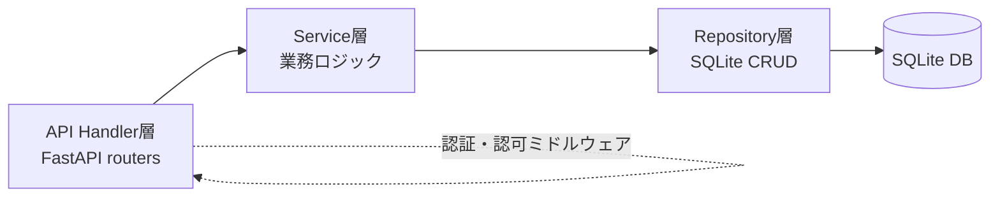
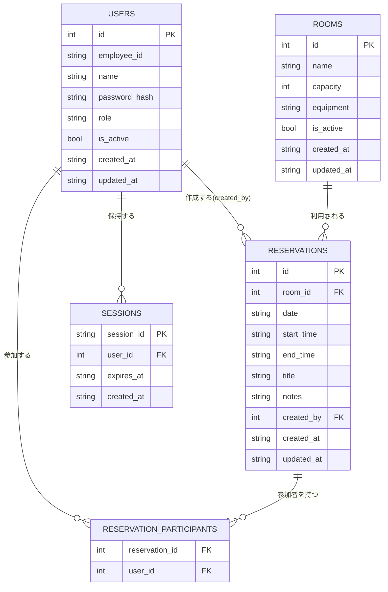

# システム詳細設計書 — 会議室予約システム

> 本書は `spec-driven-dev` Skill フェーズP003の成果物です。インプット文書: `docs/P001-requirement.md`、`docs/P002-frontend-spec.md`。既存のADR/CRはなし(新規作成のため)。

## 0. 本書の役割と前提

* 本書は `docs/P001-requirement.md` のAPI一覧にある全エンドポイントの**内部仕様**(サーバー内部でどのように外部仕様を成立させるか)を確定する。外部から見える契約(リクエスト/レスポンス形式、ステータスコード、Cookieの使用有無)は `docs/P002-frontend-spec.md` で確定済みであり、本書ではそれを覆さない。
* アーキテクチャ: レイヤードアーキテクチャ(Controller/Handler層 → Service層 → Repository層 → SQLite)。FastAPIのルーター機能をController/Handler層として使う。

## 1. レイヤー構成

* **API Handler層**: FastAPIのルーター。リクエストのパース・レスポンスの整形・HTTPステータスの決定を担う。業務ロジックは持たない。
* **Service層**: 業務ロジック(重複チェック、権限チェックの実処理、論理削除等)を担う。
* **Repository層**: SQLiteへのCRUD操作のみを担う。SQL文はここに閉じ込める。
* **認証・認可ミドルウェア**: 全リクエストに対しCookieからセッションを解決し、`request.state.user` に現在ユーザーを設定する(FastAPIの `Depends` によるミドルウェア的な依存関数として実装する)。

## 2. 認証・セッション内部設計

* `docs/P002-frontend-spec.md` §1 で確定した外部契約(Cookieベースセッション認証)を、次の内部実装で成立させる。
* **セッションの保存方式**: SQLiteの `sessions` テーブルに保存する(スコープ: システム全体で共有する永続ストア。単一サーバー構成のためインメモリではなくDB保存とし、サーバー再起動時にもセッションが失われないようにする)。
* **セッションID**: `secrets.token_urlsafe(32)` で生成する暗号論的に安全なランダム文字列。
* **Cookie発行**: `Set-Cookie: session_id={session_id}; HttpOnly; Secure; SameSite=Lax; Max-Age=28800`(有効期限8時間 = 1営業日分。★FIXME★ 具体的な有効期限がP001に指定がないため、業務時間内で完結する8時間と仮定した)。
* **セッション検証**: リクエスト毎にCookieの `session_id` で `sessions` テーブルを検索し、`expires_at` が現在時刻より後であれば有効とする。有効なら `sessions.user_id` から `users` テーブルを引いて `request.state.user` に設定する。無効・期限切れ・レコードなしの場合は `401 AUTH_REQUIRED` を返す(P002 §2のエラー形式に従う)。
* **ログイン時の処理順序**:
  1. `employee_id` で `users` テーブルを検索する。
  2. レコードが無い、または `is_active = false` の場合は `401 AUTH_INVALID_CREDENTIALS`(存在しない場合と無効化済みの場合を区別せず同一エラーにする。アカウント存在の推測を防止するため)。
  3. `password_hash` と入力パスワードを検証する(bcryptによる検証)。不一致なら `401 AUTH_INVALID_CREDENTIALS`。
  4. 一致すれば `sessions` にレコードを作成し、Cookieを発行する。
* **ログアウト時の処理**: 該当 `session_id` のレコードを `sessions` テーブルから削除し、Cookieを失効させる。
* **無効化されたユーザーの扱い**: ユーザーが管理者によって `is_active = false` にされた場合、既存のセッションはその場では削除しない(バッチ処理は行わない)。ただし次回以降のリクエスト時にセッション検証の一部として `users.is_active` を確認し、`false` であれば `401 AUTH_REQUIRED` として扱い、該当セッションを削除する(遅延失効方式)。★FIXME★ 即時失効(無効化と同時に全セッション削除)にするか遅延失効にするかはP001/P002に指定がないため、実装が単純な遅延失効を採用した。リアルタイム性が必要な場合は要見直し。

## 3. パスワードのハッシュ方式

* `bcrypt`(cost factor 12)を用いてハッシュ化して `users.password_hash` に保存する。平文パスワードは保存しない(P001の非機能要件「パスワードはハッシュ化して保存する」に対応)。
* 初期パスワード・パスワードリセット時のパスワード生成規則(`docs/P002-frontend-spec.md` §3 S07)は、英大文字・小文字・数字を含む10文字のランダム文字列とする。★FIXME★

## 4. 権限チェックの内部実現

* `role` は `general` / `admin` の2値。管理者専用API(会議室・ユーザー管理系、`docs/P002-frontend-spec.md` §4の「権限: 管理者」表記箇所)は、Service層に入る前にHandler層の依存関数 `require_admin()` でチェックし、`admin` でなければ `403 FORBIDDEN` を返す。
* 予約の編集・取消(`PUT /api/reservations/{id}` `DELETE /api/reservations/{id}`)は、対象予約の `created_by` が現在ユーザーと一致するか、現在ユーザーが `admin` であることをService層でチェックする(`ReservationService.check_editable(reservation, current_user)`)。一致しなければ `403 FORBIDDEN`。

## 5. 予約重複チェックの内部設計(排他制御含む)

* **判定ロジック**: 同一 `room_id` かつ同一 `date` の既存予約(自分自身を除く)のうち、`start_time < 既存.end_time AND end_time > 既存.start_time` を満たすものが1件でもあれば重複とみなす(区間が真に重なっている場合のみ重複、境界が接する場合は重複としない。例: 10:00-11:00 と 11:00-12:00 は重複しない)。★FIXME★ 境界の扱いがP001に明記がないため一般的な区間判定を採用した。
* **同時リクエストに対する排他制御**: SQLiteは単一ファイルDBのため、書き込みは事実上シリアライズされる(SQLiteのファイルロック)。アプリケーション側では以下の手順で二重予約を防止する。
  1. `BEGIN IMMEDIATE` でトランザクションを開始し、書き込みロックを即座に取得する。
  2. トランザクション内で重複チェックのSELECTを実行する。
  3. 重複がなければ `INSERT`(または `UPDATE`)を実行し `COMMIT`。重複があれば `ROLLBACK` して `409 RESERVATION_CONFLICT` を返す。
  * `BEGIN IMMEDIATE` を使うことで、チェックと書き込みの間に他のトランザクションが割り込んで同じ枠を予約する競合状態(TOCTOU)を防ぐ。
* この内部設計は `docs/P001-requirement.md` の「認証方式(セッション/JWT等)や重複チェックの厳密な仕様(同時リクエスト時の排他制御など)は次フェーズで確定する」という記述を受けて、本フェーズ(P003)で確定するものである。

## 6. データモデル(内部拡張分)

`docs/P002-frontend-spec.md` §5 のER図・テーブル定義に対し、ユーザインタフェースに現れない以下のテーブル・カラムを追加する。

### 6.1 ER図(追加分反映)

### 6.2 追加テーブル定義: SESSIONS

| カラム | 型 | 制約 | 備考 |
| --- | --- | --- | --- |
| session_id | TEXT | PK | `secrets.token_urlsafe(32)` |
| user_id | INTEGER | NOT NULL, FK -> USERS.id | |
| expires_at | TEXT | NOT NULL | ISO8601、発行時刻+8時間 |
| created_at | TEXT | NOT NULL | ISO8601 |

### 6.3 既存テーブルへの追加カラム

* `USERS.password_hash`(TEXT, NOT NULL): bcryptハッシュ。
* `USERS.created_at` / `USERS.updated_at`(TEXT, NOT NULL): ISO8601。監査目的で全テーブル共通で付与する。★FIXME★ P001・P002に明記はないが、一般的な運用要件として付与した。
* `ROOMS.created_at` / `ROOMS.updated_at`、`RESERVATIONS.created_at` / `RESERVATIONS.updated_at`: 同上。

これらの追加はユーザインタフェースから直接使うデータモデルの「修正」ではなく「内部専用カラムの追加」であるため、`docs/P002-frontend-spec.md` の記載自体を変更する必要はない(P002は既にUI観点のテーブル定義として完結しており、内部専用カラムを含めない方針を明記済み)。

## 7. API内部仕様

`docs/P002-frontend-spec.md` §4 の外部仕様(4.1〜4.17)それぞれについて、内部処理を定める。番号はP002と対応させる。

### 7.1 POST /api/auth/login

* Handler: リクエストボディをパースし `AuthService.login(employee_id, password)` を呼ぶ。
* Service: 本書§2「ログイン時の処理順序」を実行し、成功時は `(user, session_id)` を返す。
* Handler: Cookieを設定し `{user}` を返す。

### 7.2 POST /api/auth/logout

* Handler: Cookieの `session_id` を取得し `AuthService.logout(session_id)` を呼ぶ(セッションレコード削除)。Cookie未設定・レコード無しでも例外にせず200を返す(冪等性、P002 §4.2参照)。

### 7.3 GET /api/me

* Handler: 認証ミドルウェアで解決済みの `request.state.user` をそのまま返す。Service層は不要。

### 7.4 GET /api/rooms

* Service: `RoomRepository.list(include_inactive)` を呼ぶ。`include_inactive=true` は `request.state.user.role == "admin"` の場合のみ有効(それ以外は強制的に `false` としてクエリする)。

### 7.5 POST /api/rooms

* Handler: `require_admin()` 依存関数でチェック。
* Service: `RoomService.create(data)` が (a) 同名かつ有効な会議室の重複チェック、(b) `RoomRepository.insert(data)` を行う。

### 7.6 PUT /api/rooms/{room_id}

* Service: `RoomRepository.find(room_id)` が無ければ `404`。あれば全量更新(`RoomRepository.update(room_id, data)`)。

### 7.7 DELETE /api/rooms/{room_id}

* Service: `RoomRepository.set_active(room_id, false)`。対象が無ければ `404`。

### 7.8 GET /api/reservations

* Service: `ReservationRepository.list_by_range(date_from, date_to, room_ids)`。参加者・備考は結合しない(一覧表示用に最小限のJOINに留めてクエリコストを抑える)。

### 7.9 GET /api/reservations/mine

* Service: `ReservationRepository.list_by_creator(current_user.id, period)`。`period="past"` は `date < 本日`、`upcoming` は `date >= 本日`(時刻は考慮しない。当日進行中の予約は`upcoming`扱い)。★FIXME★

### 7.10 GET /api/reservations/{reservation_id}

* Service: `ReservationRepository.find_with_detail(reservation_id)` が参加者・備考・作成者名までJOINして返す。無ければ `404`。

### 7.11 POST /api/reservations

* Service: `ReservationService.create(data, current_user)`
  1. `room_id` の存在確認(無ければ `404`、無効化済みなら `400 VALIDATION_ERROR`)。
  2. `participant_ids` の存在確認(無ければ `404`)。
  3. §5の排他制御手順で重複チェック(`409` の場合あり)。
  4. `RESERVATIONS` へINSERT、`RESERVATION_PARTICIPANTS` へ一括INSERT(同一トランザクション)。

### 7.12 PUT /api/reservations/{reservation_id}

* Service: `ReservationService.update(reservation_id, data, current_user)`
  1. 対象予約の存在確認(`404`)。
  2. `check_editable`(本書§4)で権限確認(`403`)。
  3. §5の重複チェック(自分自身を除外)。
  4. UPDATE、参加者は一旦全削除して再INSERT(同一トランザクション)。

### 7.13 DELETE /api/reservations/{reservation_id}

* Service: 存在確認(`404`)→ `check_editable`(`403`)→ `RESERVATIONS` から物理DELETE(`RESERVATION_PARTICIPANTS` もFK連鎖削除、SQLiteの `ON DELETE CASCADE` を設定する)。

### 7.14 GET /api/users

* Handler: `require_admin()`。Service: `UserRepository.list(include_inactive)`。

### 7.15 POST /api/users

* Handler: `require_admin()`。
* Service: `UserService.create(data)`
  1. `employee_id` の一意性チェック(`400`)。
  2. `initial_password` を本書§3のルールでbcryptハッシュ化。
  3. INSERT。

### 7.16 PUT /api/users/{user_id}

* Service: 対象確認(`404`)。`new_password` が非nullならbcryptハッシュ化して更新。その他項目は全量更新。

### 7.17 DELETE /api/users/{user_id}

* Service: `current_user.id == user_id` なら `400 VALIDATION_ERROR`(自己無効化禁止、P002 §4.17参照)。それ以外は `is_active=false` に更新。

## 8. 非機能要件への対応(`docs/P001-requirement.md` 非機能要件節との対応)

P001の非機能要件は、性能・可用性・セキュリティ・スケーラビリティ・想定同時利用者数・ログ出力先の6項目。このうち性能・同時利用者数(予約重複時の排他制御)はアプリケーションロジックの設計対象であり本書で確定する。可用性・セキュリティの一部(通信経路)・スケーラビリティ・ログ出力先は、デプロイ構成(サーバー台数、リバースプロキシ、ログ収集基盤)に強く依存するインフラ観点の要件であり、本書(バックエンドのアプリケーションロジック設計)の対象外とし、`docs/P005-impl-plan.md`(必要なミドルウェア・インフラのスプリント化)および `docs/P302-deliver.md`(docker compose化・起動方法)で具体化する方針とする。★FIXME★ P002・P003は「フロントエンド外部仕様」「バックエンド内部仕様」を対象とするフェーズであり、インフラ構成そのものを決定するフェーズが明示されていないため、この切り分けは本書側の判断で行った。

* **性能(カレンダー表示3秒以内)**: `RESERVATIONS` テーブルに `(room_id, date)` の複合インデックスを作成し、7.8 `GET /api/reservations` の日付範囲・会議室絞り込みクエリを高速化する。一覧取得APIは参加者・備考をJOINしない設計(7.8参照)とし、想定規模(会議室10室・同時接続30)であれば単一クエリで応答可能と見積もる。
* **想定同時利用者数(ピーク時30接続)・予約の同時実行制御**: §5の `BEGIN IMMEDIATE` によるトランザクション制御で対応する。SQLiteは書き込みを事実上シリアライズするため、想定同時接続数の規模であれば待ち時間は許容範囲内と見積もる(★FIXME★ 具体的な負荷試験はP009受け入れテストで実施し、本書の見積もりを検証する)。
* **セキュリティ**: パスワードのハッシュ化(§3)、管理者権限チェック(§4)、SQLインジェクション対策(Repository層でのプレースホルダ使用を必須とし文字列連結によるSQL組み立てを禁止する)は本書の対象として確定する。通信のHTTPS化(TLS終端)はアプリケーションコードの範囲外であり、リバースプロキシ/ロードバランサでの設定を前提とする(`docs/P302-deliver.md` で具体化)。Cookieの `Secure` 属性(`docs/P002-frontend-spec.md` §1)は、HTTPS前提でのみ正しく機能する点に注意する。
* **可用性(平日日中99%以上)・スケーラビリティ(単一サーバーで十分、将来スケールアウト検討)**: 単一SQLiteファイルへの書き込みシリアライズは、将来的な複数サーバーへのスケールアウトの制約になる(SQLiteは複数サーバー間での共有書き込みに向かない)。本バージョンの想定規模(300名・同時30接続)では単一サーバー構成で要件を満たすと判断する。将来の多拠点展開等でスケールアウトが必要になった場合は、SQLiteからサーバー型RDB(PostgreSQL等)への移行が必要になる旨を、後続のP022(ADR整理)で意思決定として記録することを推奨する。★FIXME★
* **ログ出力先(標準出力経由でクラウドのログ管理サービスへ集約)**: アプリケーションは構造化ログ(JSON Lines)を標準出力に出力する(FastAPIのアクセスログ・Service層でのエラーログ)。標準出力からのログ収集基盤への転送はデプロイ環境側の責務とし、`docs/P302-deliver.md` で起動方法とあわせて明記する。

## 9. 未解決事項・確認が必要な項目

* セッション有効期限(8時間)、パスワード生成規則、監査用タイムスタンプの付与など、P001/P002に明記のない内部仕様を複数箇所で仮定した(★FIXME★ 各所参照)。
* 予約の物理削除方針(`docs/P002-frontend-spec.md` §4.13で仮定済み)を前提に、`RESERVATION_PARTICIPANTS` のFK制約を `ON DELETE CASCADE` とした。
* 非機能要件のうちインフラ構成に依存する項目(可用性・スケーラビリティ・ログ収集基盤・TLS終端)は、本書ではなく `docs/P005-impl-plan.md`/`docs/P302-deliver.md` で具体化する方針とした。この切り分け自体がP001/SKILL.mdに明記されていないため、本書独自の判断である旨を記録する(★FIXME★)。
