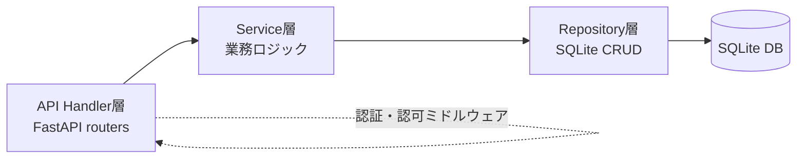
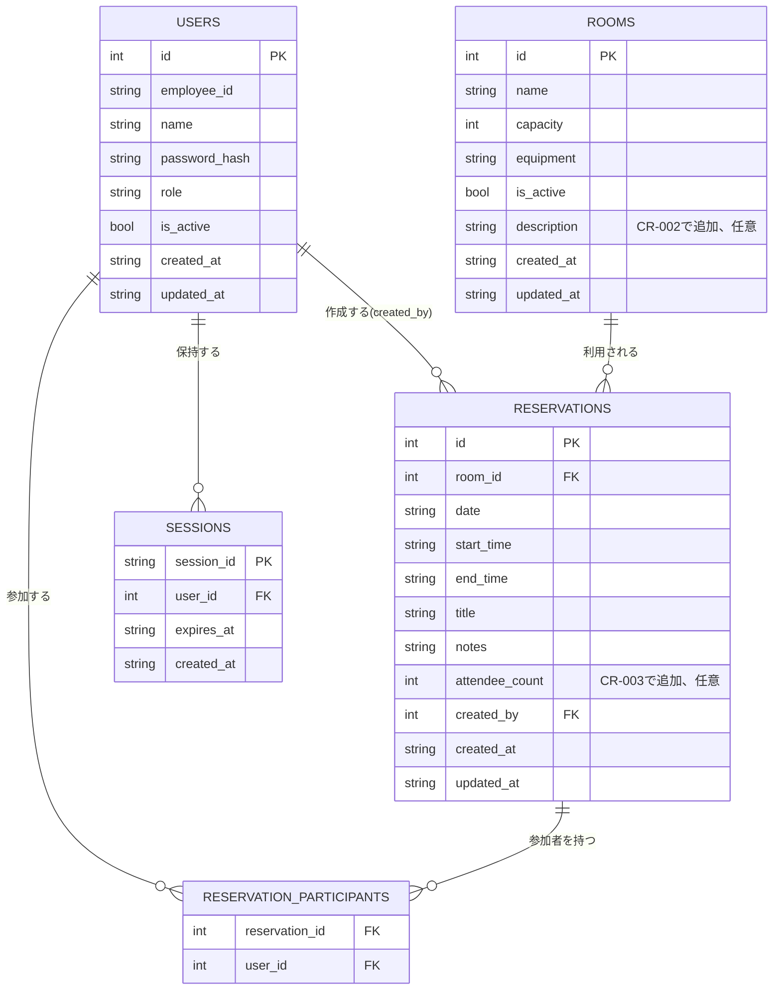

# システム詳細設計書 — 会議室予約システム

> 本書は `spec-driven-dev` Skill フェーズP003の成果物です。インプット文書: `docs/P001-requirement.md`、`docs/P002-frontend-spec.md`。既存のADR/CRはなし(新規作成のため)。

## 0. 本書の役割と前提

* 本書は `docs/P001-requirement.md` のAPI一覧にある全エンドポイントの**内部仕様**(サーバー内部でどのように外部仕様を成立させるか)を確定する。外部から見える契約(リクエスト/レスポンス形式、ステータスコード、Cookieの使用有無)は `docs/P002-frontend-spec.md` で確定済みであり、本書ではそれを覆さない。
* アーキテクチャ: レイヤードアーキテクチャ(Controller/Handler層 → Service層 → Repository層 → SQLite)。FastAPIのルーター機能をController/Handler層として使う。

## 1. レイヤー構成

* **API Handler層**: FastAPIのルーター。リクエストのパース・レスポンスの整形・HTTPステータスの決定を担う。業務ロジックは持たない。
* **Service層**: 業務ロジック(重複チェック、権限チェックの実処理、論理削除等)を担う。
* **Repository層**: SQLiteへのCRUD操作のみを担う。SQL文はここに閉じ込める。
* **認証・認可ミドルウェア**: 全リクエストに対しCookieからセッションを解決し、`request.state.user` に現在ユーザーを設定する(FastAPIの `Depends` によるミドルウェア的な依存関数として実装する)。

## 2. 認証・セッション内部設計

* `docs/P002-frontend-spec.md` §1 で確定した外部契約(Cookieベースセッション認証)を、次の内部実装で成立させる。
* **セッションの保存方式**: SQLiteの `sessions` テーブルに保存する(スコープ: システム全体で共有する永続ストア。単一サーバー構成のためインメモリではなくDB保存とし、サーバー再起動時にもセッションが失われないようにする)。
* **セッションID**: `secrets.token_urlsafe(32)` で生成する暗号論的に安全なランダム文字列。
* **Cookie発行**: `Set-Cookie: session_id={session_id}; HttpOnly; Secure; SameSite=Lax; Max-Age=28800`(有効期限8時間 = 1営業日分。★FIXME★ 具体的な有効期限がP001に指定がないため、業務時間内で完結する8時間と仮定した)。
* **セッション検証**: リクエスト毎にCookieの `session_id` で `sessions` テーブルを検索し、`expires_at` が現在時刻より後であれば有効とする。有効なら `sessions.user_id` から `users` テーブルを引いて `request.state.user` に設定する。無効・期限切れ・レコードなしの場合は `401 AUTH_REQUIRED` を返す(P002 §2のエラー形式に従う)。
* **ログイン時の処理順序**:
  1. `employee_id` で `users` テーブルを検索する。
  2. レコードが無い、または `is_active = false` の場合は `401 AUTH_INVALID_CREDENTIALS`(存在しない場合と無効化済みの場合を区別せず同一エラーにする。アカウント存在の推測を防止するため)。
  3. `password_hash` と入力パスワードを検証する(bcryptによる検証)。不一致なら `401 AUTH_INVALID_CREDENTIALS`。
  4. 一致すれば `sessions` にレコードを作成し、Cookieを発行する。
* **ログアウト時の処理**: 該当 `session_id` のレコードを `sessions` テーブルから削除し、Cookieを失効させる。
* **無効化されたユーザーの扱い**: ユーザーが管理者によって `is_active = false` にされた場合、既存のセッションはその場では削除しない(バッチ処理は行わない)。ただし次回以降のリクエスト時にセッション検証の一部として `users.is_active` を確認し、`false` であれば `401 AUTH_REQUIRED` として扱い、該当セッションを削除する(遅延失効方式)。★FIXME★ 即時失効(無効化と同時に全セッション削除)にするか遅延失効にするかはP001/P002に指定がないため、実装が単純な遅延失効を採用した。リアルタイム性が必要な場合は要見直し。

## 3. パスワードのハッシュ方式

* `bcrypt`(cost factor 12)を用いてハッシュ化して `users.password_hash` に保存する。平文パスワードは保存しない(P001の非機能要件「パスワードはハッシュ化して保存する」に対応)。
* 初期パスワード・パスワードリセット時のパスワード生成規則(`docs/P002-frontend-spec.md` §3 S07)は、英大文字・小文字・数字を含む10文字のランダム文字列とする。★FIXME★

## 4. 権限チェックの内部実現

* `role` は `general` / `admin` の2値。管理者専用API(会議室・ユーザー管理系、`docs/P002-frontend-spec.md` §4の「権限: 管理者」表記箇所)は、Service層に入る前にHandler層の依存関数 `require_admin()` でチェックし、`admin` でなければ `403 FORBIDDEN` を返す。
* 予約の編集・取消(`PUT /api/reservations/{id}` `DELETE /api/reservations/{id}`)は、対象予約の `created_by` が現在ユーザーと一致するか、現在ユーザーが `admin` であることをService層でチェックする(`ReservationService.check_editable(reservation, current_user)`)。一致しなければ `403 FORBIDDEN`。

## 5. 予約重複チェックの内部設計(排他制御含む)

* **判定ロジック**: 同一 `room_id` かつ同一 `date` の既存予約(自分自身を除く)のうち、`start_time < 既存.end_time AND end_time > 既存.start_time` を満たすものが1件でもあれば重複とみなす(区間が真に重なっている場合のみ重複、境界が接する場合は重複としない。例: 10:00-11:00 と 11:00-12:00 は重複しない)。★FIXME★ 境界の扱いがP001に明記がないため一般的な区間判定を採用した。
* **同時リクエストに対する排他制御**: SQLiteは単一ファイルDBのため、書き込みは事実上シリアライズされる(SQLiteのファイルロック)。アプリケーション側では以下の手順で二重予約を防止する。
  1. `BEGIN IMMEDIATE` でトランザクションを開始し、書き込みロックを即座に取得する。
  2. トランザクション内で重複チェックのSELECTを実行する。
  3. 重複がなければ `INSERT`(または `UPDATE`)を実行し `COMMIT`。重複があれば `ROLLBACK` して `409 RESERVATION_CONFLICT` を返す。
  * `BEGIN IMMEDIATE` を使うことで、チェックと書き込みの間に他のトランザクションが割り込んで同じ枠を予約する競合状態(TOCTOU)を防ぐ。
* この内部設計は `docs/P001-requirement.md` の「認証方式(セッション/JWT等)や重複チェックの厳密な仕様(同時リクエスト時の排他制御など)は次フェーズで確定する」という記述を受けて、本フェーズ(P003)で確定するものである。

## 6. データモデル(内部拡張分)

`docs/P002-frontend-spec.md` §5 のER図・テーブル定義に対し、ユーザインタフェースに現れない以下のテーブル・カラムを追加する。

### 6.1 ER図(追加分反映)

### 6.2 追加テーブル定義: SESSIONS

| カラム | 型 | 制約 | 備考 |
| --- | --- | --- | --- |
| session_id | TEXT | PK | `secrets.token_urlsafe(32)` |
| user_id | INTEGER | NOT NULL, FK -> USERS.id | |
| expires_at | TEXT | NOT NULL | ISO8601、発行時刻+8時間 |
| created_at | TEXT | NOT NULL | ISO8601 |

### 6.3 既存テーブルへの追加カラム

* `USERS.password_hash`(TEXT, NOT NULL): bcryptハッシュ。
* `USERS.created_at` / `USERS.updated_at`(TEXT, NOT NULL): ISO8601。監査目的で全テーブル共通で付与する。★FIXME★ P001・P002に明記はないが、一般的な運用要件として付与した。
* `ROOMS.created_at` / `ROOMS.updated_at`、`RESERVATIONS.created_at` / `RESERVATIONS.updated_at`: 同上。
* `ROOMS.description`(TEXT、NULL可、※CR-002により追加): 任意入力、最大200文字(検証は`app/core/validators.py`の`validate_room_description`で行う)。既存行(CR-002適用前に登録済みの会議室)は`NULL`のまま扱う。マイグレーション`0002_add_room_description.sql`(`ALTER TABLE ROOMS ADD COLUMN description TEXT`)で追加する。★FIXME★ `ALTER TABLE ADD COLUMN`はSQLiteの構文上「未適用の場合のみ」という条件付き実行ができないため、`app/db/connection.py`の`init_db()`側で`duplicate column name`エラーを捕捉して無視する実装とした(既存のマイグレーション設計(起動のたびに全ファイルを再実行する)を壊さないための実装判断)。

* `RESERVATIONS.attendee_count`(INTEGER、NULL可、※CR-003により追加): 参加予定人数。任意入力。指定される場合は1以上の整数であり、かつ当該予約の `room_id` が指す `ROOMS.capacity` 以下であること(検証は `app/core/validators.py` の `validate_attendee_count` と `app/services/reservation_service.py` の収容人数チェックで行う。単体の値域検証と会議室を跨ぐ検証を分けている理由は§7.11参照)。既存行(CR-003適用前に登録済みの予約)は `NULL` のまま扱う。マイグレーション `0003_add_reservation_attendee_count.sql`(`ALTER TABLE RESERVATIONS ADD COLUMN attendee_count INTEGER`)で追加する。適用方式については§6.4を参照。

なお `attendee_count` はユーザインタフェース(S03・S04)に直接現れる項目であるため、`docs/P002-frontend-spec.md` §5.1・§5.2 にも反映済みである(内部専用カラムではない)。

これらの追加はユーザインタフェースから直接使うデータモデルの「修正」ではなく「内部専用カラムの追加」であるため、`docs/P002-frontend-spec.md` の記載自体を変更する必要はない(P002は既にUI観点のテーブル定義として完結しており、内部専用カラムを含めない方針を明記済み)。

### 6.4 スキーマの適用方式(マイグレーション方式)

`SKILL-P003-backend-spec.md` の規定にもとづき、スキーマの適用方式を次のとおり明記する。本節はCR-003(データモデル変更)の対応時に、`SKILL-P903-refactor-execute.md`「データモデル変更」カテゴリの必須確認に従って追記した(V0.5以前の本書には適用方式の記載が無く、`app/db/connection.py` の実装を読んで現行方式を特定するところから始めた)。

**(1) 適用のタイミングと方式**

* アプリケーション起動時(および各テストのセットアップ時)に `app.db.connection.init_db()` を呼び出し、`server/app/db/migrations/*.sql` をファイル名の昇順に適用する。
* 適用済みのマイグレーションは、管理テーブル `SCHEMA_MIGRATIONS`(`filename` TEXT PK、`applied_at` TEXT)に記録し、**未適用のファイルのみを適用する差分適用方式**とする(CR-003で導入。それ以前は「毎回全件を再実行する」方式だった。変更理由は下記(3)参照)。
* 外部のマイグレーションツール(Alembic等)は導入しない。ADR-003(データストアはSQLite、ORMは使わず標準 `sqlite3` モジュールを直接使用)の方針に合わせ、標準ライブラリのみで完結させる。

**(2) この方式が冪等かどうか**

* 冪等である。同じマイグレーションファイルは `SCHEMA_MIGRATIONS` に記録されている限り2回目以降は実行されないため、`init_db()` を何度呼び出しても成功する。
* `init_db()` の呼び出しは「1回目=全ファイル適用」「2回目以降=何も適用しない(SELECTのみ)」となり、アプリケーションの停止・再起動を繰り返しても起動に失敗しない。

**(3) 冪等でない場合の担保方法 — 本プロジェクトが差分適用方式に切り替えた理由**

* CR-003以前の方式は「起動のたびに `migrations/*.sql` を `executescript()` で全件再実行する」ものであり、初期構築時点(`0001_initial.sql`)は `CREATE TABLE IF NOT EXISTS` のみで構成されていたため冪等に成功していた。
* しかしCR-002で `ALTER TABLE ROOMS ADD COLUMN description` が必要になった際、SQLiteの `ALTER TABLE ... ADD COLUMN` には `IF NOT EXISTS` 相当の条件付き構文が無いため、素朴に追加すると2回目以降の起動が `duplicate column name` で失敗する。CR-002ではこれに対し `init_db()` 側で `duplicate column name` を含む `sqlite3.OperationalError` を捕捉して当該ファイルの適用を打ち切る(`continue`)という場当たり的な対処を行った。
* CR-003の対応にあたりこの対処の妥当性を再評価し、次の理由から**不十分**と判断して差分適用方式に置き換えた(この判断と実測結果は `docs/cr-records/CR-003.md` に記録している)。
  * 例外を捕捉した時点でそのファイルの**残りの文が黙って読み飛ばされる**。「カラム追加 + 付随するインデックス作成/バックフィルUPDATE」のように1ファイルが複数文で構成される場合、途中まで適用された状態のDBに対して再実行すると、後続の文が適用されないまま `init_db()` が正常終了する(実測で確認済み。★FIXME★ 現状のマイグレーションは「1ファイル1文」の慣習で運用されているが、この慣習自体はどこにも明文化されていなかった)。
  * エラーメッセージの文字列一致(`"duplicate column name" in str(exc)`)で判定しているため、同一ファイル内の別の文が起こした本物のエラーも取り違えて握りつぶす余地がある。
  * 「適用済みかどうか」の情報がどこにも残らないため、運用時にどのマイグレーションまで適用されているかを確認する手段が無い。
* 差分適用方式への移行にあたっては、**既にCR-003以前の方式で構築済みのDB(`SCHEMA_MIGRATIONS` を持たず、0001・0002が適用済み)** が存在しうるため、次のブートストラップ手順を採る。
  * `SCHEMA_MIGRATIONS` を `CREATE TABLE IF NOT EXISTS` で用意する。
  * 未記録のマイグレーションファイルは**1文ずつ**実行し、「既に適用済みであること」を意味するエラー(`duplicate column name` / `table ... already exists` / `index ... already exists`)のみを読み飛ばす。読み飛ばしても後続の文の実行は継続する(場当たり対処との違いはここ)。
  * ファイル単位の適用が終わったら `SCHEMA_MIGRATIONS` に記録する。以降そのファイルは二度と実行されない。
  * この結果、新規DB・CR-002時点のDBのどちらから起動しても同じスキーマに収束し、かつ2回目以降の起動では1文も実行されない。
* ★FIXME★ 1文ずつの実行のためにSQLを `;` で分割している。現状のマイグレーションにはトリガ(`BEGIN ... END` を含む複合文)が存在しないため問題ないが、将来トリガを定義する場合は分割処理の見直しが必要である。

**(4) この方式の検証観点**

* 上記(2)の冪等性は、テストごとに新しい一時DBを作る単体テスト・結合テストでは検出できない(常に初回実行になるため)。`docs/P006-test-plan.md` の「運用観点(再起動耐性)」に、**アプリケーションを停止・再起動しても正常に起動すること**を確認する観点として明記している。
* 具体的な確認手順は「同一のDBファイルに対して `init_db()` を2回連続で実行し、2回目も成功すること」とする(`server/tests/test_db_init.py` の再起動シナリオテスト、および `docs/test-records/` の実測記録を参照)。

## 7. API内部仕様

`docs/P002-frontend-spec.md` §4 の外部仕様(4.1〜4.17)それぞれについて、内部処理を定める。番号はP002と対応させる。

### 7.1 POST /api/auth/login

* Handler: リクエストボディをパースし `AuthService.login(employee_id, password)` を呼ぶ。
* Service: 本書§2「ログイン時の処理順序」を実行し、成功時は `(user, session_id)` を返す。
* Handler: Cookieを設定し `{user}` を返す。

### 7.2 POST /api/auth/logout

* Handler: Cookieの `session_id` を取得し `AuthService.logout(session_id)` を呼ぶ(セッションレコード削除)。Cookie未設定・レコード無しでも例外にせず200を返す(冪等性、P002 §4.2参照)。

### 7.3 GET /api/me

* Handler: 認証ミドルウェアで解決済みの `request.state.user` をそのまま返す。Service層は不要。

### 7.4 GET /api/rooms

* Service: `RoomRepository.list(include_inactive)` を呼ぶ。`include_inactive=true` は `request.state.user.role == "admin"` の場合のみ有効(それ以外は強制的に `false` としてクエリする)。

### 7.5 POST /api/rooms

* Handler: `require_admin()` 依存関数でチェック。
* Service: `RoomService.create(data)` が (a) `description`(任意、最大200文字、※CR-002により追加)を含む各項目の検証、(b) 同名かつ有効な会議室の重複チェック、(c) `RoomRepository.insert(data)` を行う。

### 7.6 PUT /api/rooms/{room_id}

* Service: `RoomRepository.find(room_id)` が無ければ `404`。あれば各項目(`description`含む、※CR-002により追加)を検証のうえ全量更新(`RoomRepository.update(room_id, data)`)。`description`を含む全項目をrepository呼び出しへ渡すこと(P202-F004: `description`を渡し忘れる実装ミスが実際に発生したため、実装時の注意点として明記する)。

### 7.7 DELETE /api/rooms/{room_id}

* Service: `RoomRepository.set_active(room_id, false)`。対象が無ければ `404`。

### 7.8 GET /api/reservations

* Service: `ReservationRepository.list_by_range(date_from, date_to, room_ids)`。参加者・備考は結合しない(一覧表示用に最小限のJOINに留めてクエリコストを抑える)。

### 7.9 GET /api/reservations/mine

* Service: `ReservationRepository.list_by_creator(current_user.id, period)`。`period="past"` は `date < 本日`、`upcoming` は `date >= 本日`(時刻は考慮しない。当日進行中の予約は`upcoming`扱い)。★FIXME★
* Handler: レスポンス要素に `attendee_count`(整数または `null`)を含める(※CR-003により追加)。Repository は `SELECT r.*` で全カラムを取得しているため、SQLの変更は不要でHandlerの写像のみを変更する。

### 7.10 GET /api/reservations/{reservation_id}

* Service: `ReservationRepository.find_with_detail(reservation_id)` が参加者・備考・作成者名までJOINして返す。無ければ `404`。
* `find_with_detail` の返す辞書に `attendee_count` を追加する(※CR-003により追加)。これにより `POST`(7.11)・`PUT`(7.12)のレスポンスにも自動的に含まれる(いずれも `find_with_detail` の結果をそのまま返しているため)。

### 7.11 POST /api/reservations

* Service: `ReservationService.create(data, current_user)`
  1. 予約単体で完結する入力検証(時刻範囲・件名・備考・日付・`attendee_count` の値域)。`attendee_count` は `validate_attendee_count`(`None` を許容、それ以外は1以上の整数)で検証し、違反時は `400 VALIDATION_ERROR`(`field="attendee_count"`)。
  2. `room_id` の存在確認(無ければ `404`、無効化済みなら `400 VALIDATION_ERROR`)。
  3. **会議室の収容人数チェック(※CR-003により追加)**: `attendee_count` が `None` でない場合、2.で取得した会議室の `capacity` と比較し、`attendee_count > capacity` なら `400 VALIDATION_ERROR`(`field="attendee_count"`, `reason="exceeds room capacity"`)。等しい場合は許容する。
  4. `participant_ids` の存在確認(無ければ `404`)。
  5. §5の排他制御手順で重複チェック(`409` の場合あり)。
  6. `RESERVATIONS` へINSERT(`attendee_count` を含む)、`RESERVATION_PARTICIPANTS` へ一括INSERT(同一トランザクション)。

* **検証の配置についての設計判断(※CR-003)**: `attendee_count` の値域検証(1以上の整数か)は他の項目と同じく `app/core/validators.py` の純粋関数に置くが、収容人数との比較は「予約」と「会議室」という2つのエンティティにまたがるため純粋関数にできない。そこで、会議室レコードを既に取得している Service 層(`_check_room_and_participants` の直後)に配置する。Repository 層(SQLの CHECK 制約等)には置かない。理由は、(a) SQLiteの CHECK 制約は他テーブルを参照できない、(b) エラーメッセージ・`details[].field` の形式を他のバリデーションと揃えたい、の2点である。

### 7.12 PUT /api/reservations/{reservation_id}

* Service: `ReservationService.update(reservation_id, data, current_user)`
  1. 対象予約の存在確認(`404`)。
  2. `check_editable`(本書§4)で権限確認(`403`)。
  3. 7.11の1.と同じ入力検証(`attendee_count` の値域を含む)。
  4. 7.11の2.〜3.と同じ会議室の存在確認・収容人数チェック(※CR-003により追加)。全量更新のため、比較対象は**リクエストで指定された `room_id`**(=更新後の会議室)の `capacity` とする。会議室を変更する更新で、変更後の会議室の収容人数を超える場合も `400 VALIDATION_ERROR` になる。
  5. §5の重複チェック(自分自身を除外)。
  6. UPDATE(`attendee_count` を含む)、参加者は一旦全削除して再INSERT(同一トランザクション)。
* リクエストで `attendee_count` が省略された場合は `null` として扱い、既存値を `null` で上書きする(4.12の「全量更新」の定義に従う。CR-002で `ROOMS.description` に採った扱いと同じ)。

### 7.13 DELETE /api/reservations/{reservation_id}

* Service: 存在確認(`404`)→ `check_editable`(`403`)→ `RESERVATIONS` から物理DELETE(`RESERVATION_PARTICIPANTS` もFK連鎖削除、SQLiteの `ON DELETE CASCADE` を設定する)。

### 7.14 GET /api/users

* Handler: `require_admin()`。Service: `UserRepository.list(include_inactive)`。

### 7.15 POST /api/users

* Handler: `require_admin()`。
* Service: `UserService.create(data)`
  1. `employee_id` の一意性チェック(`400`)。
  2. `initial_password` を本書§3のルールでbcryptハッシュ化。
  3. INSERT。

### 7.16 PUT /api/users/{user_id}

* Service: 対象確認(`404`)。`new_password` が非nullならbcryptハッシュ化して更新。その他項目は全量更新。

### 7.17 DELETE /api/users/{user_id}

* Service: `current_user.id == user_id` なら `400 VALIDATION_ERROR`(自己無効化禁止、P002 §4.17参照)。それ以外は `is_active=false` に更新。

## 8. 非機能要件への対応(`docs/P001-requirement.md` 非機能要件節との対応)

P001の非機能要件は、性能・可用性・セキュリティ・スケーラビリティ・想定同時利用者数・ログ出力先の6項目。このうち性能・同時利用者数(予約重複時の排他制御)はアプリケーションロジックの設計対象であり本書で確定する。可用性・セキュリティの一部(通信経路)・スケーラビリティ・ログ出力先は、デプロイ構成(サーバー台数、リバースプロキシ、ログ収集基盤)に強く依存するインフラ観点の要件であり、本書(バックエンドのアプリケーションロジック設計)の対象外とし、`docs/P005-impl-plan.md`(必要なミドルウェア・インフラのスプリント化)および `docs/P302-deliver.md`(docker compose化・起動方法)で具体化する方針とする。★FIXME★ P002・P003は「フロントエンド外部仕様」「バックエンド内部仕様」を対象とするフェーズであり、インフラ構成そのものを決定するフェーズが明示されていないため、この切り分けは本書側の判断で行った。

* **性能(カレンダー表示3秒以内)**: `RESERVATIONS` テーブルに `(room_id, date)` の複合インデックスを作成し、7.8 `GET /api/reservations` の日付範囲・会議室絞り込みクエリを高速化する。一覧取得APIは参加者・備考をJOINしない設計(7.8参照)とし、想定規模(会議室10室・同時接続30)であれば単一クエリで応答可能と見積もる。
* **想定同時利用者数(ピーク時30接続)・予約の同時実行制御**: §5の `BEGIN IMMEDIATE` によるトランザクション制御で対応する。SQLiteは書き込みを事実上シリアライズするため、想定同時接続数の規模であれば待ち時間は許容範囲内と見積もる(★FIXME★ 具体的な負荷試験はP009受け入れテストで実施し、本書の見積もりを検証する)。
* **セキュリティ**: パスワードのハッシュ化(§3)、管理者権限チェック(§4)、SQLインジェクション対策(Repository層でのプレースホルダ使用を必須とし文字列連結によるSQL組み立てを禁止する)は本書の対象として確定する。通信のHTTPS化(TLS終端)はアプリケーションコードの範囲外であり、リバースプロキシ/ロードバランサでの設定を前提とする(`docs/P302-deliver.md` で具体化)。Cookieの `Secure` 属性(`docs/P002-frontend-spec.md` §1)は、HTTPS前提でのみ正しく機能する点に注意する。
* **可用性(平日日中99%以上)・スケーラビリティ(単一サーバーで十分、将来スケールアウト検討)**: 単一SQLiteファイルへの書き込みシリアライズは、将来的な複数サーバーへのスケールアウトの制約になる(SQLiteは複数サーバー間での共有書き込みに向かない)。本バージョンの想定規模(300名・同時30接続)では単一サーバー構成で要件を満たすと判断する。将来の多拠点展開等でスケールアウトが必要になった場合は、SQLiteからサーバー型RDB(PostgreSQL等)への移行が必要になる旨を、後続のP022(ADR整理)で意思決定として記録することを推奨する。★FIXME★
* **ログ出力先(標準出力経由でクラウドのログ管理サービスへ集約)**: アプリケーションは構造化ログ(JSON Lines)を標準出力に出力する(FastAPIのアクセスログ・Service層でのエラーログ)。標準出力からのログ収集基盤への転送はデプロイ環境側の責務とし、`docs/P302-deliver.md` で起動方法とあわせて明記する。

## 9. 未解決事項・確認が必要な項目

* セッション有効期限(8時間)、パスワード生成規則、監査用タイムスタンプの付与など、P001/P002に明記のない内部仕様を複数箇所で仮定した(★FIXME★ 各所参照)。
* 予約の物理削除方針(`docs/P002-frontend-spec.md` §4.13で仮定済み)を前提に、`RESERVATION_PARTICIPANTS` のFK制約を `ON DELETE CASCADE` とした。
* スキーマの適用方式(マイグレーション方式)は、V0.5以前の本書には記載が無く、CR-003の対応時に実装コードを読んで特定し§6.4として明文化した。あわせて、CR-002時点の場当たり的な冪等化を差分適用方式に置き換えた(§6.4(3))。
* 非機能要件のうちインフラ構成に依存する項目(可用性・スケーラビリティ・ログ収集基盤・TLS終端)は、本書ではなく `docs/P005-impl-plan.md`/`docs/P302-deliver.md` で具体化する方針とした。この切り分け自体がP001/SKILL.mdに明記されていないため、本書独自の判断である旨を記録する(★FIXME★)。
