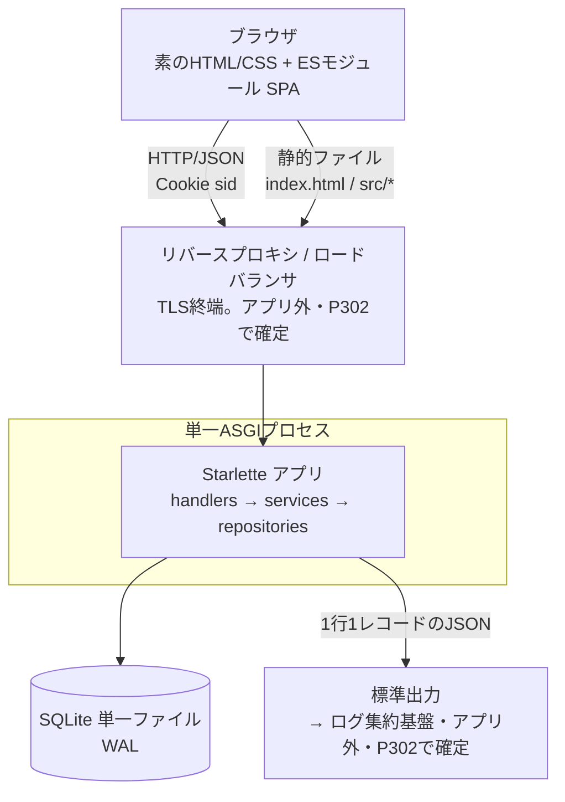

# ArchitectureHandbook.md

このドキュメントは、P022フェーズで作成・更新する。目的は、後続のAgent(Executor・Reviewer Loop・Refactor)が `docs/P001-requirement.md` 〜 `docs/P009-acceptance-direction.md` を毎回読み直さなくても、アプリケーションの技術的側面を短時間で把握できるようにすることである。

* 詳細な仕様そのものはここに書かない。詳細は `docs/P002-frontend-spec.md` `docs/P003-backend-spec.md` などの原本を参照させ、ここには「どこに何が書いてあるか」と「実装・運用にあたって知っておくべき技術的な要点」だけをまとめる。
* 仕様が変わるたびに全面書き直しするのではなく、差分だけを更新する。矛盾が出た場合は原本(`docs/P00N-*.md`)を正とする。
* 記載内容が古くなっていないかは、P020(実装構造生成/修正)・P021(ADR整理)と合わせて確認する。

## 1. アプリケーション概要

* アプリケーション名: **会議室予約システム**(コード上のパッケージ名は `meeting_room`)
* 一言で言うと何のアプリか: 社内の会議室予約を一元管理し、空き状況の確認から予約・変更・取消までをオンラインで完結させる社内向けWebアプリケーション。二重予約の防止が中核価値である。
* 想定規模: 従業員300名程度・会議室10室程度、ピーク時の同時接続30程度。
* 利用者は2種類: 一般ユーザー(社員/予約者)と管理者(総務・情シス。会議室・ユーザーのマスタ管理を行う)。
* 参照元: `docs/P001-requirement.md`

## 2. 全体構成図



* クライアント/サーバ型だが、**静的ファイルの配信もAPIと同じ単一プロセスが行う**(同一オリジン。CORS設定なし)。ADR-010。
* 外部サービス連携は存在しない(P001「連携する既存システムなし」。Google/Outlookカレンダー連携は対象外)。

## 3. 技術スタック

| レイヤ | 技術 | バージョン | 選定理由の参照先 |
| --- | --- | --- | --- |
| フロントエンド | 素のHTML/CSS + ESモジュール形式のJavaScript(ビルドツールなし、ハッシュルーティングのSPA) | ECMAScriptモジュール(ブラウザ標準) | ADR-001 |
| バックエンド | Python + Starlette(ASGI)+ Pydantic v2(明示検証) | Python 3.11 以上 | ADR-002 |
| データベース | SQLite(Python標準 `sqlite3`、ORMなし、WAL) | Python同梱の sqlite3 | ADR-004 |
| 認証 | セッションCookie `sid`(HttpOnly / SameSite=Lax / Secure)+ `sessions` テーブル永続化 + `hashlib.scrypt` | 標準ライブラリのみ | ADR-005 / ADR-006 / ADR-003 |
| インフラ/デプロイ | 単一ASGIプロセス。TLS終端・ログ集約・プロセス監視はプロセス外(`docs/P302-deliver.md` で確定) | - | ADR-010 |
| スキーマ管理 | 差分適用型マイグレーション(`server/migrations/NNN-*.sql` + `schema_migrations` テーブル) | 自作(標準ライブラリ) | ADR-009 |
| バックエンドのテスト | Python標準 `unittest`(`cd server && python3 -m unittest discover -s tests -t .`) | 標準ライブラリ | ADR-002 |
| フロントエンドのテスト | Node.js標準 `node --test`(`cd client && node --test tests`) | Node.js標準 | ADR-001 |

* **重要**: P001はフロントエンドに React 18 + TypeScript + Vite、バックエンドに FastAPI を指定しているが、実行環境が外部パッケージレジストリ(`registry.npmjs.org` / `pypi.org`)に到達できないため、上表の代替構成を採用している。この逸脱は `docs/P004-traceability-matrix.md` 3章に「逸脱#1・#2」として記録済みで、ADR-001・ADR-002 に★FIXME★付きで残っている(人間が「代替のまま進める」か「環境を用意して作り直す」かを確定する必要がある)。実装担当は**上表の代替構成で実装すること**。
* 外部パッケージへの依存を新たに追加してはならない(取得できない)。`client/package.json` は依存パッケージを持たず、`server/pyproject.toml` の `dependencies` は空である。

## 4. ディレクトリ構成の方針

* コード格納先はクライアント・サーバ型として、プロジェクトルート直下に `client/` と `server/` の2ソースツリーを置く(`docs/P005-impl-plan.md`、`docs/P007-impl-direction.md` 2章)。
* 各ソースツリーの目次は `client/INDEX.md` / `server/INDEX.md`(INDEX形式。`SKILL.md` の「INDEX形式について」を参照)。P020で作成し、実装後にP104で更新する。プロジェクト全体の目次 `./INDEX.md` はP301で作成する。
* ビルドツール:
  * `server/` = **uv**(`pyproject.toml` / `src/meeting_room/` レイアウト。初期化済み)。
  * `client/` = **npm(メタデータのみ)**。バンドル・トランスパイル工程は持たず、ブラウザが `client/src/**` を直接読む。
* サーバー側の層構成と責務(`docs/P003-backend-spec.md` 2.1):

```text
handlers/   HTTP入出力とPydanticスキーマ検証   ← SQLを書かない
services/   業務ルールとトランザクション境界
repositories/ SQL実行                          ← HTTPを知らない
```

* フロントエンドは「1画面 = 1つのESモジュール(`client/src/views/s0N-*.js`)」とし、画面横断の共通処理は `client/src/lib/`(router / api / validation / grid)と `client/src/components/`(header / reservation-form)に置く。
* 詳細なファイル一覧は `server/INDEX.md` / `client/INDEX.md` を参照(実装前の予定ファイルには `(実装前)` が付いている)。

## 5. データモデルの要点

* テーブルは全6つ。画面・APIから見える4つは `docs/P002-frontend-spec.md` 6章、画面に現れない内部2つは `docs/P003-backend-spec.md` 3章が原本である。

| テーブル | 役割 | 定義元 | 実装スプリント |
| --- | --- | --- | --- |
| `users` | ユーザー(社員ID = ログインID、氏名、`password_hash`、`role`、`is_active`) | P002 6.2 | Sprint 1 |
| `sessions` | ログインセッション(`session_id` = Cookie `sid` の値、`last_accessed_at`、`expires_at`) | P003 3.2 | Sprint 1 |
| `schema_migrations` | マイグレーション適用状況(他テーブルと関連を持たない) | P003 3.3 | Sprint 1(起動処理が作成) |
| `rooms` | 会議室(名称、収容人数、設備、説明文、`is_active`) | P002 6.2 | Sprint 2 |
| `reservations` | 予約(会議室、予約者、日付、開始/終了時刻、件名、参加予定人数、**オンライン会議URL(※CR-001)**、備考) | P002 6.2 | Sprint 3(`meeting_url` はCR-001の差分) |
| `reservation_attendees` | 予約の参加者(予約×ユーザーの多対多) | P002 6.2 | Sprint 3 |

* 実装時に踏み外しやすい要点:
  * **日付は `YYYY-MM-DD`、時刻は `HH:MM` のゼロ埋め文字列**で保持し、ローカル(JST)の壁時計時刻として扱う。タイムゾーン変換を行わない。`created_at` / `updated_at` のみUTCのISO 8601文字列(P002 2.1)。
  * `HH:MM` 固定長のため**辞書順比較が時刻順比較と一致する**。重複判定でこの性質を使う(ADR-007)。
  * 論理削除は `rooms` / `users` のみ(`is_active`)。**予約の取消は物理削除**(ADR-008)。
  * 会議室名の一意性は「有効な行のなかで一意」= 部分ユニークインデックス `uq_rooms_name_active`。全行ユニークにしない(ADR-008)。
  * 接続直後に `PRAGMA foreign_keys = ON` を実行しないと外部キーが効かない(SQLiteの既定はOFF)。起動時に1回 `PRAGMA journal_mode = WAL`(ADR-004)。
  * 任意のテキスト項目(`note`、および※CR-001で追加した `meeting_url`)は **`NOT NULL DEFAULT ''`** で持ち、`NULL` を使わない。API応答も常に文字列を返す(ADR-011)。`attendee_count`(数値)だけがNULL許容である。
  * スキーマ変更は**必ず新しい連番ファイル**を追加して行う(適用済みファイルを編集しない。ADR-009)。現在のマイグレーションは `001-init.sql` / `002-rooms.sql` / `003-reservations.sql` / `004-meeting-url.sql`(※CR-001)の4本で、`schema_migrations` の行数は4である。
* 状態(ステート)のスコープと実現方法(P003 2.2):

| 状態 | スコープ | 実現方法 |
| --- | --- | --- |
| ログインセッション | ユーザセッション | SQLiteの `sessions` テーブル。無操作8時間(スライディング)+ 発行から24時間の絶対上限(ADR-006) |
| DB接続 | リクエスト単位 | リクエストごとに接続し応答後にクローズ。プールなし |
| 設定値 | アプリケーション | 起動時に環境変数から読み込みモジュール変数に保持 |
| キャッシュ | なし | 導入しない |

## 6. API/画面構成の要点

* **画面は7つ、APIは17本**。画面↔APIの対応表は `docs/P002-frontend-spec.md` 5.8 が正。

| 画面 | ルート | 使うAPI | 実装スプリント |
| --- | --- | --- | --- |
| S01 ログイン | `#/login` | API-01 | Sprint 1 |
| S02 予約カレンダー(トップ) | `#/calendar` | API-04, API-12, API-02 | Sprint 4 |
| S03 予約作成 | `#/reservations/new` | API-04, API-08(`scope=attendee_candidates`), API-15 | Sprint 4 |
| S04 予約詳細・編集 | `#/reservations/{reservation_id}` | API-14, API-16, API-17, API-08 | Sprint 4 |
| S05 マイ予約一覧 | `#/my-reservations` | API-13 | Sprint 4 |
| S06 会議室管理(管理者) | `#/admin/rooms` | API-04(`include_inactive=true`), API-05〜07 | Sprint 2 |
| S07 ユーザー管理(管理者) | `#/admin/users` | API-08〜11 | Sprint 2 |

| API群 | 番号 | 概要 | 原本(外部契約 / 内部処理) |
| --- | --- | --- | --- |
| 認証 | API-01〜03 | login / logout / me | P002 5.4 / P003 6.1 |
| 会議室 | API-04〜07 | 一覧・登録・更新・無効化(登録以降は管理者のみ) | P002 5.5 / P003 6.2 |
| ユーザー | API-08〜11 | 一覧(`scope` 2モード)・登録・更新・無効化 | P002 5.6 / P003 6.3 |
| 予約 | API-12〜17 | 期間一覧・マイ予約・詳細・登録・更新・取消 | P002 5.7 / P003 6.4 |

* **役割分担(外部契約 = P002 / 内部実現 = P003)で、実装時に両方を読む必要がある箇所**(P002 1.3):

| 論点 | 外部契約(P002) | 内部実現(P003) |
| --- | --- | --- |
| 認証方式 | Cookie名・属性、ログイン/ログアウトの応答形式、401のコード(5.1・5.4) | ハッシュ方式、セッションID生成、保存先・期限判定(4.3) |
| 予約の重複チェック | エラーコード `RESERVATION_CONFLICT` / 409 / `conflicts` の形式、画面の表示位置(3.3・5.7) | 区間比較ロジック、排他制御(5.1〜5.3) |
| 論理削除 | 無効化された会議室・ユーザーの一覧での見え方(3.6・3.7) | `is_active` の更新処理、参照整合性(6.2・6.3) |
| データモデル | 画面・APIから見える4テーブル(6章) | 内部2テーブル、インデックス、マイグレーション(3章) |
| バリデーション | 画面ごとの必須・形式・文字数・**日本語エラーメッセージ**(3章) | Pydanticモデルへの1対1の写し取り(4.2) |

* エラー契約は `docs/P002-frontend-spec.md` 5.2 が単一の正: `VALIDATION_ERROR` / `CAPACITY_EXCEEDED` / `UNAUTHENTICATED` / `AUTH_FAILED` / `FORBIDDEN` / `NOT_FOUND` / `RESERVATION_CONFLICT` / `DUPLICATE_KEY` / `CONSTRAINT_VIOLATION` / `INTERNAL_ERROR` の10種類。**この表にないHTTPステータス・エラーコードを増やさないこと**(503を使わない理由はADR-007)。
* OpenAPI仕様は自動生成されない。API契約の正は P002 5章のみである(ADR-002)。
* ルーティングの落とし穴: `/api/reservations/mine` は `/api/reservations/{reservation_id}` より**先に**登録する(Starletteは登録順に最初にマッチしたルートを使う。P003 6.4)。

## 7. 実装・テストの単位

* **4スプリント**構成。依存順に U001 → U002 → U003 → U004(詳細は `docs/P005-impl-plan.md`、作業指示は `docs/P007-impl-direction.md` と `docs/P007-impl-direction/U00N-*.md`)。

| スプリント | 内容 | 難易度 |
| --- | --- | --- |
| U001 `foundation-auth` | プロジェクト骨格、DB接続とマイグレーション基盤、`users`/`sessions`、API-01〜03、S01、フロント共通基盤、静的配信 | 高(後戻りコスト大) |
| U002 `master-management` | `rooms`、API-04〜11、S06・S07 | 低〜中 |
| U003 `reservation-core` | `reservations`/`reservation_attendees`、API-12〜17、重複判定と排他制御 | 高(中核) |
| U004 `reservation-ui` | S02・S03・S04・S05(新規APIなし) | 中 |

* **スプリントをまたぐ持ち越しが1件だけある**: API-07「今後の予約がある会議室は無効化できない」の判定は、U002 では常に0件を返す関数として実装し、**U003 で本実装に差し替える**(`docs/P005-impl-plan.md` 2.2・2.3、リスク#5)。差し替え忘れがないことはU003の完了条件で確認する。
* テストレベルの方針(詳細は `docs/P006-test-plan.md`):

| レベル | 作成フェーズ | 実行フェーズ | 方針 |
| --- | --- | --- | --- |
| 単体テスト | P007(各スプリント指示に内包) | P102 | **スプリント内で全件PASSさせる**。合格しないままスプリントを終えない |
| 結合テスト(スプリント内) | P008(T001〜T018) | P103 | スプリントに閉じて実行できるものだけ。**失敗しても修正せず記録に残す** |
| システム/受入/スプリント横断 | P009(A001〜A012) | P201 | P001の要件・非機能要件の充足確認。**A007(再起動耐性)は必須の独立タスク** |

* テストの禁止事項(P008・P009共通): 失敗時にアプリケーションコードを直さない / テストコードを都合よく変えない / スキップしない / 期待値を変えて成功扱いにしない。
* テストデータは `docs/P006-test-plan.md` 5章の基準データセット(`admin001`/`user001`/`user002`/`user003`(無効)、会議室A/B/C(Cは無効)、翌営業日の予約1件)。**日付をハードコードせず「本日」から相対で計算する。**
* テスト記録は `docs/test-records/YYYYMMDD-HHMM-test-record.md`(`TEMPLATE-test-record.md` の形式)。
* モック方針: 外部APIが無いためモックは最小限。時刻取得は必ず専用関数(`now_utc()` / `today_local()`)に集約し、`datetime.now()` を各所に直書きしないこと(差し替えテストのため。P006 6章)。

## 8. 横断的関心事

* **認証・認可**(ADR-005 / ADR-006、P003 4.3)
  * 認証不要な経路は `POST /api/auth/login` と静的ファイル配信のみ。それ以外は全てCookie `sid` を要求し、不成立は 401 `UNAUTHENTICATED`。
  * 認可ヘルパは `require_login` / `require_admin`(403 `FORBIDDEN`)/ `require_owner_or_admin(reservation)`。管理者専用APIは404にマスクせず403を返す。
  * 画面側にも認証ガードがあるが(P002 2.3)、**クライアント側の制御はAPI側の検証を代替しない**(二重の防御)。
  * ユーザーの権限変更・無効化時は当該ユーザーの `sessions` を全削除して即時失効させる。
  * 予約の**閲覧**は全ログインユーザーに許可し、**編集・取消**のみ予約者本人と管理者に限定する。
* **エラーハンドリング**(P003 4.4)
  * `services` は `ApiError(status, code, message, details=None, extra=None)` を送出し、ミドルウェアがP002 5.2の形式に変換する。`details` は `VALIDATION_ERROR` のときのみ。`extra`(例: `conflicts`)は `error` オブジェクト直下にマージする。
  * 想定外の例外は 500 `INTERNAL_ERROR`。**レスポンスにスタックトレース・SQL文・ファイルパスを含めない**(V-N-06)。
  * バリデーションは Pydantic(形式・範囲)と `services`(業務ルール: 会議室の存在・有効性、収容人数、重複、権限)に分かれる。エラーメッセージはP002 3章の日本語文言を用い、Pydanticの英語既定メッセージを返さない。
* **ログ出力・監視**(ADR-010、P003 4.4)
  * 標準 `logging` で**標準出力**に1リクエスト1行のJSON。項目は `ts` / `level` / `method` / `path` / `status` / `duration_ms` / `user_id`(未認証は `-`)/ `error_code` / `message`。5xxのみ `stack` を含める。
  * **パスワード・Cookie値(`sid`)・セッションIDを絶対に出力しない**(V-N-07)。
  * 集約先(CloudWatch Logs等)と監視・アラートはアプリの責務外。`docs/P302-deliver.md` で確定する。
* **トランザクションと排他制御**(ADR-004 / ADR-007、P003 4.5・5.3)
  * 書き込みを伴う処理(POST/PUT/DELETE)は必ず `BEGIN IMMEDIATE` で開始し、検査と更新を同一トランザクションで行う。
  * ロック待ちは接続の `timeout=5.0`。超過時は 500 `INTERNAL_ERROR` とし、ログに `error_code=DB_LOCK_TIMEOUT` を記録する。
* **設定値・環境変数**(P003 3.6、U001-T1)
  * `DB_PATH`(既定 `./data/app.db`)、`SESSION_IDLE_SECONDS`(既定 28800)、`SESSION_ABSOLUTE_SECONDS`(既定 86400)、`INITIAL_ADMIN_ID`(既定 `admin001`)、`INITIAL_ADMIN_PASSWORD`(既定 `Passw0rd!23`)。
  * 値はモジュール読み込み時に1回だけ解決する。初期管理者は「管理者が1人も存在しない場合にのみINSERT」する冪等処理として起動時に実行する。
  * サーバーのタイムゾーンは `TZ=Asia/Tokyo` を前提とする(「本日」判定がプロセスのローカル日付に依存するため)。配布時に明示すること(P003 6.4)。

## 9. 既知の制約・技術的負債

### 意識的に受け入れた割り切り(★ACCEPTED★。再指摘不要)

* ★ACCEPTED★ **フロントエンドとバックエンドを独立にスケールできない**(単一プロセスがAPIと静的配信を兼ねる)。別Webサーバーでの配信も検討したが、同一オリジンにするとCORSとプリフライトの考慮が不要になり、運用プロセスも増えないため単一プロセスを選んだ。想定規模(同時30接続)では問題にならない。詳細はADR-010。
* ★ACCEPTED★ **書き込みが事実上直列化される**(全書き込みが `BEGIN IMMEDIATE` を取る)。アプリケーションレベルのロックやロック粒度の細分化も検討したが、前者は複数プロセス化で無効になり、後者はSQLiteがDBファイル単位のロックしか持たないため実現できない。残るのはスループット上限であり、想定同時接続数では実測上の問題にならない。詳細はADR-007。
* ★ACCEPTED★ **予約の取消履歴が残らない**(予約は物理削除)。取消済みフラグによる論理削除も検討したが、重複チェックの全クエリに除外条件が増えて誤りやすくなるため採らなかった。監査要件が生じた場合はCR(P901)で取消履歴テーブルを追加する。詳細はADR-008。
* ★ACCEPTED★ **セッション更新のたびにDB書き込みが発生する**(`last_accessed_at` の更新)。メモリ保持や更新間引きも検討したが、前者は再起動耐性を失い、後者は期限判定の精度を損なうため採らなかった。詳細はADR-006。
* ★ACCEPTED★ **OpenAPI仕様が自動生成されない**ため、API契約とコードの乖離を機械的に検出できない。手書きのOpenAPI定義を別途保守する案は二重管理で乖離リスクがかえって増えるため採らなかった。P002 5章を正としたレビューと結合テストで検出する。詳細はADR-002。
* ★ACCEPTED★ **実ブラウザ固有の挙動(CSSレイアウト、実クリック)を自動検証できない**。ヘッドレスブラウザによるE2Eも検討したが、ツールを取得できない環境である。`docs/P009-acceptance-direction/A011-user-acceptance.md` の手動確認手順で補う。詳細はADR-001 / P006 1.1。
* ★ACCEPTED★ **ダウンマイグレーションを持たない**。上り下り両方を持つ方式も検討したが、SQLiteはDDLのロールバック手段が限られ、実運用ではバックアップからの復元が確実であるため採らなかった。バックアップ手順は `docs/P302-deliver.md` で定める。詳細はADR-009。
* ★ACCEPTED★ **予約の日時をタイムゾーンなしの壁時計時刻で保持する**。タイムゾーン付き保持も検討したが、P001の対象が単一拠点の社内システムであり多拠点展開は本バージョン対象外のため採らなかった。将来の多拠点展開時にタイムゾーン列の追加とデータ移行が必要になる。詳細はP002 2.1。
* ★ACCEPTED★ **CSRFトークンを持たない**。同一オリジン配信 + `SameSite=Lax` + JSON `Content-Type` 必須の組み合わせでクロスサイトからの書き込みが成立しないため、トークン管理を増やす利益が小さいと判断した。前提(同一オリジン配信)が変わる場合はCRで見直す。詳細はADR-005。
* ★ACCEPTED★ **無効化されたアカウントであることを利用者が判別できない**(ログイン失敗メッセージを1種類に統一)。専用メッセージ案は無効化されたIDの存在が判別できてしまうため採らなかった。詳細はP002 3.1。

### 人間の確認が必要な未解決事項(★FIXME★)

* ★FIXME★ **技術スタックの代替そのもの**(ADR-001 / ADR-002)。人間は「(a) 代替構成のまま進める」「(b) レジストリに到達できる環境を用意しP001どおり React / FastAPI で作り直す」を確定すること。(b) の場合はADR-001・ADR-002が廃止となり、P002・P005・P007の再作成が必要になる。
* ★FIXME★ **ロック競合時に 500 を返す方針**(503 + `Retry-After` のほうが意味的には正確だが、P002 5.2 のエラーコード表に503がないため契約を増やさない選択をした)。ADR-007 / P003 5.3。
* ★FIXME★ **初期管理者の払い出し手順**(環境変数の受け渡し方法、初回ログイン後のパスワード変更強制の要否)。P003 3.6 → `docs/P302-deliver.md` へ引き継ぎ済み。
* ★FIXME★ **TLS終端の実体**(リバースプロキシの構成、証明書の入手・更新手順)。ADR-010 → `docs/P302-deliver.md` で確定。
* ★FIXME★ P001に対応する要求がない仕様が6件ある(`docs/P004-traceability-matrix.md` 5章)。特に S07 のパスワード欄、`GET /api/users?scope=attendee_candidates` の一般ユーザー開放、会議室・ユーザー無効化の業務制約は、**要求書への追記が推奨**されている。実装からは削らない。
* ★FIXME★ P002 8章のスコープ指摘3件(通知手段の不在など)は本バージョンでは解消せず、CR(P901)での対応を想定する。「変更・取消の連絡漏れ」は通知機能がないため、「S02/S05で最新状態を随時確認できること」で代替確認する(P006 4.4)。

### CR起票候補(将来の見直し)

* 通知機能(予約の作成・変更・取消をメール等で通知する)。P001の課題「変更・取消の連絡漏れ」に対する直接的な解決手段であり、現バージョンには存在しない。
* 社内SSO(SAML/OIDC)連携、外部カレンダー(Google / Outlook)連携。いずれもP001が「将来検討」としている。
* 予約の取消履歴(監査要件が発生した場合)。ADR-008。
* オンライン会議URLの厳密な形式検証・複数URL対応・大文字スキームの許容(現状はスキーム前方一致のみ・1予約1URL。ADR-011)。
* SQLiteからRDBMSサーバーへの移行(多拠点展開・スケールアウトが必要になった場合)。ADR-004。
* 実際の起票は P901 が `docs/P901-cr-direction/CR-NNN.md` として行う。

## 10. 関連ドキュメントへのリンク

| ドキュメント | 内容 |
| --- | --- |
| `docs/P001-requirement.md` | システム要件定義(画面一覧・API一覧・非機能要件) |
| `docs/P002-frontend-spec.md` | UI設計 + **API外部契約の正**(5章)+ 画面から見えるデータモデル(6章) |
| `docs/P003-backend-spec.md` | システム詳細設計(内部実現・重複判定と排他制御・非機能要件の担当フェーズ) |
| `docs/P004-traceability-matrix.md` | 要求トレーサビリティ(48要求、逸脱2件、過剰実装6件) |
| `docs/P005-impl-plan.md` | 実装計画(4スプリントの分割と依存関係) |
| `docs/P006-test-plan.md` | テスト計画(テスト観点とレベル、テストデータ、モック方針) |
| `docs/P007-impl-direction.md` + `P007-impl-direction/U001〜U004-*.md` | プログラム実装定義 兼 実装指示書 |
| `docs/P008-test-direction.md` + `P008-test-direction/T001〜T018-*.md` | 結合テスト定義 兼 テスト指示書 |
| `docs/P009-acceptance-direction.md` + `P009-acceptance-direction/A001〜A012-*.md` | 受け入れ結合テスト定義 兼 テスト指示書 |
| `docs/P010-design-review.md` / `docs/P011-impact-analysis.md` | 設計書横断レビュー結果 / 影響分析 |
| `docs/ADR.md` | 現在有効な設計判断(ADR-001〜ADR-011) |
| `server/INDEX.md` / `client/INDEX.md` | 各ソースツリーの目次(INDEX形式) |
| `./INDEX.md` | プロジェクト全体の目次(P301で作成) |
