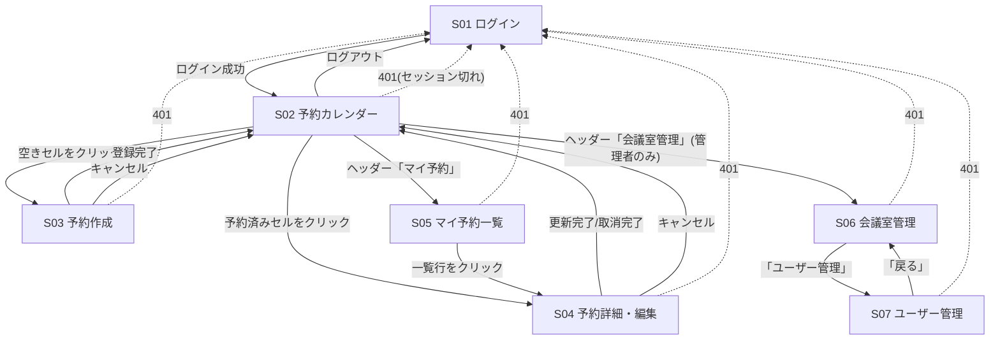
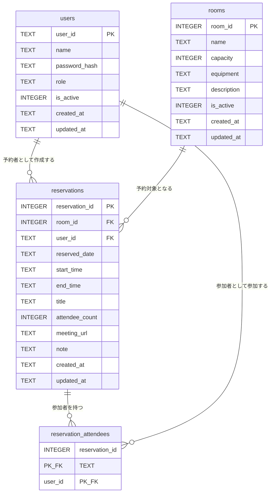
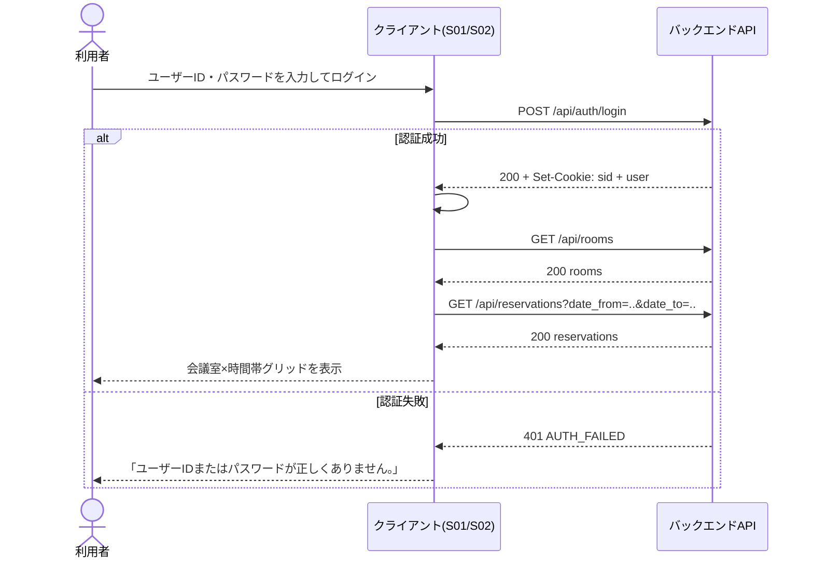
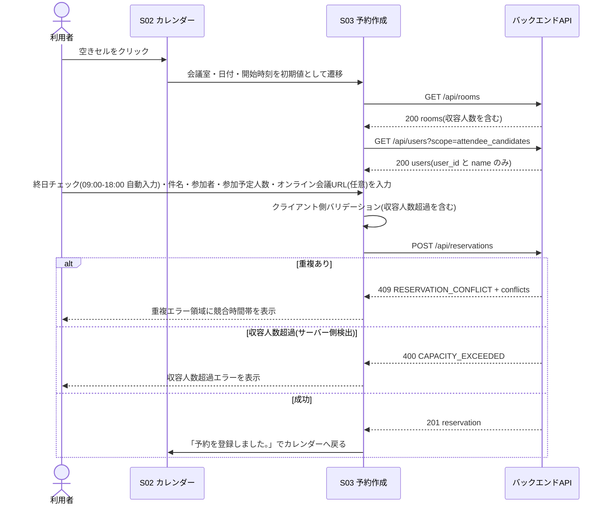
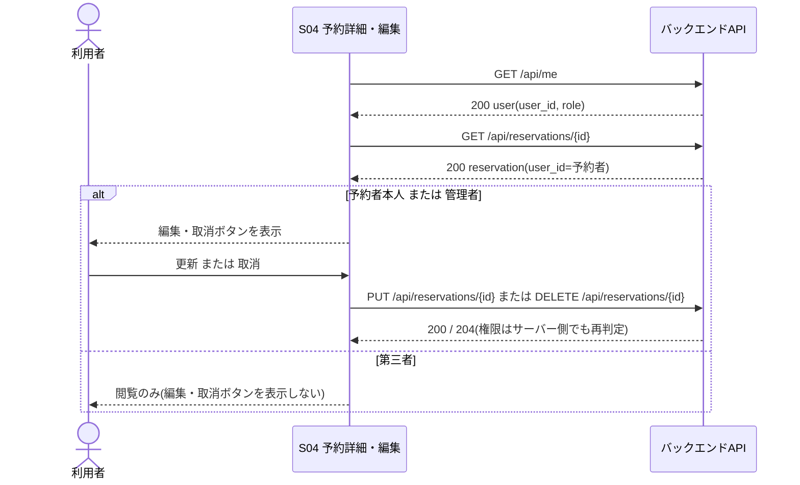

# ユーザインタフェース設計書 — 会議室予約システム

> 本書は `spec-driven-dev` Skill フェーズP002の成果物です。
> インプット: `docs/P001-requirement.md`(`docs/ADR.md` は未作成(P021で作成予定)のため参照なし。CRなし)
> **改訂(CR-001 / P903 2026-08-05)**: `docs/P901-cr-direction/CR-001.md`(予約にオンライン会議URLを登録できるようにしてほしい)にもとづき、第3.2節・第3.3節・第3.4節・第5.3節・第5.7節・第6.1節・第6.2節・第7.2節を差分更新しました。CR-001による変更箇所には「※CR-001」と注記しています。

## 1. 本書の位置づけ

### 1.1 目的と範囲

本書は `docs/P001-requirement.md`(以下P001)で定義された7画面・17APIについて、次を確定する。

* 全画面の全入力項目のバリデーションルール(必須・形式・文字数・範囲)
* 全APIエンドポイントの**外部仕様**(メソッド、パス、リクエスト、レスポンス、ステータスコード、エラーコード)
* ユーザインタフェースを成立させるためのデータモデル(ER図 + テーブル定義)
* 画面をまたぐ処理のシーケンス図

P001にない画面・APIは追加していない(第8章「スコープ確認」参照)。

### 1.2 採用技術と、実行環境制約による代替

P001は「フロントエンド: React 18 + TypeScript + Vite」を指定している。しかし本プロジェクトの実行環境は外部パッケージレジストリ(`registry.npmjs.org` / `pypi.org`)へ到達できないため、これらのパッケージを取得できず、指定どおりの構成では実装・テストが実行できない。したがって本書は次の代替構成を前提として設計する。

| 区分 | P001の指定 | 本書で前提とする実装技術 | 代替の理由 |
| --- | --- | --- | --- |
| フロントエンド | React 18 + TypeScript + Vite | 素のHTML/CSS + ESモジュール形式のJavaScript(ビルドツールなし、ブラウザが直接読む) | npmレジストリに到達できずReact/TypeScript/Viteを取得できないため |
| フロントエンドの単体テスト | (P001未指定) | Node.js標準の `node --test`(外部テストランナーなし) | 同上(Jest等を取得できないため) |

★FIXME★ この代替は実行環境の制約にもとづくAgentの判断であり、P001の技術選定を人間が変更したものではない。人間は「(a) 制約を受け入れて代替構成のまま進める」「(b) レジストリに到達できる環境を用意してP001どおりReactで作り直す」のいずれかを確定すること。

* 代替後も、**P001の選定理由(コンポーネント分割による画面再利用性、SPA的なカレンダーUI)を可能な範囲で満たす**ように設計する。具体的には、画面ごとに1つのESモジュール(`views/S0N-*.js`)を用意して描画関数として分離し、ハッシュルーティングでSPAとして動作させる(第2.2節)。状態管理ライブラリは導入しない(P001の「React標準のみ」という方針に対応する)。
* この代替の経緯と最終的な決定理由は、P021で `docs/ADR.md` に **ADR-001(フロントエンド技術の選定)** として記録済みである(予定値どおりの番号で確定。P021にて確認)。なお、上の★FIXME★(人間が (a)/(b) を確定すること)は依然として未解決であり、ADR-001 側にも同じ★FIXME★を転記してある。
* 本書の以降の記述は、特定のフレームワークに依存しない外部仕様(画面項目・バリデーション・API契約・データモデル)を主とし、実装技術に依存する記述は第2.2節に閉じ込める。

### 1.3 P003(システム詳細設計)との役割分担

判断に迷いやすい項目についてのみ、担当フェーズを明示する。

| 項目 | 本書(P002)で確定する範囲 | `docs/P003-backend-spec.md`(P003)で確定する範囲 |
| --- | --- | --- |
| 認証方式 | クライアントから見える契約: セッションCookieを使うこと、Cookie名・属性、ログイン/ログアウトのレスポンス形式、未認証時のステータスコードとエラーコード(第5.2節・第5.4節) | パスワードのハッシュ方式、セッションIDの生成方法、セッションの保存先と有効期限の実装、期限切れ判定処理 |
| 予約の重複チェック | クライアントが受け取るエラーコード `RESERVATION_CONFLICT` とHTTPステータス409、画面での表示位置(第3.3節) | 重複判定の区間比較ロジック、同時リクエスト時の排他制御方式(トランザクション分離レベル・ロック) |
| 論理削除 | 削除操作がユーザーから見て「無効化」であること、無効化された会議室・ユーザーが一覧にどう出るか | `is_active` 列の更新処理、無効データの参照整合性の扱い |
| データモデル | 画面表示・API契約を成立させるために必要なテーブルと列(第6章) | 画面に現れない内部テーブル(セッション等)の追加、インデックス、マイグレーション方式 |

* 非機能要件のうちインフラ寄りの項目(可用性・TLS終端・スケーラビリティ・ログ集約基盤)は本書では確定しない。P003がアプリケーション側の前提を明記し、インフラ構成そのものの決定は `docs/P005-impl-plan.md` と `docs/P302-deliver.md` に委譲される(`SKILL-P003-backend-spec.md` の規定による)。

## 2. 画面共通仕様

### 2.1 用語と表記の統一

以降、全設計文書で次の用語を用いる(P010の用語一貫性レビューの基準となる)。

| 用語 | 英語表記(コード上の識別子) | 意味 |
| --- | --- | --- |
| ユーザー | user | システム利用者。P001の「社員」と同義 |
| 社員ID | `user_id` | ユーザーの識別子。ログインIDを兼ねる |
| 権限 | `role` | `general`(一般) / `admin`(管理者) |
| 会議室 | room | 予約対象の会議室 |
| 予約 | reservation | 会議室の時間帯占有 |
| 予約者 | owner | 予約を作成したユーザー(`reservations.user_id`) |
| 参加者 | attendee | 予約に紐づけられた社員(`reservation_attendees`) |
| 参加予定人数 | `attendee_count` | 予約時に入力する人数。参加者の選択件数とは独立した任意入力項目 |
| 有効/無効 | `is_active` | 論理削除の状態。`true` = 有効 |

* 日付は `YYYY-MM-DD`、時刻は `HH:MM`(24時間制)、日時は ISO 8601 の UTC 表記(`YYYY-MM-DDTHH:MM:SSZ`)で表す。予約の日付・時刻は**ローカル時刻(JST)の壁時計時刻**として扱い、タイムゾーン変換を行わない。★ACCEPTED★ タイムゾーン付きで保持する案も検討したが、P001の対象は単一拠点の社内システムであり、拠点をまたぐ予約は本バージョンの対象外(P001「将来的な多拠点展開時はスケールアウトを検討」)であるため、壁時計時刻での保持を選んだ。残る制約は、将来の多拠点展開時にタイムゾーン列の追加とデータ移行が必要になることである。

### 2.2 画面構成とルーティング(実装技術に依存する部分)

* 単一のHTMLシェル `client/index.html` を入口とし、ハッシュフラグメントで画面を切り替えるSPAとする。
* 画面とルートの対応:

| 画面ID | ルート | モジュール |
| --- | --- | --- |
| S01 | `#/login` | `client/src/views/s01-login.js` |
| S02 | `#/calendar` | `client/src/views/s02-calendar.js` |
| S03 | `#/reservations/new` | `client/src/views/s03-reservation-new.js` |
| S04 | `#/reservations/{reservation_id}` | `client/src/views/s04-reservation-detail.js` |
| S05 | `#/my-reservations` | `client/src/views/s05-my-reservations.js` |
| S06 | `#/admin/rooms` | `client/src/views/s06-room-admin.js` |
| S07 | `#/admin/users` | `client/src/views/s07-user-admin.js` |

* 共通ヘッダー(S01以外の全画面に表示): アプリ名、「カレンダー」「マイ予約」リンク、管理者にのみ表示する「会議室管理」「ユーザー管理」リンク、ログイン中ユーザーの氏名、ログアウトボタン。
* 共通フッター: なし。

### 2.3 認証ガードと権限による表示制御

* S01を除く全画面は、描画前に `GET /api/me` を呼び、401が返った場合は S01(`#/login`)へ遷移し「セッションの有効期限が切れました。再度ログインしてください。」を表示する。
* S06・S07は `role === 'admin'` のときのみ到達できる。一般ユーザーがURLを直接入力して到達した場合は、画面本体を描画せず「この画面を表示する権限がありません。」を表示し、「カレンダーへ戻る」リンクのみを出す(API側でも403を返す。二重の防御)。
* 一般ユーザーには、共通ヘッダーの「会議室管理」「ユーザー管理」リンクを描画しない。

### 2.4 共通のエラー表示規則

| APIの応答 | 画面の挙動 |
| --- | --- |
| 400 `VALIDATION_ERROR` | 該当入力欄の直下にフィールド単位のエラーメッセージを赤字で表示する(`details[].field` で対応付ける) |
| 401 `UNAUTHENTICATED` | S01へ遷移し、セッション切れメッセージを表示する |
| 403 `FORBIDDEN` | 画面上部に「この操作を行う権限がありません。」を表示する |
| 404 `NOT_FOUND` | 画面上部に「対象のデータが見つかりません。削除された可能性があります。」を表示する |
| 409 `RESERVATION_CONFLICT` | S03/S04の重複エラー表示領域に「選択した時間帯はすでに予約されています。」+ 競合予約の時間帯を表示する |
| 409 `DUPLICATE_KEY` | 該当入力欄の直下に「同じ値がすでに登録されています。」を表示する |
| 409 `CONSTRAINT_VIOLATION` | 画面上部にAPIの `message` をそのまま表示する |
| 500 `INTERNAL_ERROR` | 画面上部に「システムエラーが発生しました。時間をおいて再度お試しください。」を表示する |

* 送信ボタンは、リクエスト送信中は非活性にし、二重送信を防ぐ。
* バリデーションはクライアント側でも実施するが、**クライアント側バリデーションはAPI側の検証を代替しない**(API側は常に同じルールで再検証する。詳細はP003)。

## 3. 画面別仕様

### 3.1 S01 ログイン画面

* 到達経路: 未認証時の全画面アクセス、ログアウト後。
* 表示項目: アプリケーション名、ログインフォーム、エラーメッセージ領域。

| 項目名 | 種別 | 必須 | 形式・範囲 | エラーメッセージ |
| --- | --- | --- | --- | --- |
| ユーザーID(社員ID) | テキスト | 必須 | 半角英数字のみ、4〜20文字(`^[A-Za-z0-9]{4,20}$`) | 「ユーザーIDを入力してください。」「ユーザーIDは半角英数字4〜20文字で入力してください。」 |
| パスワード | パスワード(マスク表示) | 必須 | 8〜64文字、ASCII印字可能文字 | 「パスワードを入力してください。」「パスワードは8〜64文字で入力してください。」 |

* 操作: 「ログイン」ボタン → `POST /api/auth/login`。成功時はS02へ遷移。
* 認証失敗時の表示: 「ユーザーIDまたはパスワードが正しくありません。」の1種類のみとし、**IDが存在しない場合・パスワード不一致・アカウント無効のいずれでも同じ文言**を表示する(アカウント存在の推測を防ぐため)。★ACCEPTED★ 無効アカウントには専用メッセージを出す案も検討したが、無効化されたIDの存在が判別できてしまうため採用しなかった。残る制約は、無効化された利用者が管理者に問い合わせるまで理由を知り得ないことである。
* 認証方式の外部契約: ログイン成功時、サーバーはセッションCookie `sid`(HttpOnly / SameSite=Lax / Secure / Path=/)を発行する。クライアントはCookieを直接読まない。**内部実装(ハッシュ方式、セッションの保存先・有効期限)はP003で確定する。**

### 3.2 S02 予約カレンダー画面(トップ)

* 表示: 選択中の週(月曜〜日曜の7日間)について、**会議室を列、時間帯(30分刻み)を行**とするグリッドを、日付ごとに1つ表示する。表示時間帯は 08:00〜20:00。
* 予約済みセルには「予約者の氏名 / 件名」を表示する。**参加予定人数はこの画面には表示しない**(P001の指定どおり)。※CR-001: **オンライン会議URL(`meeting_url`)もこの画面には表示しない**(CR-001が明示的に対象外としている)。`GET /api/reservations` の応答には `meeting_url` が含まれるが、セル表示文言には使わない。
* 自分の予約は他と異なる配色で強調する。

| 項目名 | 種別 | 必須 | 形式・範囲 | 備考 |
| --- | --- | --- | --- | --- |
| 表示対象日 | 日付選択 + 「前週」「翌週」「今日」ボタン | 必須(初期値=本日) | `YYYY-MM-DD` | 選択日を含む週(月曜起点)を表示する |
| 会議室フィルタ | 複数選択(チェックボックス) | 任意 | 有効な会議室のうち0件以上 | 未選択時は全ての有効な会議室を表示する |

* 呼び出すAPI: `GET /api/rooms`(列見出し用)、`GET /api/reservations?date_from={週初}&date_to={週末}`(グリッド本体)。会議室フィルタはクライアント側で絞り込む。★ACCEPTED★ `room_id` をAPIに渡してサーバー側で絞る案も検討したが、会議室10室・1週間という要件規模ではレスポンスが小さく、フィルタ切替のたびに再取得するほうが表示待ちを増やすため、クライアント側絞り込みを選んだ。残る制約は、会議室数が大幅に増えた場合に転送量が増えることであり、その時点で `room_id` パラメータ(APIには定義済み・第5.8節)に切り替えれば対応できる。
* 操作:
  * 空きセルをクリック → S03へ遷移(会議室・日付・開始時刻を初期値として引き継ぐ。終了時刻は開始時刻+30分)。
  * 予約済みセルをクリック → S04へ遷移(自分の予約でなくても詳細は閲覧できる。編集・取消の可否はS04側で制御する)。
  * ヘッダーの各リンク → S05 / S06 / S07、ログアウト → `POST /api/auth/logout` 後にS01。
* 過去日のセルはクリックしても S03 へ遷移せず、「過去の日付には予約できません。」を表示する。

### 3.3 S03 予約作成画面

| 項目名 | 種別 | 必須 | 形式・範囲 | エラーメッセージ |
| --- | --- | --- | --- | --- |
| 会議室 | プルダウン | 必須 | 有効な会議室のみ選択可 | 「会議室を選択してください。」 |
| 日付 | 日付 | 必須 | `YYYY-MM-DD`、本日以降 | 「日付を入力してください。」「過去の日付には予約できません。」 |
| 終日 | チェックボックス | 任意 | - | (エラーなし) |
| 開始時刻 | 時刻(30分刻みプルダウン) | 必須 | 08:00〜19:30 | 「開始時刻を選択してください。」 |
| 終了時刻 | 時刻(30分刻みプルダウン) | 必須 | 08:30〜20:00、開始時刻より後 | 「終了時刻は開始時刻より後にしてください。」 |
| 件名 | テキスト | 必須 | 1〜100文字 | 「件名を入力してください。」「件名は100文字以内で入力してください。」 |
| 参加者(社員) | 複数選択(候補は `GET /api/users?scope=attendee_candidates` で取得。一般ユーザーも利用可) | 任意 | 有効なユーザーから0〜50名。重複選択不可 | 「参加者は50名以内で選択してください。」 |
| 参加予定人数 | 数値 | 任意 | 1以上9999以下の整数。選択中の会議室の収容人数以下 | 「参加予定人数は1以上の整数で入力してください。」「参加予定人数が会議室の収容人数({capacity}名)を超えています。」 |
| オンライン会議URL ※CR-001 | テキスト | 任意 | 0〜500文字。空欄可。入力する場合は `http://` または `https://` で始まること | 「オンライン会議URLは500文字以内で入力してください。」★FIXME★ 文言はCR-001に指定がないため、他項目の言い回しに合わせて補った / 「オンライン会議URLは http:// または https:// で始まるURLを入力してください。」★FIXME★ 同上 |
| 備考 | 複数行テキスト | 任意 | 0〜500文字 | 「備考は500文字以内で入力してください。」 |

* **終日チェックボックスの挙動**(P001の指定どおり): チェックすると開始時刻に `09:00`、終了時刻に `18:00` を自動入力する。自動入力後も開始時刻・終了時刻は手動で上書きできる(手動で変更してもチェックは自動では外れない)。チェックを外しても、自動入力された時刻はそのまま残す。★FIXME★ 「チェックを外したときに時刻を元に戻すか」はP001に記載がないため、「戻さない」と仮定した。
* **オンライン会議URLの検証仕様(※CR-001)**: 空欄(未入力)はエラーとしない。空欄でない場合のみ、(1)500文字以内であること、(2)`http://` または `https://` で始まることを検証する。**判定順序は (1) 文字数 → (2) スキーム の順とし、両方に違反する場合は文字数のエラーメッセージを返す**(P010第3回 矛盾点#1 / P012により明文化。クライアント側・サーバー側の双方でこの順序に従う)。判定は**スキームの前方一致のみ**とし、ホスト名の妥当性・到達性・ドメインのホワイトリストは検証しない。★ACCEPTED★ `URL` パーサによる厳密な構文検証も検討したが、CR-001が要求しているのは「`http://` か `https://` で始まっていること」だけであり、厳密化すると社内の独自ホスト名(ポート番号付き・IPアドレス直指定など)を誤って弾く可能性があるため、要求どおり前方一致に留めた。残る制約は `https://` の後に無意味な文字列(例: `https://`)を入力しても通ることであり、実害はリンクが開けないことに限られる。文字数は文字(コードポイント)数で数え、バイト数では数えない(他項目と同じ数え方)。
* **参加予定人数の検証タイミング**: 会議室選択の変更時と送信時にクライアント側で検証する。会議室未選択のあいだは収容人数の上限検証を行わない(必須チェックのみ)。サーバー側でも同じ検証を行い、超過時は 400 `CAPACITY_EXCEEDED` を返す。
* 表示項目: 重複エラーメッセージ領域(409 `RESERVATION_CONFLICT` 時)、収容人数超過エラーメッセージ領域(400 `CAPACITY_EXCEEDED` 時)。
* 操作: 「登録」→ `POST /api/reservations`。成功時はS02へ戻り「予約を登録しました。」を表示。「キャンセル」→ 確認なしでS02へ戻る。

### 3.4 S04 予約詳細・編集画面

* 表示項目(閲覧モード): 会議室名 / 日付 / 開始時刻・終了時刻 / 件名 / 参加者の氏名一覧 / 参加予定人数(未入力なら「-」) / **オンライン会議URL(※CR-001)** / 備考 / 予約者の氏名 / 登録日時 / 更新日時。
* **オンライン会議URLの閲覧モード表示(※CR-001)**: 登録されている場合は、URLそのものを表示文字列とする**クリック可能なリンク**(`a` 要素。`href` は登録されたURL、別タブで開く)として表示する。未登録(空文字)の場合はリンクを作らず「-」を表示する。★FIXME★ 未登録時の表示文字と、リンクを別タブで開くかどうかはCR-001に指定がないため、参加予定人数の「-」の規約に合わせ、かつ会議参加中の画面を失わないよう `target="_blank"` + `rel="noopener noreferrer"` と仮定した。
* 編集可否: `me.user_id === reservation.user_id`(予約者本人)または `me.role === 'admin'` のときのみ「編集」「取消」ボタンを表示する。それ以外は閲覧のみ。
* 編集モードの入力項目とバリデーションは **S03と完全に同一**(第3.3節の表を参照)。ただし日付の「本日以降」制約は、既に過去日となっている予約を開いた場合には編集自体を不可とする(「過去の予約は編集できません。」を表示し、編集・取消ボタンを非表示にする)。★FIXME★ 過去予約の取消可否はP001に記載がないため、「編集・取消とも不可」と仮定した。
* 重複チェックでは**自分自身の予約を競合として扱わない**(同じ時間帯のまま件名だけを変更できる)。
* 操作:
  * 「更新」→ `PUT /api/reservations/{reservation_id}`。成功時はS02へ戻り「予約を更新しました。」を表示。
  * 「取消」→ 「この予約を取り消します。よろしいですか?」の確認ダイアログの後 `DELETE /api/reservations/{reservation_id}`。成功時はS02へ戻り「予約を取り消しました。」を表示。
  * 「キャンセル」→ 遷移元(S02またはS05)へ戻る。

### 3.5 S05 マイ予約一覧画面

| 項目名 | 種別 | 必須 | 形式・範囲 | 備考 |
| --- | --- | --- | --- | --- |
| 期間フィルタ | ラジオボタン(今後の予約 / 過去の予約) | 任意(初期値=今後の予約) | `upcoming` / `past` | `GET /api/reservations/mine?period=` に渡す |

* 表示: ログインユーザーが**予約者である**予約のみを、日付・開始時刻の昇順(過去の予約は降順)で一覧表示する。列は「日付 / 会議室名 / 時間帯 / 件名」。
* 0件のときは「該当する予約はありません。」を表示する。
* 操作: 行をクリック → S04へ遷移。
* ★FIXME★ 「自分が参加者として登録された(予約者ではない)予約」を含めるかはP001に記載がない。P001の「ログインユーザー自身の予約のみ表示」を「予約者である予約のみ」と解釈した。

### 3.6 S06 会議室管理画面(管理者用)

* 表示: 会議室一覧(会議室名 / 収容人数 / 設備 / 説明文 / 有効・無効)。無効な会議室もグレー表示で一覧に含める(`GET /api/rooms?include_inactive=true`)。
* 新規登録・編集はモーダルフォームで行う。

| 項目名 | 種別 | 必須 | 形式・範囲 | エラーメッセージ |
| --- | --- | --- | --- | --- |
| 会議室名 | テキスト | 必須 | 1〜50文字。有効な会議室のなかで一意 | 「会議室名を入力してください。」「同じ名前の会議室がすでに登録されています。」 |
| 収容人数 | 数値 | 必須 | 1以上500以下の整数 | 「収容人数は1以上500以下の整数で入力してください。」 |
| 設備 | テキスト | 任意 | 0〜200文字(カンマ区切りの自由記述: 例「プロジェクタ,ホワイトボード」) | 「設備は200文字以内で入力してください。」 |
| 説明文 | 複数行テキスト | 任意 | 0〜200文字 | 「説明文は200文字以内で入力してください。」 |
| 有効フラグ | チェックボックス | 必須(初期値=有効) | `true` / `false` | - |

* 操作:
  * 「新規登録」→ `POST /api/rooms`。
  * 行の「編集」→ `PUT /api/rooms/{room_id}`。
  * 行の「削除」→ 「この会議室を無効化します。よろしいですか?」の確認後 `DELETE /api/rooms/{room_id}`(論理削除)。今後の予約が残っている会議室は 409 `CONSTRAINT_VIOLATION` となり、「この会議室には今後の予約が {n} 件あります。先に予約を取り消してください。」を表示する。★FIXME★ 今後の予約がある会議室を無効化できるかはP001に記載がないため、「できない(409)」と仮定した。
* 「ユーザー管理」への遷移リンクをこの画面に置く(P001の画面遷移図の `S06 → S07` に対応)。

### 3.7 S07 ユーザー管理画面(管理者用)

* 表示: ユーザー一覧(社員ID / 氏名 / 権限 / 有効・無効)。無効なユーザーもグレー表示で含める。

| 項目名 | 種別 | 必須 | 形式・範囲 | エラーメッセージ |
| --- | --- | --- | --- | --- |
| 社員ID | テキスト | 必須(新規登録時のみ入力可。編集時は表示のみ) | 半角英数字4〜20文字。全ユーザー中で一意 | 「社員IDは半角英数字4〜20文字で入力してください。」「この社員IDはすでに登録されています。」 |
| 氏名 | テキスト | 必須 | 1〜50文字 | 「氏名を入力してください。」「氏名は50文字以内で入力してください。」 |
| 権限 | プルダウン(一般 / 管理者) | 必須(初期値=一般) | `general` / `admin` | 「権限を選択してください。」 |
| パスワード | パスワード | 新規登録時のみ必須(編集時は空欄なら変更しない) | 8〜64文字 | 「パスワードは8〜64文字で入力してください。」 |
| 有効フラグ | チェックボックス | 必須(初期値=有効) | `true` / `false` | - |

* ★FIXME★ P001のS07の入出力項目にパスワード欄の記載がないが、ユーザーを新規登録する以上は初期パスワードの設定手段が必要なため、入力項目として追加した(P001のS07表への追記が必要かどうかは人間の判断を仰ぐ)。
* 操作: 「新規登録」→ `POST /api/users`、行の「編集」→ `PUT /api/users/{user_id}`、行の「削除」→ 確認後 `DELETE /api/users/{user_id}`(論理削除)。
* 自分自身の無効化、および「最後の有効な管理者」の無効化・権限降格は 409 `CONSTRAINT_VIOLATION` となり、APIの `message` をそのまま表示する。
* 「戻る」→ S06へ遷移(P001の画面遷移図の `S07 → S06` に対応)。

## 4. 画面遷移図



* 実線はP001の画面遷移図と同一の遷移である。破線は本書第2.3節で追加した「セッション切れ時のS01への強制遷移」であり、P001の遷移に対する詳細化(新しい画面・機能の追加ではない)。
* S02から到達できるS06のリンクは管理者にのみ表示される(第2.3節)。

## 5. API外部仕様

### 5.1 共通事項

* ベースURL: `/api`。全リクエスト・レスポンスの `Content-Type` は `application/json; charset=utf-8`(204応答を除く)。
* 認証: `POST /api/auth/login` 以外の全エンドポイントはセッションCookie `sid` を要求する。未提示・無効・期限切れはすべて 401 `UNAUTHENTICATED`。
* 認可: 管理者専用エンドポイントに一般ユーザーがアクセスした場合は 403 `FORBIDDEN`(404にマスクしない)。
* 日付・時刻はすべて文字列(`YYYY-MM-DD` / `HH:MM`)。`created_at` `updated_at` はUTCのISO 8601文字列。

### 5.2 エラーレスポンス共通形式

```json
{
  "error": {
    "code": "VALIDATION_ERROR",
    "message": "入力内容に誤りがあります。",
    "details": [
      { "field": "title", "message": "件名は100文字以内で入力してください。" }
    ]
  }
}
```

* `details` は `VALIDATION_ERROR` のときのみ設定し、それ以外は省略する。
* エラーコード一覧:

| HTTP | `code` | 意味 |
| --- | --- | --- |
| 400 | `VALIDATION_ERROR` | 入力値がバリデーションルールに違反 |
| 400 | `CAPACITY_EXCEEDED` | 参加予定人数が会議室の収容人数を超過 |
| 401 | `UNAUTHENTICATED` | 未認証・セッション無効・期限切れ |
| 401 | `AUTH_FAILED` | ログイン時のID/パスワード不一致、または無効アカウント |
| 403 | `FORBIDDEN` | 権限不足 |
| 404 | `NOT_FOUND` | 対象リソースが存在しない |
| 409 | `RESERVATION_CONFLICT` | 同一会議室・同一時間帯に既存予約がある |
| 409 | `DUPLICATE_KEY` | 一意制約違反(会議室名・社員ID) |
| 409 | `CONSTRAINT_VIOLATION` | 業務制約違反(今後の予約がある会議室の無効化、最後の管理者の無効化など) |
| 500 | `INTERNAL_ERROR` | サーバー内部エラー |

### 5.3 リソース表現

```jsonc
// User
{ "user_id": "E0001", "name": "山田 太郎", "role": "general", "is_active": true,
  "created_at": "2026-08-01T00:00:00Z", "updated_at": "2026-08-01T00:00:00Z" }

// Room
{ "room_id": 1, "name": "会議室A", "capacity": 10, "equipment": "プロジェクタ,ホワイトボード",
  "description": "窓側の大会議室", "is_active": true,
  "created_at": "2026-08-01T00:00:00Z", "updated_at": "2026-08-01T00:00:00Z" }

// Reservation
{ "reservation_id": 12, "room_id": 1, "room_name": "会議室A",
  "user_id": "E0001", "user_name": "山田 太郎",
  "reserved_date": "2026-08-10", "start_time": "09:00", "end_time": "10:00",
  "title": "定例会議", "attendee_count": 8,
  "meeting_url": "https://example.com/meet/abc", // ※CR-001。未登録の場合は空文字 ""(null は返さない)
  "note": "資料は事前配布",
  "attendees": [ { "user_id": "E0002", "name": "鈴木 花子" } ],
  "created_at": "2026-08-01T01:00:00Z", "updated_at": "2026-08-01T01:00:00Z" }
```

* `Reservation` は `room_name` `user_name` を含める(S02のセル表示・S05の一覧が追加のAPI呼び出しなしで描画できるようにするため)。
* ※CR-001: `meeting_url` は**常に文字列**で返す(未登録は空文字 `""`)。`attendee_count` のように `null` を返す設計にしない。★ACCEPTED★ `null` 許容も検討したが、既存の任意テキスト項目 `note` が「NOT NULL DEFAULT ''」で統一されており、画面側の分岐(`null` と `""` の二重判定)を増やさないため空文字に揃えた。残る制約は「未入力」と「空文字を明示的に入力した」を区別できないことだが、URLにおいてその区別に業務上の意味はない。
* パスワードハッシュはいかなるレスポンスにも含めない。

### 5.4 認証API

| # | メソッド | パス | 権限 | 概要 |
| --- | --- | --- | --- | --- |
| API-01 | POST | `/api/auth/login` | 不要 | ログイン |

* リクエスト: `{ "user_id": "E0001", "password": "password123" }`
* 成功: `200` + `Set-Cookie: sid=...; HttpOnly; SameSite=Lax; Secure; Path=/` + `{ "user": { "user_id": "E0001", "name": "山田 太郎", "role": "general" } }`
* エラー: `400 VALIDATION_ERROR`(未入力・形式違反) / `401 AUTH_FAILED`(ID不明・パスワード不一致・`is_active=false`。3ケースとも同一の `message`「ユーザーIDまたはパスワードが正しくありません。」)

| # | メソッド | パス | 権限 | 概要 |
| --- | --- | --- | --- | --- |
| API-02 | POST | `/api/auth/logout` | 要ログイン | ログアウト |

* リクエストボディなし。成功: `204`(`Set-Cookie: sid=; Max-Age=0` を返す)。エラー: `401 UNAUTHENTICATED`。

| # | メソッド | パス | 権限 | 概要 |
| --- | --- | --- | --- | --- |
| API-03 | GET | `/api/me` | 要ログイン | ログイン中ユーザー情報の取得 |

* 成功: `200` + `{ "user": { "user_id": "...", "name": "...", "role": "..." } }`。エラー: `401 UNAUTHENTICATED`。

### 5.5 会議室API

| # | メソッド | パス | 権限 | 概要 |
| --- | --- | --- | --- | --- |
| API-04 | GET | `/api/rooms` | 要ログイン | 会議室一覧 |

* クエリ: `include_inactive`(`true`/`false`、既定 `false`)。`true` は管理者のみ(一般ユーザーが指定した場合は `403 FORBIDDEN`)。
* 成功: `200` + `{ "rooms": [ Room, ... ] }`(`room_id` 昇順)。

| # | メソッド | パス | 権限 | 概要 |
| --- | --- | --- | --- | --- |
| API-05 | POST | `/api/rooms` | 管理者 | 会議室の新規登録 |

* リクエスト: `{ "name", "capacity", "equipment", "description", "is_active" }`(`equipment` `description` は省略可、`is_active` 省略時 `true`)。
* 成功: `201` + `{ "room": Room }`。エラー: `400 VALIDATION_ERROR` / `401` / `403` / `409 DUPLICATE_KEY`(有効な会議室に同名が存在)。

| # | メソッド | パス | 権限 | 概要 |
| --- | --- | --- | --- | --- |
| API-06 | PUT | `/api/rooms/{room_id}` | 管理者 | 会議室の更新 |

* リクエスト: API-05と同じ全項目(全項目送信の全置換更新)。成功: `200` + `{ "room": Room }`。
* エラー: `400` / `401` / `403` / `404 NOT_FOUND` / `409 DUPLICATE_KEY`。

| # | メソッド | パス | 権限 | 概要 |
| --- | --- | --- | --- | --- |
| API-07 | DELETE | `/api/rooms/{room_id}` | 管理者 | 会議室の無効化(論理削除) |

* 成功: `204`(`is_active=false` に更新)。すでに無効な場合も `204`(冪等)。
* エラー: `401` / `403` / `404 NOT_FOUND` / `409 CONSTRAINT_VIOLATION`(本日以降の予約が1件以上ある。`message` に件数を含める)。

### 5.6 ユーザーAPI

| # | メソッド | パス | 権限 | 概要 |
| --- | --- | --- | --- | --- |
| API-08 | GET | `/api/users` | 管理者 | ユーザー一覧 |

* クエリ: `include_inactive`(既定 `true`。S07は無効ユーザーも表示するため)。成功: `200` + `{ "users": [ User, ... ] }`(`user_id` 昇順)。
* **`scope` クエリによる2つの利用モード**(※P004トレーサビリティ検証の差し戻し#1にもとづき追記):

| `scope` | 権限 | 返す内容 |
| --- | --- | --- |
| `management`(既定) | 管理者のみ。非管理者は 403 `FORBIDDEN` | `User` の全項目(`user_id` / `name` / `role` / `is_active` / `created_at` / `updated_at`)。S07が使う |
| `attendee_candidates` | 要ログイン(一般ユーザーも可) | `is_active=1` のユーザーの `{ "user_id", "name" }` **のみ**(`role`・`is_active`・日時は返さない)。S03/S04の参加者選択が使う |

* 成功: `200` + `{ "users": [ ... ] }`(`user_id` 昇順)。`include_inactive` は `scope=management` のときのみ有効(既定 `true`)。
* ★FIXME★ P001のAPI一覧は `GET /api/users` を「管理者のみ」としているが、同じくP001のS03は「参加者(社員)」を**全ユーザー向けの入力項目**として定義しており、社員の氏名一覧を取得する手段が他に存在しない。P001の内部で要求が競合しているため、本書は「『管理者のみ』の制約は、権限・有効フラグまで含む管理用の一覧(`scope=management`)に対する制約である」と解釈し、参加者選択に必要な最小限の射影(社員IDと氏名のみ)に限って一般ユーザーへ開放した。新しいエンドポイントは追加していない。**この解釈が妥当かどうかは人間の確認を要する**(妥当でない場合は、S03の参加者選択を管理者限定にするCR、またはP001のAPI一覧を修正するCRが必要)。

| # | メソッド | パス | 権限 | 概要 |
| --- | --- | --- | --- | --- |
| API-09 | POST | `/api/users` | 管理者 | ユーザーの新規登録 |

* リクエスト: `{ "user_id", "name", "role", "password", "is_active" }`。成功: `201` + `{ "user": User }`。
* エラー: `400` / `401` / `403` / `409 DUPLICATE_KEY`(社員ID重複。無効化済みの同一IDが存在する場合も重複とする)。

| # | メソッド | パス | 権限 | 概要 |
| --- | --- | --- | --- | --- |
| API-10 | PUT | `/api/users/{user_id}` | 管理者 | ユーザーの更新 |

* リクエスト: `{ "name", "role", "is_active", "password"(省略可・省略時は変更しない) }`。`user_id` は変更不可。
* 成功: `200` + `{ "user": User }`。エラー: `400` / `401` / `403` / `404` / `409 CONSTRAINT_VIOLATION`(最後の有効な管理者を一般に降格、または無効化しようとした場合)。

| # | メソッド | パス | 権限 | 概要 |
| --- | --- | --- | --- | --- |
| API-11 | DELETE | `/api/users/{user_id}` | 管理者 | ユーザーの無効化(論理削除) |

* 成功: `204`。すでに無効な場合も `204`(冪等)。
* エラー: `401` / `403` / `404` / `409 CONSTRAINT_VIOLATION`(自分自身、または最後の有効な管理者)。
* ★FIXME★ 無効化したユーザーが持つ今後の予約をどう扱うか(残す/自動取消)はP001に記載がないため、「予約はそのまま残す(管理者が個別に取り消す)」と仮定した。

### 5.7 予約API

| # | メソッド | パス | 権限 | 概要 |
| --- | --- | --- | --- | --- |
| API-12 | GET | `/api/reservations` | 要ログイン | 期間・会議室指定の予約一覧(カレンダー用) |

* クエリ: `date_from`(必須, `YYYY-MM-DD`)、`date_to`(必須, `YYYY-MM-DD`、`date_from` 以上、範囲は最大31日)、`room_id`(任意, 繰り返し可)。
* 成功: `200` + `{ "reservations": [ Reservation, ... ] }`(`reserved_date`, `start_time`, `room_id` 昇順)。`attendees` は含めない(一覧の軽量化のため空配列を返す)。
* エラー: `400 VALIDATION_ERROR`(必須欠落・範囲超過) / `401`。

| # | メソッド | パス | 権限 | 概要 |
| --- | --- | --- | --- | --- |
| API-13 | GET | `/api/reservations/mine` | 要ログイン | 自分が予約者である予約の一覧 |

* クエリ: `period`(`upcoming`(既定) / `past`)。`upcoming` は `reserved_date >= 本日` を日付昇順、`past` は `reserved_date < 本日` を日付降順。
* 成功: `200` + `{ "reservations": [ Reservation, ... ] }`。エラー: `400`(`period` が不正) / `401`。
* 注: パス `/api/reservations/mine` は `/api/reservations/{reservation_id}` より**先に**ルーティング評価する必要がある(実装上の注意。詳細はP003)。

| # | メソッド | パス | 権限 | 概要 |
| --- | --- | --- | --- | --- |
| API-14 | GET | `/api/reservations/{reservation_id}` | 要ログイン | 予約詳細 |

* 成功: `200` + `{ "reservation": Reservation }`(`attendees` を含む)。エラー: `401` / `404 NOT_FOUND`。
* 予約の閲覧は全ログインユーザーに許可する(編集・取消のみ予約者本人と管理者に限定)。

| # | メソッド | パス | 権限 | 概要 |
| --- | --- | --- | --- | --- |
| API-15 | POST | `/api/reservations` | 要ログイン | 予約の新規登録 |

* リクエスト:

```json
{ "room_id": 1, "reserved_date": "2026-08-10", "start_time": "09:00", "end_time": "10:00",
  "title": "定例会議", "attendee_user_ids": ["E0002"], "attendee_count": 8,
  "meeting_url": "https://example.com/meet/abc", "note": "" }
```

* 予約者は常にセッションのユーザー(リクエストで指定させない)。
* ※CR-001: `meeting_url` は任意。キーの省略・`null`・空文字はいずれも「未登録(空文字として保存)」として扱う。値がある場合は第3.3節の検証ルール(500文字以内・`http://` または `https://` で始まる)をサーバー側でも適用し、違反は 400 `VALIDATION_ERROR`(`field="meeting_url"`)を返す。
* 成功: `201` + `{ "reservation": Reservation }`。
* エラー: `400 VALIDATION_ERROR`(第3.3節のルール違反、無効/存在しない `room_id`・`attendee_user_ids`、過去日、※CR-001: `meeting_url` の形式違反・文字数超過) / `400 CAPACITY_EXCEEDED` / `401` / `409 RESERVATION_CONFLICT`。
* `409` の応答には競合相手を含める: `{"error":{"code":"RESERVATION_CONFLICT","message":"...","conflicts":[{"reservation_id":9,"start_time":"09:30","end_time":"10:30"}]}}`。

| # | メソッド | パス | 権限 | 概要 |
| --- | --- | --- | --- | --- |
| API-16 | PUT | `/api/reservations/{reservation_id}` | 予約者本人または管理者 | 予約の更新 |

* リクエスト: API-15と同じ全項目(全置換更新)。成功: `200` + `{ "reservation": Reservation }`。
* ※CR-001: 全置換更新であるため、`meeting_url` を空文字で送ると登録済みのURLが削除される(S04の編集モードで入力欄を空にして更新した場合の挙動)。
* 重複チェックから**自分自身(更新対象の予約)を除外**する。
* エラー: `400` / `400 CAPACITY_EXCEEDED` / `401` / `403 FORBIDDEN`(予約者でも管理者でもない) / `404` / `409 RESERVATION_CONFLICT` / `409 CONSTRAINT_VIOLATION`(対象が過去日の予約)。

| # | メソッド | パス | 権限 | 概要 |
| --- | --- | --- | --- | --- |
| API-17 | DELETE | `/api/reservations/{reservation_id}` | 予約者本人または管理者 | 予約の取消 |

* 成功: `204`。予約行と参加者行を物理削除する。★ACCEPTED★ 取消済みフラグによる論理削除も検討したが、P001は会議室・ユーザーについてのみ論理削除を指定しており、予約は「取消(削除)」とだけ書かれていること、および論理削除にすると重複チェックの全問い合わせに除外条件が増えて誤りやすいことから、物理削除を選んだ。残る制約は取消履歴が残らないことであり、監査要件が発生した場合はCRで取消履歴テーブルを追加する。
* エラー: `401` / `403 FORBIDDEN` / `404` / `409 CONSTRAINT_VIOLATION`(対象が過去日の予約)。

### 5.8 画面とAPIの対応表(P001「入出力に紐づくバックエンドAPI」の詳細化)

| 画面 | 操作 | API |
| --- | --- | --- |
| S01 | ログイン | API-01 |
| 全画面(S01除く) | 認証ガード / ヘッダー描画 | API-03 |
| S02 | グリッド描画 | API-04, API-12 |
| S02 | ログアウト | API-02 |
| S03 | 会議室プルダウン | API-04 |
| S03 | 参加者候補の取得 | API-08(`scope=attendee_candidates`) |
| S04 | 参加者候補の取得(編集モード) | API-08(`scope=attendee_candidates`) |
| S03 | 予約登録 | API-15 |
| S04 | 予約詳細表示 | API-14 |
| S04 | 予約更新 | API-16 |
| S04 | 予約取消 | API-17 |
| S05 | マイ予約一覧 | API-13 |
| S06 | 会議室一覧 | API-04(`include_inactive=true`) |
| S06 | 会議室 登録/更新/無効化 | API-05, API-06, API-07 |
| S07 | ユーザー一覧 | API-08 |
| S07 | ユーザー 登録/更新/無効化 | API-09, API-10, API-11 |

## 6. データモデル

### 6.1 ER図



* 本書で定義するのは、画面・APIから直接見える上記4テーブルである。画面に現れない内部テーブル(セッション、マイグレーション管理)はP003で追加定義する。

### 6.2 テーブル定義

#### users(ユーザー)

| 列名 | 型 | 制約 | 説明 |
| --- | --- | --- | --- |
| `user_id` | TEXT | PK | 社員ID。半角英数字4〜20文字 |
| `name` | TEXT | NOT NULL | 氏名。1〜50文字 |
| `password_hash` | TEXT | NOT NULL | パスワードの検証情報。**形式・アルゴリズムはP003で確定する。APIレスポンスには決して含めない** |
| `role` | TEXT | NOT NULL, CHECK (`general`,`admin`) | 権限 |
| `is_active` | INTEGER | NOT NULL, DEFAULT 1 | 1=有効 / 0=無効(論理削除) |
| `created_at` | TEXT | NOT NULL | 作成日時(UTC ISO 8601) |
| `updated_at` | TEXT | NOT NULL | 更新日時(UTC ISO 8601) |

#### rooms(会議室)

| 列名 | 型 | 制約 | 説明 |
| --- | --- | --- | --- |
| `room_id` | INTEGER | PK AUTOINCREMENT | 会議室ID |
| `name` | TEXT | NOT NULL | 会議室名。1〜50文字。**有効な行のなかで一意**(部分ユニークインデックス。詳細はP003) |
| `capacity` | INTEGER | NOT NULL, CHECK (1〜500) | 収容人数 |
| `equipment` | TEXT | NOT NULL, DEFAULT '' | 設備(カンマ区切り、0〜200文字) |
| `description` | TEXT | NOT NULL, DEFAULT '' | 説明文(0〜200文字) |
| `is_active` | INTEGER | NOT NULL, DEFAULT 1 | 1=有効 / 0=無効(論理削除) |
| `created_at` | TEXT | NOT NULL | 作成日時 |
| `updated_at` | TEXT | NOT NULL | 更新日時 |

#### reservations(予約)

| 列名 | 型 | 制約 | 説明 |
| --- | --- | --- | --- |
| `reservation_id` | INTEGER | PK AUTOINCREMENT | 予約ID |
| `room_id` | INTEGER | NOT NULL, FK → `rooms.room_id` | 会議室 |
| `user_id` | TEXT | NOT NULL, FK → `users.user_id` | 予約者 |
| `reserved_date` | TEXT | NOT NULL | 予約日 `YYYY-MM-DD` |
| `start_time` | TEXT | NOT NULL | 開始時刻 `HH:MM`(30分刻み、08:00〜19:30) |
| `end_time` | TEXT | NOT NULL, CHECK (`end_time` > `start_time`) | 終了時刻 `HH:MM`(30分刻み、08:30〜20:00) |
| `title` | TEXT | NOT NULL | 件名。1〜100文字 |
| `attendee_count` | INTEGER | NULL可, CHECK (1〜9999) | 参加予定人数。未入力はNULL |
| `meeting_url` | TEXT | NOT NULL, DEFAULT '' | オンライン会議URL。0〜500文字。未入力は空文字。※CR-001により追加(既存行には既定値 `''` が入る) |
| `note` | TEXT | NOT NULL, DEFAULT '' | 備考。0〜500文字 |
| `created_at` | TEXT | NOT NULL | 作成日時 |
| `updated_at` | TEXT | NOT NULL | 更新日時 |

* 「同一会議室・同一日で時間帯が重ならないこと」はDBの一意制約では表現できないため、アプリケーション側の重複チェックで担保する(判定ロジックと排他制御はP003で確定する)。
* ※CR-001: `meeting_url` の追加は、既存の `001`〜`003` を編集せず、新しいマイグレーションファイル `004-meeting-url.sql`(`ALTER TABLE reservations ADD COLUMN meeting_url TEXT NOT NULL DEFAULT ''`)で行う(適用方式はP003第3.5節)。`ALTER TABLE ... ADD COLUMN` に `NOT NULL` を付けられるのは既定値を伴う場合のみであり、`DEFAULT ''` があるため既存行にも適用できる。

#### reservation_attendees(予約参加者)

| 列名 | 型 | 制約 | 説明 |
| --- | --- | --- | --- |
| `reservation_id` | INTEGER | PK(複合), FK → `reservations.reservation_id` ON DELETE CASCADE | 予約 |
| `user_id` | TEXT | PK(複合), FK → `users.user_id` | 参加者 |

* 参加予定人数(`reservations.attendee_count`)と参加者の件数は**独立**であり、一致を強制しない(P001が両方を任意入力としているため)。

## 7. シーケンス図

### 7.1 ログインからカレンダー表示まで



### 7.2 予約作成(重複チェック・収容人数チェックを含む)



* ※P011矛盾点#3にもとづき、S03が参加者候補を取得する流れ(`GET /api/users?scope=attendee_candidates`)を図に追加した(第3.3節・第5.8節の本文と一致させるため)。

### 7.3 予約の編集・取消(権限判定を含む)



* この図の主題は権限判定であるため、編集モードに入った後に S04 が `GET /api/rooms` と `GET /api/users?scope=attendee_candidates` を呼ぶ流れ(第3.4節・第5.8節に記載)は省略している。省略であって、呼ばないという意味ではない。※P011矛盾点#3にもとづき注記を追加

## 8. スコープ確認(P001との差分)

* **P001にない画面・APIの追加**: なし。本書の画面は S01〜S07 の7画面、APIは API-01〜API-17 の17本で、P001の一覧と1対1に対応する。
* **詳細化にあたって気づいたスコープの抜け漏れ**(勝手に拡張せず、指摘のみを記録する):
  1. **P001の内部で要求が競合している(S03の参加者選択 と `GET /api/users` の「管理者のみ」)。** P004の差し戻し#1を受け、第5.6節のとおり `scope=attendee_candidates`(社員IDと氏名のみを返す射影)を一般ユーザーに開放することで解消した。新しいエンドポイントは追加していない。★FIXME★ この解釈の妥当性は人間の確認を要する(第5.6節参照)。
  2. **S07にパスワード入力欄が必要**(第3.7節)。P001のS07入出力項目表に記載がない。★FIXME★
  3. **予約の通知手段が定義されていない。** P001の課題「予約変更・取消の連絡漏れ」に対し、通知(メール等)の要件が画面・APIのどちらにも存在しない。本バージョンでは「S02/S05で最新状態を随時確認できること」をもって解決手段とみなす。★FIXME★ 通知が必要かどうかは人間の確認を要する。
* **P001の記述をそのまま採用した点**: 画面ID・画面名、API一覧のメソッドとパス、S02で参加予定人数を表示しないこと、S03の終日チェックボックスの挙動、S06の説明文(最大200文字)。
