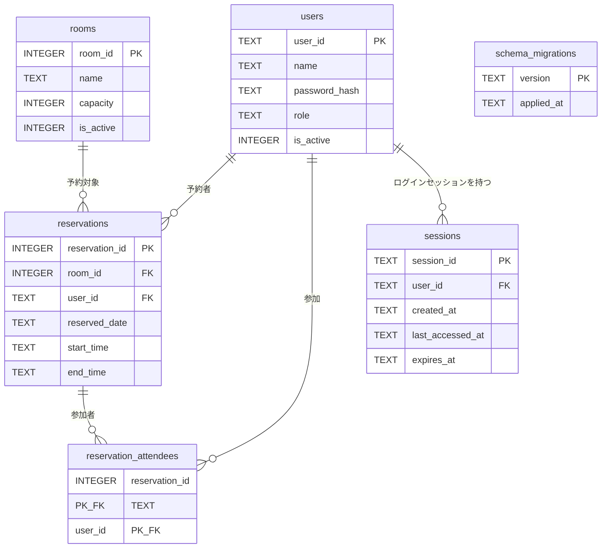
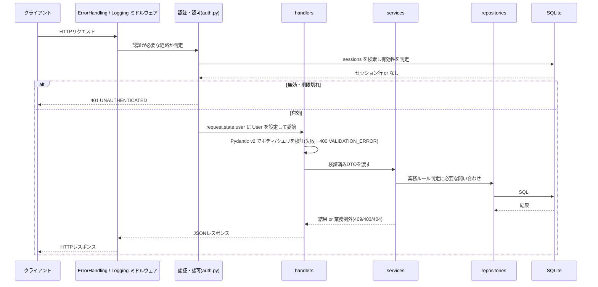

# システム詳細設計書 — 会議室予約システム

> 本書は `spec-driven-dev` Skill フェーズP003の成果物です。
> インプット: `docs/P001-requirement.md`、`docs/P002-frontend-spec.md`(`docs/ADR.md` は未作成(P021で作成予定)。CRなし)
> **改訂(CR-001 / P903 2026-08-05)**: `docs/P901-cr-direction/CR-001.md`(予約にオンライン会議URLを登録できるようにしてほしい)にもとづき、第3.5節・第4.2節・第6.4節を差分更新しました。CR-001による変更箇所には「※CR-001」と注記しています。

## 1. 本書の位置づけ

本書は、`docs/P002-frontend-spec.md`(以下P002)が確定した外部仕様(画面項目・API契約・データモデル)を、どのように内部で成立させるかを確定する。P002の第1.3節に定めた役割分担に従い、本書は「内部実現」だけを扱う。API契約そのもの(パス・ステータスコード・エラーコード・レスポンス形式)は本書では再定義せず、P002第5章を正とする。

### 1.1 採用技術と、実行環境制約による代替

P001は「バックエンド: Python + FastAPI、データストア: SQLite」を指定している。本プロジェクトの実行環境は外部パッケージレジストリ(`pypi.org`)へ到達できず、FastAPIおよびその依存パッケージを取得できないため、次の代替構成を前提とする。

| 区分 | P001の指定 | 本書で前提とする実装技術 | 代替の理由 |
| --- | --- | --- | --- |
| Webフレームワーク | FastAPI | Starlette(ASGIアプリケーション層のみを使用) | PyPIに到達できずFastAPIを取得できないため。Starletteはルーティング・リクエスト/レスポンス・ミドルウェアを提供し、FastAPIの下位層と同じ設計思想であるため移行が容易 |
| リクエスト/レスポンス検証 | FastAPI + Pydantic(自動) | Pydantic v2 を明示的に呼び出して検証する | FastAPIの自動バインドが使えないため、ハンドラ内でモデル検証を明示実行する |
| OpenAPI仕様の自動生成 | FastAPIが自動生成 | 自動生成しない。API契約は `docs/P002-frontend-spec.md` 第5章を正とする | Starletteは自動生成機能を持たないため |
| DBアクセス | (P001未指定) | Python標準ライブラリの `sqlite3`(ORMなし、SQL直書き) | ORM(SQLAlchemy等)を取得できないため |
| パスワードハッシュ | (P001未指定。「ハッシュ化して保存する」のみ) | `hashlib.scrypt`(Python標準ライブラリ) | bcrypt/argon2のライブラリを取得できないため。scryptはメモリハード関数であり、標準ライブラリの範囲で要件「パスワードはハッシュ化して保存する」を満たせる |
| テストフレームワーク | (P001未指定) | Python標準の `unittest` | pytestを取得できないため |

★FIXME★ この代替は実行環境の制約にもとづくAgentの判断である。人間は「(a) 代替構成のまま進める」「(b) PyPIに到達できる環境を用意してFastAPIで作り直す」のいずれかを確定すること。P001の選定理由のうち「OpenAPI仕様が自動生成される」だけは代替構成では満たせないため、API契約はP002第5章を単一の正とする運用で代替する。

* この代替の経緯は、P021で `docs/ADR.md` に **ADR-002(バックエンド技術の選定)**、**ADR-003(パスワードハッシュ方式)** として記録済みである(予定値どおりの番号で確定。P021にて確認)。なお、上記★FIXME★(人間が (a)/(b) を確定すること)は依然として未解決であり、ADR-002 側にも同じ★FIXME★を転記してある。

## 2. アプリケーション構成

### 2.1 ディレクトリ構成(サーバー側)

```text
server/
  pyproject.toml            # ビルド定義(uv 前提)
  src/meeting_room/
    __init__.py
    main.py                 # ASGIアプリ生成・ルーティング定義・起動時マイグレーション実行
    config.py               # 設定(DBパス・セッション有効期限・初期管理者)の読み込み
    db.py                   # sqlite3 接続管理・トランザクション・マイグレーション適用
    errors.py               # APIエラー例外とエラーレスポンス変換
    logging_middleware.py   # アクセスログ・エラーログの出力(全リクエスト横断。4.4節)※P011矛盾点#5にもとづき追記
    security.py             # パスワードハッシュ(scrypt)、セッションID生成
    auth.py                 # 認証・認可の共通処理(セッション解決、権限判定)
    schemas.py              # Pydantic v2 モデル(リクエスト/レスポンス)
    repositories/           # users_repo.py / rooms_repo.py / reservations_repo.py / sessions_repo.py
    services/               # auth_service.py / room_service.py / user_service.py / reservation_service.py
    handlers/               # auth_handlers.py / room_handlers.py / user_handlers.py / reservation_handlers.py
  migrations/               # 001-init.sql, 002-....sql(連番)
  tests/                    # unittest のテストコード
```

* 層の責務: `handlers`(HTTP入出力とスキーマ検証) → `services`(業務ルール・トランザクション境界) → `repositories`(SQL実行)。`repositories` はHTTPを知らず、`handlers` はSQLを書かない。
* フロントエンド `client/` の構成はP002第2.2節による。サーバーは `client/` を静的ファイルとして配信する(`/` 配下)。★ACCEPTED★ フロントエンドを別のWebサーバーで配信する構成も検討したが、ビルドツールを持たない静的ファイル構成であり、同一オリジンで配信すればCORS設定とプリフライトの考慮が不要になるため、単一プロセスからの配信を選んだ。残る制約は、フロントエンドとバックエンドを独立にスケールできないことであり、P001の想定規模(同時30接続)では問題にならない。

### 2.2 状態(ステート)の保持

| 状態 | スコープ | 実現方法 | 有効期限・破棄 |
| --- | --- | --- | --- |
| ログインセッション | ユーザセッション | SQLiteの `sessions` テーブル(第3.1節) | 最終アクセスから8時間の無操作でタイムアウト。アクセスのたびに `last_accessed_at` を更新(スライディング期限)。絶対上限は発行から24時間 |
| DB接続 | リクエスト単位 | リクエストごとに `sqlite3.connect()` し、応答後にクローズする | リクエスト終了時 |
| 設定値 | アプリケーション | プロセス起動時に環境変数から読み込み、モジュール変数として保持 | プロセス終了時 |
| キャッシュ | なし | 導入しない | - |

* ★ACCEPTED★ セッションをプロセス内メモリに保持する案(最も単純)は採らなかった。P001はプロセス再起動を伴う計画メンテナンスを許容しており、メモリ保持では再起動のたびに全ユーザーが強制ログアウトされる。また将来スケールアウトする際に破綻する。SQLite保持は書き込み回数が増える(アクセスごとの `last_accessed_at` 更新)が、同時30接続の規模では問題にならないと判断した。残る制約は、セッション更新がDB書き込みを伴うため高負荷時にロック競合の一因となりうることである。
* セッションIDは `secrets.token_urlsafe(32)` で生成する(推測困難な256bit相当)。Cookie名・属性(`sid` / HttpOnly / SameSite=Lax / Secure / Path=/)はP002第5.4節で確定済みであり、本書はその値をそのまま設定する。
* セッションの有効期限判定は、各リクエストの認証ミドルウェアで行う。期限切れの行は削除したうえで 401 `UNAUTHENTICATED` を返す。期限切れ行の一括掃除は、ログイン処理のたびに「期限切れセッションを削除する」DELETE を1回実行することで行う(専用のバッチプロセスは設けない)。

## 3. データモデル(内部テーブルの追加)

P002第6章で定義した4テーブル(`users` / `rooms` / `reservations` / `reservation_attendees`)に加え、画面に現れない次の2テーブルを追加する。**P002で定義済みのテーブル定義への変更はない**(したがってP002への追記は不要。第9章参照)。

### 3.1 ER図(追加分を含む全体)



* `schema_migrations` は他テーブルと関連を持たない(マイグレーション適用状況の記録専用)。

### 3.2 sessions(ログインセッション)

| 列名 | 型 | 制約 | 説明 |
| --- | --- | --- | --- |
| `session_id` | TEXT | PK | セッションID(Cookie `sid` の値) |
| `user_id` | TEXT | NOT NULL, FK → `users.user_id` | セッションの所有者 |
| `created_at` | TEXT | NOT NULL | 発行日時(UTC ISO 8601) |
| `last_accessed_at` | TEXT | NOT NULL | 最終アクセス日時。認証のたびに更新 |
| `expires_at` | TEXT | NOT NULL | 絶対有効期限(`created_at` + 24時間) |

* インデックス: `idx_sessions_user_id (user_id)`(ユーザー無効化時のセッション一括削除用)。

### 3.3 schema_migrations(マイグレーション適用状況)

| 列名 | 型 | 制約 | 説明 |
| --- | --- | --- | --- |
| `version` | TEXT | PK | 適用済みマイグレーションファイル名(例: `001-init.sql`) |
| `applied_at` | TEXT | NOT NULL | 適用日時 |

### 3.4 インデックス定義

| インデックス | 対象 | 目的 |
| --- | --- | --- |
| `idx_reservations_room_date` | `reservations(room_id, reserved_date)` | 重複チェック・カレンダー描画の主経路 |
| `idx_reservations_date` | `reservations(reserved_date)` | 期間指定の一覧取得(API-12) |
| `idx_reservations_user_date` | `reservations(user_id, reserved_date)` | マイ予約一覧(API-13) |
| `uq_rooms_name_active` | `rooms(name) WHERE is_active = 1`(部分ユニークインデックス) | P002第6.2節「有効な行のなかで一意」の実現。無効化した会議室と同名の会議室を新規登録できるようにするため、全行ユニークにはしない |
| `idx_sessions_user_id` | `sessions(user_id)` | セッション一括削除 |

### 3.5 スキーマの適用方式(マイグレーション方式)

**方式**: 差分適用型。`server/migrations/` 配下の `*.sql` をファイル名昇順に走査し、`schema_migrations` に未記録のものだけを適用する。

* **適用のタイミング**: アプリケーションプロセスの起動時(ASGIアプリの生成直後、リクエスト受付を開始する前)に1回実行する。
* **適用の手順**:
  1. `CREATE TABLE IF NOT EXISTS schema_migrations (version TEXT PRIMARY KEY, applied_at TEXT NOT NULL)` を実行する(この1文のみ常に実行してよい。`IF NOT EXISTS` 付きなので冪等)。
  2. `SELECT version FROM schema_migrations` で適用済み集合を取得する。
  3. `migrations/*.sql` をファイル名昇順に並べ、適用済み集合に**含まれないもの**だけを対象とする。
  4. 対象ファイルごとに、**1つのトランザクション**で「ファイル内の全SQLの実行」と「`INSERT INTO schema_migrations(version, applied_at)`」を行い、コミットする。途中で失敗した場合はロールバックし、プロセスを異常終了させる(中途半端な状態で起動しない)。
* **冪等かどうか**: **冪等である。** 同じマイグレーションが2回以上「実行対象になる」ことがない(手順3で除外される)ため、`ALTER TABLE ... ADD COLUMN` のような条件付き構文を持たないDDLを含んでいても、2回目以降の起動で `duplicate column name` エラーにならない。
* **「全件再実行」方式を採らない理由**: 初回構築時は `CREATE TABLE IF NOT EXISTS` だけで構成されるため全件再実行でも冪等に見えるが、CRによって後からカラム追加(`ALTER TABLE ... ADD COLUMN`)が発生した時点で破綻する。SQLiteは `ADD COLUMN IF NOT EXISTS` を持たないため、2回目の起動で必ず失敗する。この破綻はデータモデルを最初に定義する本フェーズで防いでおく必要があるため、最初から差分適用型を採用する。
* **マイグレーションファイルの作法**(実装時の遵守事項):
  * 一度コミットしたマイグレーションファイルは**編集しない**。スキーマ変更は必ず新しい連番ファイルを追加して行う。
  * ファイル名は `NNN-{説明}.sql`(NNNは3桁ゼロ埋め連番)。
  * 1ファイルに複数のSQL文を書いてよい。文の区切りはセミコロンとし、`sqlite3.Connection.executescript()` ではなく**文単位で実行する**(`executescript()` は暗黙のコミットを行いトランザクション境界が壊れるため)。
* **※CR-001 による追加ファイル**: CR-001(予約のオンライン会議URL)により `server/migrations/004-meeting-url.sql`(`ALTER TABLE reservations ADD COLUMN meeting_url TEXT NOT NULL DEFAULT '';`)を追加する。`001`〜`003` は編集しない。SQLiteの `ALTER TABLE ... ADD COLUMN` は `IF NOT EXISTS` を持たないが、本方式では `schema_migrations` に記録済みのファイルが再び実行対象にならないため、2回目以降の起動でも `duplicate column name` にならない(この方式を最初から採ったのは、まさにこの種の後続変更を想定していたためである)。実際に同一DBファイルに対して初期化処理を2回連続実行して2回目も成功することを確認済み(結果は `docs/P903-cr-records/CR-001.md` および `docs/test-records/` に記録)。
* **検証観点の申し送り**: この方式が実際に冪等であることは、**アプリケーションを停止・再起動しても正常に起動すること**を確認しなければ検証できない。テストごとに新しい一時DBを作る単体テスト・結合テストは常に初回実行になるため、この欠陥を検出できない。したがって `docs/P006-test-plan.md`(テスト計画)に、独立した運用観点として「再起動耐性(同一DBファイルに対してプロセスを2回以上起動しても正常起動すること)」を必ず含めること。

### 3.6 初期データ(シード)

* マイグレーション `001-init.sql` の一部として、初期管理者を1件だけ投入する。`user_id` と初期パスワードは環境変数 `INITIAL_ADMIN_ID` / `INITIAL_ADMIN_PASSWORD` から取得する。パスワードはハッシュ化して格納する必要があるため、SQLではなく起動処理側(`db.py` のマイグレーション実行直後)で「管理者が1人も存在しない場合にのみ INSERT する」ロジックとして実装する(この処理も冪等)。
* ★FIXME★ 初期管理者の払い出し手順(環境変数の受け渡し方法、初回ログイン後のパスワード変更強制の要否)はP001に記載がない。本書では「環境変数で与え、変更強制は行わない」と仮定した。運用開始前の確定事項として `docs/P302-deliver.md` に引き継ぐ。

## 4. 共通処理の内部設計

### 4.1 リクエスト処理の流れ



### 4.2 バリデーション

* リクエストボディ・クエリは `schemas.py` のPydantic v2モデルで検証する。制約値(文字数・範囲・正規表現)は**P002第3章の表と1対1で一致させる**。P002を変更した場合は必ず本モデルも変更する。
* Pydanticの `ValidationError` は `errors.py` で捕捉し、`{"error":{"code":"VALIDATION_ERROR","message":"入力内容に誤りがあります。","details":[{"field":..., "message":...}]}}` に変換する。`field` はPydanticの `loc` の末尾要素を用いる。
* メッセージはP002第3章に定めた日本語文言を、Pydanticモデルのフィールド定義に併記して用いる(英語の既定メッセージをそのまま返さない)。
* 業務ルールに依存する検証(会議室の存在・有効性、収容人数超過、重複、権限)は Pydantic では表現できないため `services` 層で行う。
* ※CR-001: `meeting_url`(オンライン会議URL)は `ReservationRequest` の任意フィールドとして `schemas.py` で検証する。キー欠落・`null`・空文字はいずれも空文字に正規化してエラーとしない(既定値 `""` + `validate_default=True` により、キーが無い場合も検証を通す)。空文字でない場合のみ「500文字以内」「`http://` または `https://` で始まる」を検証する。判定は前方一致のみで、URLパーサによる構文解析は行わない(P002第3.3節の★ACCEPTED★参照)。判定順序はP002第3.3節の規定どおり「文字数 → スキーム」とする(両方に違反する場合は文字数のメッセージ)。文言はP002第3.3節の表と一致させる。

### 4.3 認証・認可

* **パスワードハッシュ**: `hashlib.scrypt(password.encode('utf-8'), salt=<16バイト乱数>, n=2**14, r=8, p=1, dklen=32)`。格納形式は `scrypt$<n>$<r>$<p>$<base64(salt)>$<base64(dk)>` の1カラム文字列(`users.password_hash`)。検証時は文字列からパラメータとsaltを復元して再計算し、`hmac.compare_digest` で定数時間比較する。パラメータを格納形式に含めるのは、将来コストパラメータを引き上げても既存ハッシュを検証できるようにするため。
  * 対応する外部契約: 「パスワードはレスポンスに含めない」「ログイン失敗時は 401 `AUTH_FAILED`」は P002第5.3節・第5.4節で確定済み。
* **セッション解決**: Cookie `sid` → `sessions` 検索 → `expires_at > now` かつ `last_accessed_at + 8時間 > now` かつ所有ユーザーが `is_active = 1` であることを確認 → `last_accessed_at` を現在時刻に更新。いずれか不成立なら該当行を削除して 401。
* **認可**: ハンドラごとに次のいずれかのデコレータ/ヘルパを適用する。
  * `require_login`: セッションが有効であること。
  * `require_admin`: 加えて `role == 'admin'`。不成立なら 403 `FORBIDDEN`。
  * `require_owner_or_admin(reservation)`: 予約者本人または管理者。不成立なら 403 `FORBIDDEN`。
* 認証不要な経路は `POST /api/auth/login` と静的ファイル配信のみ。
* ユーザーを無効化した場合(API-11)および権限を変更した場合(API-10)は、そのユーザーの `sessions` 行を全削除する(次のリクエストで401となる)。

### 4.4 エラーハンドリングとログ出力

* `errors.py` に `ApiError(status, code, message, details=None, extra=None)` を定義し、`services` はこれを送出する。ミドルウェアが捕捉してP002第5.2節の形式に変換する。
* 想定外の例外は 500 `INTERNAL_ERROR` に変換し、レスポンスには内部情報(スタックトレース・SQL文・ファイルパス)を含めない。
* ログは Python標準の `logging` で**標準出力**に1行1レコードのJSONで出力する。項目: `ts` / `level` / `method` / `path` / `status` / `duration_ms` / `user_id`(未認証は `-`) / `error_code` / `message`。
  * パスワード、Cookie値(`sid`)、セッションIDはログに出力しない。
  * 5xxのときのみスタックトレースを `stack` フィールドに含める。
* **ログの集約先・監視方法(P001非機能要件)は本書では確定しない**。標準出力に出すところまでがアプリケーションの責務であり、集約基盤(CloudWatch Logs等)への転送とアラート設定は実行環境の構成に依存するため、第8章のとおりP005/P302に委譲する。

### 4.5 トランザクションと排他制御

* SQLite接続は `isolation_level=None`(自動コミット無効化)で開き、`BEGIN IMMEDIATE` / `COMMIT` / `ROLLBACK` を明示的に発行する。
* 外部キー制約を有効化するため、接続直後に `PRAGMA foreign_keys = ON` を実行する(SQLiteの既定はOFF)。
* 同時実行性を上げるため `PRAGMA journal_mode = WAL` を設定する(初回接続時に1回)。
* 書き込みを伴う処理(POST/PUT/DELETE)は必ず `BEGIN IMMEDIATE` で開始する。これにより書き込みロックを取得したうえで検査と更新を行える。

## 5. 予約の重複チェックと排他制御(中核ロジック)

### 5.1 重複の定義

同一 `room_id`・同一 `reserved_date` の2つの予約 A・B が、`A.start_time < B.end_time AND B.start_time < A.end_time` を満たすとき「重複」とする(半開区間 `[start, end)` の交差)。

* 境界一致(A: 09:00-10:00、B: 10:00-11:00)は**重複しない**。
* 時刻は `HH:MM` 形式の文字列で、ゼロ埋め・24時間制であるため**辞書順比較が時刻順比較と一致する**。SQLの比較演算子をそのまま使える。★ACCEPTED★ 分単位の整数に変換して比較する案も検討したが、変換の往復が増えるだけで、ゼロ埋め固定長文字列の辞書順比較で正しさは担保されるため採用しなかった。残る制約は、時刻形式を可変長にする変更を入れると比較が壊れることであり、これはPydanticの形式検証(`^([01]\d|2[0-3]):[0-5]\d$`)で防ぐ。

### 5.2 判定SQL

```sql
SELECT reservation_id, start_time, end_time
  FROM reservations
 WHERE room_id = :room_id
   AND reserved_date = :reserved_date
   AND start_time < :end_time
   AND :start_time < end_time
   AND (:exclude_reservation_id IS NULL OR reservation_id <> :exclude_reservation_id);
```

* 更新(API-16)では `:exclude_reservation_id` に更新対象の予約IDを渡し、自分自身を競合から除外する(P002第5.7節の規定)。
* 1件以上返った場合は `ApiError(409, "RESERVATION_CONFLICT", ..., extra={"conflicts": [...]})` を送出する。`conflicts` にはP002第5.7節の形式で最大5件を含める。

### 5.3 同時リクエスト時の排他制御

* 「重複チェック → INSERT」は**単一のトランザクション内**で行い、トランザクションは `BEGIN IMMEDIATE` で開始する。SQLiteの `BEGIN IMMEDIATE` は開始時点で RESERVED ロックを取得するため、同一DBに対する他の書き込みトランザクションは待機し、チェックと挿入のあいだに別の予約が割り込むこと(TOCTOU)を防げる。
* ロック待ちは `sqlite3.connect(..., timeout=5.0)` で最大5秒待つ。超過時は `sqlite3.OperationalError: database is locked` となるため、これを捕捉して 409 `RESERVATION_CONFLICT` ではなく **500 `INTERNAL_ERROR`** として扱い、ログに `error_code=DB_LOCK_TIMEOUT` を記録する。★FIXME★ ロック競合時に 503 + Retry-After を返す案もあるが、P002のエラーコード表に 503 がないため、契約を増やさない 500 とした。人間の確認を要する。
* ★ACCEPTED★ アプリケーションレベルのロック(Pythonの `threading.Lock`)で直列化する案も検討したが、将来プロセスを複数立てた時点で無効になる(DBレベルのロックのみが正しい境界である)ため採用しなかった。残る制約は、単一プロセス構成では `BEGIN IMMEDIATE` による直列化が全書き込みに及ぶことだが、P001の想定同時接続数(30)では実測上の問題にならない。

## 6. エンドポイント別 内部仕様

以下、APIの番号・パス・ステータスコードはP002第5章に対応する。ここでは**内部処理の手順**のみを示す。すべてのエンドポイントで、記載のない共通処理(認証、Pydantic検証、エラー変換、ログ)は第4章のとおり適用される。

### 6.1 認証API

| API | 内部処理 |
| --- | --- |
| API-01 `POST /api/auth/login` | 1) 期限切れセッションを削除。2) `users` を `user_id` で検索。3) 行なし・`is_active=0`・パスワード不一致のいずれでも同一の 401 `AUTH_FAILED` を返す(**行が無い場合もダミーのscrypt検証を1回実行して応答時間差を減らす**)。4) `secrets.token_urlsafe(32)` でセッションIDを生成し `sessions` に INSERT。5) `Set-Cookie` を付与して200。 |
| API-02 `POST /api/auth/logout` | 1) Cookieのセッション行を DELETE。2) `sid` を `Max-Age=0` で上書きして204。 |
| API-03 `GET /api/me` | 認証ミドルウェアが解決した `request.state.user` をそのまま返す(追加のDBアクセスなし)。 |

### 6.2 会議室API

| API | 内部処理 |
| --- | --- |
| API-04 `GET /api/rooms` | `include_inactive=true` かつ非管理者なら 403。管理者かつ `true` なら全行、それ以外は `is_active=1` の行を `room_id` 昇順で返す。 |
| API-05 `POST /api/rooms` | `BEGIN IMMEDIATE` → 同名の有効な会議室の存在確認(存在すれば 409 `DUPLICATE_KEY`) → INSERT → COMMIT。`created_at`/`updated_at` に現在UTC。 |
| API-06 `PUT /api/rooms/{room_id}` | `BEGIN IMMEDIATE` → 対象取得(なければ 404) → 自分以外の同名有効行の確認(あれば 409) → UPDATE(全列置換、`updated_at` 更新) → COMMIT。**収容人数を減らした場合、既存予約の `attendee_count` が新しい収容人数を超えても既存予約は変更しない**(過去の予約を無効化しない)。★FIXME★ この扱いはP001に記載がないため「既存予約はそのまま」と仮定した。 |
| API-07 `DELETE /api/rooms/{room_id}` | `BEGIN IMMEDIATE` → 対象取得(なければ 404) → `reserved_date >= 本日` の予約件数を数え、1件以上なら 409 `CONSTRAINT_VIOLATION`(`message` に件数を含める) → `is_active=0` に UPDATE → COMMIT。既に `is_active=0` の場合は件数チェックを行わず 204(冪等)。 |

### 6.3 ユーザーAPI

| API | 内部処理 |
| --- | --- |
| API-08 `GET /api/users` | `scope` により2経路に分岐する(※P004トレーサビリティ検証の差し戻し#1にもとづき追記)。`scope=management`(既定): `require_admin` を適用し、`include_inactive`(既定 `true`)に従って `user_id` 昇順で全項目を返す。`scope=attendee_candidates`: `require_login` のみを適用し、`SELECT user_id, name FROM users WHERE is_active = 1 ORDER BY user_id` の結果だけを返す(`role`・`is_active` を含めないことをSELECT句のレベルで保証する)。いずれの経路でも `password_hash` は SELECT 句に含めない。 |
| API-09 `POST /api/users` | `BEGIN IMMEDIATE` → `user_id` の存在確認(無効化済みも含め存在すれば 409 `DUPLICATE_KEY`) → パスワードを scrypt でハッシュ化 → INSERT → COMMIT。 |
| API-10 `PUT /api/users/{user_id}` | `BEGIN IMMEDIATE` → 対象取得(なければ 404) → 「最後の有効な管理者」判定(対象が `admin` かつ `is_active=1` で、他に有効な管理者が0人のとき、`role` を `general` に変更する/`is_active=0` にする操作は 409 `CONSTRAINT_VIOLATION`) → UPDATE(`password` が指定されていればハッシュを更新) → 権限変更または無効化があれば当該ユーザーの `sessions` を全削除 → COMMIT。 |
| API-11 `DELETE /api/users/{user_id}`(※P011矛盾点#1にもとづき、単数形 `/api/user/` の誤記を修正) | `BEGIN IMMEDIATE` → 対象取得(なければ 404) → 自分自身なら 409 `CONSTRAINT_VIOLATION`(「自分自身を無効化することはできません。」) → 最後の有効な管理者なら 409 → `is_active=0` に UPDATE → `sessions` を全削除 → COMMIT。既に無効なら 204(冪等)。 |

### 6.4 予約API

| API | 内部処理 |
| --- | --- |
| API-12 `GET /api/reservations` | `date_from`/`date_to` を検証(必須・`date_to >= date_from`・31日以内、超過は 400)。`reservations` を `rooms`・`users` と JOIN して `room_name`・`user_name` を取得。`room_id` が指定されていれば `IN` で絞る。`attendees` は空配列を返す。並びは `reserved_date, start_time, room_id`。 |
| API-13 `GET /api/reservations/mine` | `period=upcoming` なら `reserved_date >= 本日` を `reserved_date, start_time` 昇順、`past` なら `reserved_date < 本日` を降順。`user_id = セッションのユーザー`。ルーティング定義では `/api/reservations/mine` を `/api/reservations/{reservation_id}` より**先に**登録する(Starletteは登録順に最初にマッチしたルートを使うため)。 |
| API-14 `GET /api/reservations/{reservation_id}` | 予約 + JOIN で `room_name`/`user_name` を取得(なければ 404)。`reservation_attendees` を `users` と JOIN して `attendees` を組み立てる。閲覧に権限制限はかけない。 |
| API-15 `POST /api/reservations` | `BEGIN IMMEDIATE` → 会議室の存在・`is_active=1` を確認(不成立は 400 `VALIDATION_ERROR`、`field="room_id"`) → `reserved_date >= 本日` を確認(過去日は 400) → `attendee_count` が指定されていれば `capacity` と比較(超過は 400 `CAPACITY_EXCEEDED`) → `attendee_user_ids` が全て存在し `is_active=1` であることを確認(不成立は 400) → 第5.2節の重複チェック(1件以上なら 409) → `reservations` に INSERT → `reservation_attendees` に一括 INSERT → COMMIT → 201。 |
| API-16 `PUT /api/reservations/{reservation_id}` | `BEGIN IMMEDIATE` → 対象取得(なければ 404) → 予約者本人でも管理者でもなければ 403 → 対象の `reserved_date` が過去日なら 409 `CONSTRAINT_VIOLATION` → API-15と同じ入力検証 → 重複チェック(`exclude_reservation_id` に自身を指定) → UPDATE → `reservation_attendees` を全削除して再INSERT → COMMIT → 200。 |
| API-17 `DELETE /api/reservations/{reservation_id}` | `BEGIN IMMEDIATE` → 対象取得(なければ 404) → 予約者本人でも管理者でもなければ 403 → 過去日なら 409 → `reservation_attendees` を削除(FKの ON DELETE CASCADE でも消えるが明示する) → `reservations` を DELETE → COMMIT → 204。 |

* ※CR-001: API-15 / API-16 の内部処理に `meeting_url` の扱いを追加する。スキーマ検証(文字数・スキーム前方一致)は `schemas.ReservationRequest` が担い、`services` 層では業務判定を行わない(会議室の有効性や重複と異なり、DBの状態に依存しないため)。`reservations_repo.insert()` / `update()` の列に `meeting_url` を追加し、API-12〜API-16 が共有する `SELECT`(`to_reservation_dict`)にも `meeting_url` を追加する。API-16は全置換更新であるため、空文字を送ると登録済みURLが消える(P002第5.7節 API-16)。
* 「本日」の判定は、サーバープロセスのローカル日付(JST想定)を用いる。P002第2.1節のとおり壁時計時刻で扱う。★FIXME★ サーバーのタイムゾーン設定(`TZ=Asia/Tokyo`)を配布時に明示する必要がある。`docs/P302-deliver.md` に引き継ぐ。

## 7. フロントエンドとの接続に関する内部事項

* 静的ファイル配信: `/` へのリクエストは `client/index.html` を返す。`/assets/*`・`/src/*` は `client/` 配下のファイルをそのまま返す。`/api/*` に一致しない未知のパスは `index.html` を返す(ハッシュルーティングのため実際には発生しないが、直リンク時の保険)。
* MIME型は `.js` → `text/javascript`、`.css` → `text/css`、`.html` → `text/html; charset=utf-8` を明示的に設定する(ESモジュールは正しいMIME型でないとブラウザが読み込まないため)。
* CORS設定は行わない(同一オリジン配信のため)。

## 8. 非機能要件の担当フェーズ

P001の非機能要件のうち、アプリケーションコードの範囲を超え、実行環境・インフラ構成に依存する項目について、担当フェーズを次のとおり明確化する。**P003ではアプリケーションコード側で前提とする内容のみを確定し、インフラ構成そのものの決定は `docs/P005-impl-plan.md`(インフラ・ミドルウェアのスプリント化)および `docs/P302-deliver.md`(実際の配布トポロジー整備)に委譲する。**

| P001の非機能要件 | P003(本書)で確定するアプリ側の前提 | 委譲先 |
| --- | --- | --- |
| 性能: カレンダー表示3秒以内 | API-12 に `idx_reservations_room_date` / `idx_reservations_date` を用意し、1週間×10室の取得を単一クエリで行う。N+1クエリを作らない(第6.4節) | (アプリ側で完結。ただし実測は `docs/P006-test-plan.md` の非機能観点、`docs/P009-acceptance-direction.md` で検証) |
| 可用性: 平日日中99%以上 | アプリはステートレスに再起動可能であること(セッションをDBに保持、起動時マイグレーションが冪等)を保証する | **`docs/P005-impl-plan.md`**(プロセス監視・自動再起動を含む実行基盤スプリントの要否判断)、**`docs/P302-deliver.md`**(restart ポリシー、ヘルスチェック、計画メンテナンス手順) |
| セキュリティ: 通信は全てHTTPS | **TLS終端はアプリケーションプロセスの外側(リバースプロキシ/ロードバランサ)で行われる前提とする。** アプリはHTTPで待ち受け、Cookieに `Secure` 属性を付与する(P002第5.4節)。`X-Forwarded-Proto` は参照しない | **`docs/P302-deliver.md`**(リバースプロキシ構成、証明書の配置、HTTPからHTTPSへのリダイレクト) |
| セキュリティ: パスワードのハッシュ化 | 第4.3節で確定(scrypt)。委譲なし | - |
| セキュリティ: 管理者機能の権限チェック | 第4.3節で確定(`require_admin`)。委譲なし | - |
| スケーラビリティ: 単一サーバー構成で十分 | 単一プロセス・単一SQLiteファイルを前提とする。将来のスケールアウト時に障害となる設計(プロセス内セッション、プロセス内ロック)を採らない(第2.2節・第5.3節) | **`docs/P005-impl-plan.md`**(将来のDB移行を含む段階的な計画の要否)、**`docs/P302-deliver.md`**(実際のサーバー台数・構成) |
| 想定同時利用者数: 同時30接続 | WAL モードと5秒のロックタイムアウトで、同時30接続の書き込み競合に耐える前提とする | **`docs/P302-deliver.md`**(ASGIサーバーのワーカー数・接続上限の設定値) |
| ログ出力先とその監視方法 | 標準出力にJSON1行で出力するところまでを担当する(第4.4節)。アプリは出力先ファイルやログ転送を意識しない | **`docs/P302-deliver.md`**(標準出力の収集方法、CloudWatch Logs等への転送、エラーログ監視・アラート設定) |

* この委譲の明記により、P004(トレーサビリティマトリクス)およびP010(設計書横断レビュー)は、これらの非機能要件の充足確認を、本表の「委譲先」に記載されたフェーズの記載箇所で行う。

## 9. P002への追記の要否

* `docs/P002-frontend-spec.md` で定義されたデータモデル(`users` / `rooms` / `reservations` / `reservation_attendees`)に対する**変更・追加は行っていない**。本書で追加した `sessions` / `schema_migrations` は画面に現れない内部テーブルであり、P002第6.1節が「画面に現れない内部テーブルはP003で追加定義する」と明記済みであるため、P002への追記は不要と判断した。
* インデックス(第3.4節)は物理設計の追加であり、P002のテーブル定義の意味を変えない。ただし `uq_rooms_name_active` は、P002第6.2節が「有効な行のなかで一意(部分ユニークインデックス。詳細はP003)」と記載した内容の実現であり、両者は整合している。

## 10. スコープ確認(P001・P002との差分)

* **P001にないAPI実装の追加**: なし。実装対象は API-01〜API-17 の17本である。
* 静的ファイル配信(第7章)はAPIではなく、フロントエンドを動作させるための配信手段であるため、API一覧の追加にはあたらない。
* P002第8章で指摘されたスコープの抜け漏れ3件(一般ユーザーの参加者選択、S07のパスワード欄、通知手段)について、本書は**新たなAPIを追加せずP002の判断を踏襲**する。解消にはP001の変更が必要であり、CR(P901)での対応を想定する。
