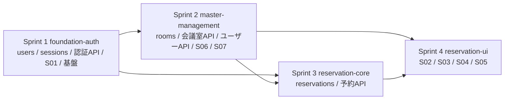

# 実装計画書 — 会議室予約システム

> 本書は `spec-driven-dev` Skill フェーズP005の成果物です。
> インプット: `docs/P001-requirement.md`、`docs/P002-frontend-spec.md`、`docs/P003-backend-spec.md`、`docs/P004-traceability-matrix.md`
> **改訂(CR-001 / P903 2026-08-05)**: CR-001(予約にオンライン会議URL)の作業を既存スプリントへの差分として位置づけ、第2.3節・第2.4節・第3.3節に追記しました。新しいスプリントは追加しません。

## 1. 実装単位の方針

実装は **4スプリント** に分割する。分割は次の原則に従った。

* 各スプリントで実装する「画面数 + API数 + データモデル数」がおおむね揃うようにしたうえで、技術的難易度・リスクを重みとして加味する(重複チェックと排他制御を含むスプリントは、見かけの量が同程度でも重いものとして扱う)。
* 各スプリントが依存する画面・API・データモデルは、先行スプリントで実装済みである。
* 各スプリントは、そのスプリントに閉じて単体テストおよび結合テストができる。
* 不確定要素の大きい要素(認証基盤・マイグレーション方式・予約の重複チェック)は、なるべく前のスプリントに寄せる。

### 1.1 スプリント一覧

| # | スプリント名(英語) | 位置づけ | 主な難易度・リスク |
| --- | --- | --- | --- |
| Sprint 1 | `foundation-auth` | プロジェクト骨格、DB接続とマイグレーション基盤、ユーザーとセッション、認証API、ログイン画面、フロントエンド共通基盤 | **高**: 以降の全スプリントが依存する土台。マイグレーションの冪等性・パスワードハッシュ・セッション管理という後戻りコストの大きい要素を含む |
| Sprint 2 | `master-management` | 会議室マスタとユーザーマスタのCRUD API、管理者向け2画面 | **低〜中**: 定型的なCRUDが中心。認可(管理者限定)と業務制約(最後の管理者、予約が残る会議室)の判定を含む |
| Sprint 3 | `reservation-core` | 予約のデータモデルと6本の予約API、重複チェックと排他制御 | **高**: 本システムの中核。区間の重なり判定、`BEGIN IMMEDIATE` による排他制御、更新時の自己除外 |
| Sprint 4 | `reservation-ui` | 予約系の4画面(カレンダー・作成・詳細編集・マイ予約)と画面↔API接続 | **中**: 新規APIはなく、既存APIの利用と画面ロジック(グリッド描画、終日チェック、権限による表示制御) |

### 1.2 量と難易度の均衡

| # | 画面数 | API数 | データモデル数 | 単純合計 | 難易度重み | 加重後の目安 |
| --- | --- | --- | --- | --- | --- | --- |
| Sprint 1 | 1 (S01) | 3 | 3 (`users` / `sessions` / `schema_migrations`) | 7 | ×1.5(基盤・後戻りコスト大) | 10.5 |
| Sprint 2 | 2 (S06, S07) | 8 | 1 (`rooms`) | 11 | ×0.9(定型CRUD) | 9.9 |
| Sprint 3 | 0 | 6 | 2 (`reservations` / `reservation_attendees`) | 8 | ×1.4(排他制御・重複判定) | 11.2 |
| Sprint 4 | 4 (S02, S03, S04, S05) | 0(既存APIの利用のみ) | 0 | 4 | ×2.5(画面あたりの実装量が大きい。特にS02のグリッド描画) | 10.0 |

* 加重後の目安がおおむね10前後に揃っており、極端に重いスプリントはない。厳密な行数の均等化は行っていない。

## 2. スプリント別の実装対象

### 2.1 Sprint 1: `foundation-auth`

* **データモデル**: `users`(P002 6.2)、`sessions`(P003 3.2)、`schema_migrations`(P003 3.3)。マイグレーションファイル `001-init.sql` に `users` / `sessions` / `schema_migrations` 以外のテーブルも含めるか否かは、後続スプリントで新しい連番ファイルを追加する方針とする(P003 3.5 の「一度コミットしたマイグレーションファイルは編集しない」に従う)。
* **API**: API-01 `POST /api/auth/login`、API-02 `POST /api/auth/logout`、API-03 `GET /api/me`。
* **画面**: S01 ログイン画面。
* **基盤**:
  * `server/` の初期化(`uv` 前提の `pyproject.toml`、`src/meeting_room/` のパッケージ構成)。
  * `db.py`(接続、`PRAGMA foreign_keys=ON` / `journal_mode=WAL`、`BEGIN IMMEDIATE` ヘルパ、差分適用マイグレーション)。
  * `errors.py`(`ApiError` とエラーレスポンス変換)、ログ出力ミドルウェア(P003 4.4)。
  * `security.py`(scryptハッシュ、セッションID生成)。
  * 初期管理者シード(P003 3.6)。
  * `client/` の初期化(`index.html`、ハッシュルーター、APIクライアント、共通ヘッダー、エラー表示ユーティリティ)。
  * サーバーからの静的ファイル配信(P003 7章)。
* **このスプリント終了時に動作すること**: ログイン → 空のカレンダー画面の枠(ヘッダーのみ)表示 → ログアウト。未認証で他画面にアクセスするとS01へ戻る。

### 2.2 Sprint 2: `master-management`

* **データモデル**: `rooms`(P002 6.2)、および `uq_rooms_name_active` 部分ユニークインデックス(P003 3.4)。マイグレーション `002-rooms.sql` を追加する。
* **API**: API-04〜API-07(会議室)、API-08〜API-11(ユーザー)。
* **画面**: S06 会議室管理画面、S07 ユーザー管理画面。
* **含まれる業務ルール**: 有効な会議室名の一意性、今後の予約がある会議室の無効化拒否(**Sprint 3で `reservations` が作られるまでは「予約0件」として扱う暫定実装ではなく、`reservations` テーブルの存在を前提とした実装をSprint 3で追加する**。Sprint 2 時点ではこの判定を関数として切り出し、常に0件を返す実装+TODOコメントとし、Sprint 3で本実装に差し替える)。★FIXME★ この段階的実装はスプリント順序上の妥協である。会議室の無効化を Sprint 3 以降に回す案もあるが、S06 の完成が遅れるため上記を選んだ。人間の確認を要する。
* **含まれる認可**: `require_admin`(P003 4.3)、`scope=attendee_candidates` の一般ユーザー開放(P002 5.6)。
* **このスプリント終了時に動作すること**: 管理者による会議室・ユーザーのCRUD一式。一般ユーザーがS06/S07およびその管理系APIにアクセスできないこと。

### 2.3 Sprint 3: `reservation-core`

* **データモデル**: `reservations`、`reservation_attendees`、および `idx_reservations_*` インデックス(P003 3.4)。マイグレーション `003-reservations.sql` を追加する。
* **API**: API-12〜API-17(予約の一覧・自分の予約・詳細・登録・更新・取消)。
* **画面**: なし(このスプリントはバックエンドに閉じる)。
* **中核ロジック**: 重複判定(P003 5.1・5.2)、`BEGIN IMMEDIATE` による排他制御(P003 5.3)、更新時の自己除外、収容人数超過チェック、過去日の扱い、予約者本人/管理者の判定。
* **Sprint 2 からの持ち越し**: API-07 の「今後の予約が1件以上ある会議室は無効化できない」判定を本実装に差し替える。
* **このスプリント終了時に動作すること**: HTTPクライアント(`curl` 相当)から予約のCRUDと重複拒否が確認できる。
* **※CR-001 による差分**: `reservations` に `meeting_url` 列を追加する(マイグレーション `004-meeting-url.sql`)。`schemas.ReservationRequest` にスキーマ検証を追加し、`reservations_repo` の `SELECT` / `INSERT` / `UPDATE` と API-15/16 に列を通す。**新規スプリントは作らず、Sprint 3 の対象範囲の差分として扱う**(既存の予約APIモジュールに閉じた変更であり、依存関係が変わらないため)。

### 2.4 Sprint 4: `reservation-ui`

* **データモデル**: なし。
* **API**: なし(Sprint 1〜3で実装済みのAPIを利用する)。
* **画面**: S02 予約カレンダー画面、S03 予約作成画面、S04 予約詳細・編集画面、S05 マイ予約一覧画面。
* **含まれるロジック**: 週グリッドの描画と空きセル判定、空きセルからS03への値の引き継ぎ、終日チェックボックス、参加予定人数と収容人数のクライアント側検証、409/400のエラー表示、予約者本人・管理者による編集/取消ボタンの出し分け、期間フィルタ。
* **このスプリント終了時に動作すること**: P001の画面遷移図に沿った一連の操作がブラウザ上で完結する。
* **※CR-001 による差分**: S03・S04 の予約入力フォーム(共通部品 `reservation-form.js`)にオンライン会議URLの入力欄とクライアント側検証を追加し、S04の閲覧モードにリンク表示を追加する。**S02は対象外**(CR-001が明示的に除外)。Sprint 4 の対象範囲の差分として扱う。

## 3. 全体対応表(実装漏れの検証)

### 3.1 画面 × スプリント

| 画面ID | 画面名 | 実装スプリント |
| --- | --- | --- |
| S01 | ログイン画面 | Sprint 1 |
| S02 | 予約カレンダー画面 | Sprint 4 |
| S03 | 予約作成画面 | Sprint 4 |
| S04 | 予約詳細・編集画面 | Sprint 4 |
| S05 | マイ予約一覧画面 | Sprint 4 |
| S06 | 会議室管理画面 | Sprint 2 |
| S07 | ユーザー管理画面 | Sprint 2 |

* 全7画面が、いずれかのスプリントに割り当てられている(漏れなし)。

### 3.2 API × スプリント

| API | メソッド・パス | 実装スプリント |
| --- | --- | --- |
| API-01 | POST `/api/auth/login` | Sprint 1 |
| API-02 | POST `/api/auth/logout` | Sprint 1 |
| API-03 | GET `/api/me` | Sprint 1 |
| API-04 | GET `/api/rooms` | Sprint 2 |
| API-05 | POST `/api/rooms` | Sprint 2 |
| API-06 | PUT `/api/rooms/{room_id}` | Sprint 2 |
| API-07 | DELETE `/api/rooms/{room_id}` | Sprint 2(予約件数判定のみ Sprint 3 で本実装) |
| API-08 | GET `/api/users` | Sprint 2 |
| API-09 | POST `/api/users` | Sprint 2 |
| API-10 | PUT `/api/users/{user_id}` | Sprint 2 |
| API-11 | DELETE `/api/users/{user_id}` | Sprint 2 |
| API-12 | GET `/api/reservations` | Sprint 3 |
| API-13 | GET `/api/reservations/mine` | Sprint 3 |
| API-14 | GET `/api/reservations/{reservation_id}` | Sprint 3 |
| API-15 | POST `/api/reservations` | Sprint 3 |
| API-16 | PUT `/api/reservations/{reservation_id}` | Sprint 3 |
| API-17 | DELETE `/api/reservations/{reservation_id}` | Sprint 3 |

* 全17APIが、いずれかのスプリントに割り当てられている(漏れなし)。

### 3.3 データモデル × スプリント

| テーブル | 定義元 | 実装スプリント | マイグレーションファイル |
| --- | --- | --- | --- |
| `schema_migrations` | P003 3.3 | Sprint 1 | (起動処理が `CREATE TABLE IF NOT EXISTS` で作成) |
| `users` | P002 6.2 | Sprint 1 | `001-init.sql` |
| `sessions` | P003 3.2 | Sprint 1 | `001-init.sql` |
| `rooms` | P002 6.2 | Sprint 2 | `002-rooms.sql` |
| `reservations` | P002 6.2 | Sprint 3 | `003-reservations.sql` |
| `reservation_attendees` | P002 6.2 | Sprint 3 | `003-reservations.sql` |
| `reservations`(列追加 `meeting_url`)※CR-001 | P002 6.2 | Sprint 3(CR-001の差分) | `004-meeting-url.sql` |

* 全6テーブル(P002の4テーブル + P003の内部2テーブル)が割り当てられている(漏れなし)。
* ※CR-001: テーブルの新規追加は無く、`reservations` への列追加のみ。適用済みの `003-reservations.sql` は編集せず、新しい連番ファイル `004-meeting-url.sql` を追加する(P003 3.5)。

### 3.4 依存関係

* Sprint 3 は `reservations.room_id` / `user_id` の外部キー先(`rooms` / `users`)を必要とするため、Sprint 1・2に依存する。
* Sprint 4 は S02/S03 が `GET /api/rooms`(Sprint 2)と予約API(Sprint 3)を、S03/S04 が `GET /api/users?scope=attendee_candidates`(Sprint 2)を必要とするため、Sprint 2・3に依存する。
* 逆方向の依存(先のスプリントが後のスプリントの成果物を必要とする)は、API-07 の予約件数判定のみであり、これは第2.2節のとおり関数の差し替えとして扱う。

## 4. インフラ・ミドルウェア・データベースのスプリント要否

`docs/P003-backend-spec.md` 第8章から本フェーズへ委譲された項目について、専用スプリントの要否を判断する。

| 委譲された項目 | 判断 | 理由・引き継ぎ先 |
| --- | --- | --- |
| データベース(SQLite) | **専用スプリント不要**。Sprint 1 に含める | SQLiteはファイルベースであり、別プロセスのミドルウェアを起動する必要がない。スキーマ適用は起動処理に組み込む(P003 3.5) |
| 可用性(プロセス監視・自動再起動) | **専用スプリント不要**。アプリ側の要件(再起動可能であること)はSprint 1で満たす。実際の監視・再起動ポリシーは `docs/P302-deliver.md` に委譲 | 単一プロセス構成であり、監視は配布形態(docker compose の `restart` ポリシー等)に属する。アプリケーションコードとして実装するものがない |
| TLS終端 | **専用スプリント不要**。`docs/P302-deliver.md` に委譲 | P003 8章のとおり、アプリはHTTPで待ち受け、TLS終端は外側のリバースプロキシが行う前提。実装対象のコードがない |
| ログ集約基盤 | **専用スプリント不要**。標準出力へのJSON出力はSprint 1で実装。集約・監視は `docs/P302-deliver.md` に委譲 | 同上 |
| スケーラビリティ(将来のスケールアウト) | **本バージョンでは対象外**。設計上の配慮(プロセス内状態を持たない)をSprint 1・3で満たす | P001が「単一サーバー構成で十分」としているため |

* 以上より、**インフラ専用のスプリントは設けない**。実行環境に属する事項は `docs/P302-deliver.md`(Closing)へ引き継ぐ。★FIXME★ 実運用に向けては、リバースプロキシ・プロセス監視・ログ転送の構成をP302で確定する必要がある(P003 8章の委譲を受けた引き継ぎ事項)。

## 5. リスクと不確定要素

| # | リスク・不確定要素 | 対応するスプリント | 対応方針 |
| --- | --- | --- | --- |
| 1 | 実行環境が外部パッケージレジストリに到達できないため、P001指定の技術スタックを使えない(P004 第3章の逸脱#1・#2) | Sprint 1 | 標準ライブラリと入手済みパッケージのみで構成する。Sprint 1 の最初のタスクで、依存パッケージなしでサーバーが起動できることを確認する |
| 2 | マイグレーションの冪等性が破綻すると、2回目の起動でアプリが立ち上がらない | Sprint 1 | 差分適用方式(P003 3.5)を最初に実装し、同一DBに対する2回起動をテスト観点に含める(`docs/P006-test-plan.md` の運用観点) |
| 3 | 予約の重複チェックが同時リクエストで破れる(TOCTOU) | Sprint 3 | `BEGIN IMMEDIATE` による排他制御(P003 5.3)。並行リクエストのテストをP008/P009に含める |
| 4 | S02のグリッド描画がフレームワークなしでは実装量が大きい | Sprint 4 | Sprint 4 の実装タスクを画面単位に細分化し、S02を最初に着手する |
| 5 | API-07 の予約件数判定がスプリントをまたぐ(第2.2節) | Sprint 2 → Sprint 3 | 判定を単一の関数に切り出し、Sprint 3で差し替える。差し替え忘れを防ぐため、Sprint 3の完了条件に明記する |

## 6. スプリントの完了条件(共通)

各スプリントは、次をすべて満たしたときに完了とする。

1. `docs/P007-impl-direction/U00N-*.md` に定義された全タスクが完了している。
2. そのスプリントの単体テストがすべて合格している(P007の指示による)。
3. そのスプリントに対応する `docs/P008-test-direction/T0NN-*.md` の結合テストが実行され、結果が記録されている(FAILが残ってもよい。修正はReviewer Loopで行う)。
4. `docs/P007-impl-direction.md` の該当スプリント行のチェックボックスが `[x]` になっている。
