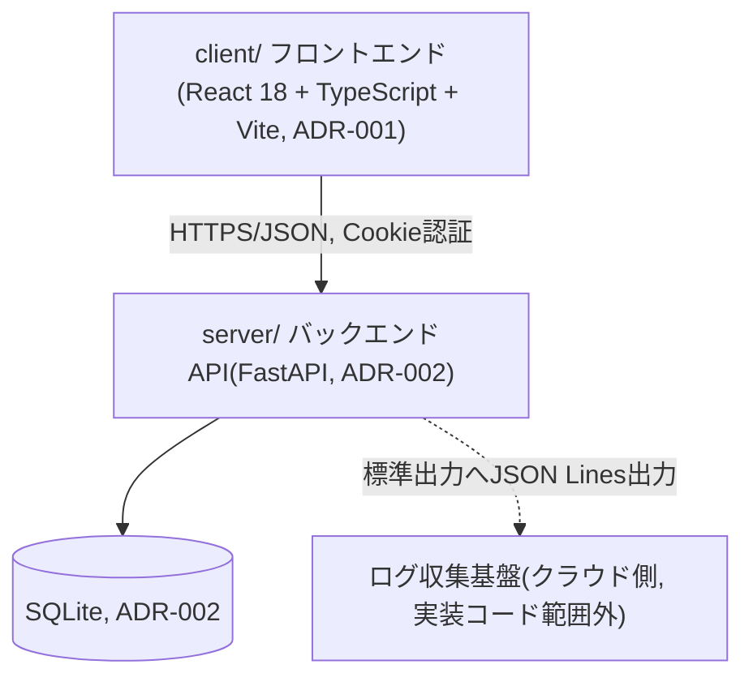

# ArchitectureHandbook.md

このドキュメントは、P022フェーズで作成・更新する。目的は、後続のAgent(Executor・Reviewer Loop・Refactor)が `docs/P001-requirement.md` 〜 `docs/P009-acceptance-direction.md` を毎回読み直さなくても、アプリケーションの技術的側面を短時間で把握できるようにすることである。

* 詳細な仕様そのものはここに書かない。詳細は `docs/P002-frontend-spec.md` `docs/P003-backend-spec.md` などの原本を参照させ、ここには「どこに何が書いてあるか」と「実装・運用にあたって知っておくべき技術的な要点」だけをまとめる。
* 仕様が変わるたびに全面書き直しするのではなく、差分だけを更新する。矛盾が出た場合は原本(`docs/P00N-*.md`)を正とする。
* 記載内容が古くなっていないかは、P020(実装構造生成/修正)・P021(ADR整理)と合わせて確認する。

## 1. アプリケーション概要

* アプリケーション名: 会議室予約システム(Meeting Room Reservation System)
* 一言で言うと何のアプリか: 社内の会議室予約を一元管理し、空き状況の確認から予約・変更・取消までをオンラインで完結させる社内向けWebアプリケーション。
* 参照元: `docs/P001-requirement.md`

## 2. 全体構成図

* クライアント・サーバ型の構成。単一アプリではなく `client/`・`server/` の2ソースツリーに分かれる(`docs/P005-impl-plan.md` 1章)。
* 外部サービス連携は無い(`docs/P001-requirement.md` 「連携・参考にする既存システムの有無: 既存システムなし」、Googleカレンダー/Outlook連携は対象外)。

## 3. 技術スタック

| レイヤ | 技術 | バージョン | 選定理由の参照先 |
| --- | --- | --- | --- |
| フロントエンド | React 18 + TypeScript + Vite(状態管理はReact標準のみ、react-router-dom) | 未固定(P007 U001-T1で`package.json`確定) | ADR-001 |
| バックエンド | Python + FastAPI(Pydantic v2) | 未固定(P007 U001-T1で`pyproject.toml`確定) | ADR-002 |
| データベース | SQLite(stdlib `sqlite3`) | - | ADR-002 |
| 認証 | Cookieベースサーバーサイドセッション(HttpOnly, SameSite=Lax, 8時間固定、`hashlib.scrypt`によるパスワードハッシュ) | - | ADR-003 |
| マイグレーション | バージョン管理テーブル(`schema_migrations`)による差分適用 | - | ADR-004 |
| インフラ/デプロイ | 未確定(TLS終端はリバースプロキシ側の前提のみP003で規定。具体構成はP005/P302で確定予定) | - | (P302で確定後にADR化を検討) |

## 4. ディレクトリ構成の方針

* コード格納先はクライアント・サーバ型の命名規則に従い `client/`(フロントエンド)、`server/`(バックエンド)とする(`docs/P005-impl-plan.md` 1章、`docs/P007-impl-direction.md` 冒頭)。
* 各ソースツリー配下の `INDEX.md`(`client/INDEX.md`、`server/INDEX.md`)がそのツリーの目次を持つ(P020、INDEX形式は`SKILL.md`「INDEX形式について」参照)。本ハンドブック執筆時点では両ディレクトリとも未実装(見出し+「(実装前)」のプレースホルダのみ)。
* ビルドツール: フロントエンドはnpm(`npm create vite@latest`相当で初期化)、バックエンドはuv(`uv init`相当で初期化)。いずれも`docs/P007-impl-direction/U001-foundation-and-auth.md` U001-T1で初期化する。

## 5. データモデルの要点

* テーブル: `users`(社員ID・氏名・パスワードハッシュ・権限・有効フラグ)、`rooms`(会議室名・収容人数・設備・説明文・有効フラグ)、`reservations`(会議室・予約者・件名・開始/終了日時・参加予定人数・備考・オンライン会議URL)、`reservation_participants`(予約と参加者の中間テーブル)、`sessions`(セッション管理)、`schema_migrations`(マイグレーション管理)。詳細は `docs/P002-frontend-spec.md` 5章(UI成立に必要な範囲)・`docs/P003-backend-spec.md` 2章(完全なDDL)を参照。
* **CR-001対応(※P903内側のP022再実行で追記)**: `reservations.meeting_url`(NULL許容TEXT、`http://`/`https://` 始まり・最大500文字)を `server/migrations/003_add_reservation_meeting_url.sql` で追加した(`ALTER TABLE ... ADD COLUMN`)。既存テーブルへのカラム追加であり新規テーブルではないため、上表のテーブル一覧・6テーブルという数自体に変更はない。マイグレーション方式(バージョン管理テーブル、`schema_migrations`)がこの追加後も冪等に動作することは `docs/P903-cr-records/CR-001.md` で実地確認済み。
* 状態を持つのはセッション(スコープ: ユーザーセッション、実現方法: `sessions`テーブル、SQLite永続化)のみ。インメモリキャッシュは導入しない(`docs/P003-backend-spec.md` 1.3節)。
* 予約の時刻表現は用途によって `date`/`start_time`/`end_time`(フォーム系エンドポイント)と `start_datetime`/`end_datetime`(カレンダー一覧エンドポイント)を使い分ける。理由・変換方針は `docs/P002-frontend-spec.md` 4章冒頭、`docs/P003-backend-spec.md` 4.6〜4.9.2節を参照。

## 6. API/画面構成の要点

* 画面: S01ログイン、S02予約カレンダー(トップ)、S03予約作成、S04予約詳細・編集、S05マイ予約一覧、S06会議室管理(管理者用)、S07ユーザー管理(管理者用)。全7画面、詳細は `docs/P002-frontend-spec.md` 3章。
* API: 認証系3、会議室系4、予約系6、参加者候補系1(`GET /api/users/directory`、P001には無いがS03/S04の参加者選択を実現するための詳細化。`docs/P002-frontend-spec.md` 4.10.1節)、ユーザー管理系4の計18本。外部仕様は `docs/P002-frontend-spec.md` 4章、内部実現は `docs/P003-backend-spec.md` 4章。
* P002/P003の役割分担: 外部から見える契約(エンドポイント・リクエスト/レスポンス形式・ステータスコード)はP002で確定し、内部実現(ハッシュ方式、排他制御、Repository構成等)はP003で確定する。認証方式・参加者候補APIなど、判断に迷いやすい項目には両文書間の相互参照を明記している(`docs/P002-frontend-spec.md` 2章・4.10.1節、`docs/P003-backend-spec.md` 1.2節・4.10節)。

## 7. 実装・テストの単位

* スプリント: U001(foundation-and-auth)→U002(room-management)→U003(reservation-core-and-calendar、排他制御を含む最難関スプリント)→U004(reservation-detail-and-mylist)→U005(user-management-and-hardening)の5スプリント。依存順・リスク前倒しの原則で並べている。詳細は `docs/P005-impl-plan.md`。
* テストレベル: 単体テスト(`docs/P007-impl-direction.md`、スプリントごとのタスクに内包)、結合テスト(`docs/P008-test-direction.md`、スプリント内/モジュール間、T001〜T015)、システムテスト・受け入れテスト(`docs/P009-acceptance-direction.md`、スプリント横断、A001〜A011)。方針の詳細は `docs/P006-test-plan.md`。
* フロントエンドのテスト実行は `node --import tsx --test`(`.tsx`のTS/JSXをNode.js標準テストランナーで実行するため`tsx`ローダーを使用)。P009側のブラウザ操作テストは`.js`・素の`node --test`(詳細は`docs/P006-test-plan.md` 5章)。バックエンドは`pytest`。
* 運用観点として、アプリケーション再起動時のマイグレーション冪等性確認(`docs/P009-acceptance-direction/A009-restart-resilience.md`)を必須のテストタスクとして含む。

## 8. 横断的関心事

* **認証・認可**: Cookieベースセッション(ADR-003)。認可は「未ログイン→401」「権限不足→403」を全APIで共通化(`docs/P002-frontend-spec.md` 4章冒頭の共通エラー形式)。管理者専用API/画面は`role=admin`チェックを要求する。
* **エラーハンドリングの方針**: 全APIが共通のエラーレスポンス形式 `{"error": {"code", "message", "fields"?}}` を返す(`docs/P002-frontend-spec.md` 4章冒頭)。バリデーションエラーは400+`fields`、認証エラーは401、認可エラーは403、Not Foundは404、予約重複は409。
* **ログ出力・監視の方針**: 構造化ログ(JSON Lines)を標準出力に出力し、クラウド側のログ収集基盤(例: CloudWatch Logs)に集約する前提(実際の収集基盤設定はアプリケーションコードの範囲外、`docs/P003-backend-spec.md` 5章・6章)。
* **設定値・環境変数の管理方針**: `DATABASE_PATH`(SQLiteファイルパス)、`COOKIE_SECURE`(Cookieの`Secure`属性を本番でのみ有効化)を想定。具体的な環境変数の一覧・管理方式はP005実装計画・P302納品物作成で確定する(`docs/P003-backend-spec.md` 4.1節)。

## 9. 既知の制約・技術的負債

* ★ACCEPTED★ SQLiteは複数プロセス・複数ホストでの水平スケールに適さない。検討した代替: PostgreSQL等の外部DBサーバ。不採用理由: 想定規模(300名、同時30接続)では運用コストに見合わない。残存リスク: 将来の多拠点展開等でユーザー数・同時接続数が大幅に増える場合は移行が必要(ADR-002参照)。
* ★ACCEPTED★ 認証はJWTではなくCookie+サーバーサイドセッション。検討した代替: JWT。不採用理由: 即時失効の実現がセッション方式より複雑になる。残存リスク: セッションテーブルへの問い合わせがリクエストごとに発生するが、想定規模では性能上の懸念は小さい(ADR-003参照)。
* ★ACCEPTED★ 予約の取消は物理削除であり取消履歴は残らない。検討した代替: 論理削除+履歴閲覧画面。不採用理由: 対応する画面要求がP001に無くスコープ外。残存リスク: 監査ログが必要になった場合はCRとして起票が必要(`docs/P002-frontend-spec.md` 4.9.2節参照)。
* ★ACCEPTED★ ヘッダーの「ユーザー管理」リンクはS06画面表示中のみ表示し、他画面からは直接遷移できない。検討した代替: 全管理者画面のヘッダーから常時アクセス可能にする。不採用理由: `docs/P001-requirement.md`画面遷移図がS06経由の1経路のみを定義しており、上流文書を優先した。残存リスク: 管理者がユーザー管理へ遷移する際に1クリック分の手間が生じるが軽微(`docs/P002-frontend-spec.md` 3.0節参照)。
* ★FIXME★(未解決、要人間確認): 社員ID書式、パスワードポリシー、カレンダー営業時間帯(08:00-20:00・30分刻み)、週表示の起点(月曜始まり)、会議室設備の選択肢、TLS終端の具体構成など、`docs/P001-requirement.md`に明記が無く`docs/P002-frontend-spec.md`・`docs/P003-backend-spec.md`側で仮定した項目が複数ある。各文書内の★FIXME★をgrepして確認すること(該当箇所は`docs/P002-frontend-spec.md`に18箇所、`docs/P003-backend-spec.md`に7箇所)。
* 将来的に見直しが必要な点(CR起票候補): 初期管理者アカウントの初期パスワード(`docs/P007-impl-direction/U001-foundation-and-auth.md` U001-T2、固定値`ChangeMe123!`)は本番投入前に変更または強制変更フローの追加が必要。

## 10. 関連ドキュメントへのリンク

* `docs/P001-requirement.md` 〜 `docs/P009-acceptance-direction.md`
* `docs/ADR.md`
* `client/INDEX.md` / `server/INDEX.md`(現時点ではいずれも「(実装前)」のプレースホルダ)
* `./INDEX.md`(P301で作成予定、本バージョンではまだ未作成)
