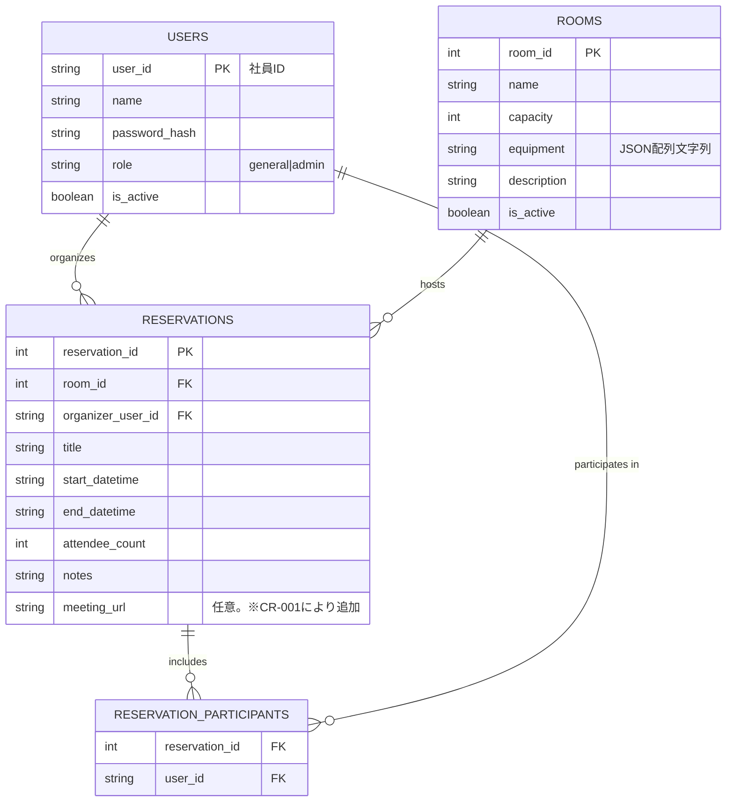
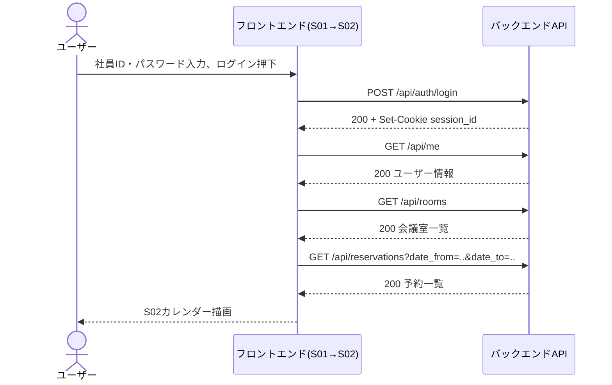
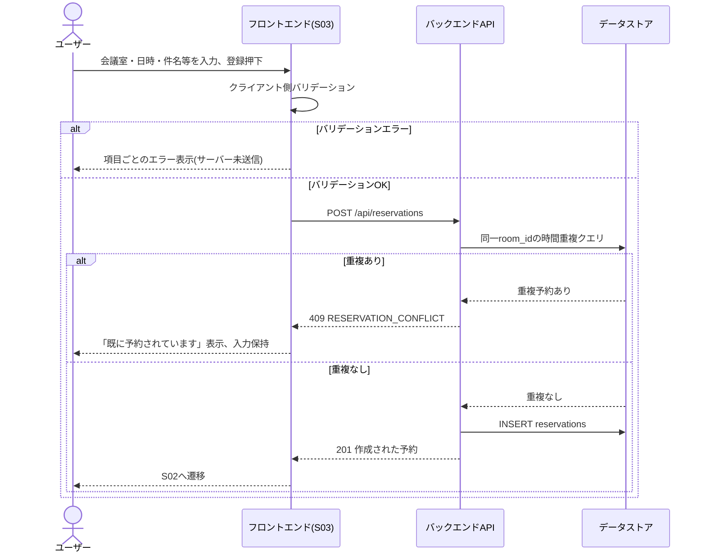

# ユーザインタフェース設計書 — 会議室予約システム

> 本書は `spec-driven-dev` Skill フェーズP002の成果物です。`docs/P001-requirement.md` の画面一覧・API一覧を詳細化し、フロントエンドの仕様(バリデーション、API外部契約、UI成立に必要なデータモデル)を確定します。

## 0. 技術スタックについて

* フロントエンド技術スタックは `docs/P001-requirement.md` の指定どおり **React 18 + TypeScript + Vite** とする。状態管理はReact標準(useState/useContext)のみを用い、Redux等の外部状態管理ライブラリは導入しない。
* この技術選定は `docs/ADR.md` の **ADR-001**(フロントエンド技術スタック)として記録済みである(P021、Overview Stepで確定。旧版では「ADR-001見込み」と暫定表記していたが、P021実行によりこの表記は解消した)。
* ネットワーク接続を確認したところ npm レジストリ (`registry.npmjs.org`) には到達可能であった(2026-08-09時点、HTTPステータス200)。したがって `V0.7_testbed` で行ったような技術代替(Starlette/plain JS等)は本バージョンでは行わない。P001指定どおりの技術スタックを採用する。

## 1. 用語

| 用語 | 意味 |
| --- | --- |
| 予約者 | 予約を作成したユーザー(`reservations.organizer_user_id`)。S03で予約を作成した本人。 |
| 参加者 | 予約に招待されたユーザー(予約者本人を含まない)。S03の「参加者」入力欄で選択される。 |
| 一般ユーザー | `role = general` のアカウント。自分の予約のみ作成・編集・取消できる。 |
| 管理者 | `role = admin` のアカウント。全予約の編集・取消、会議室管理、ユーザー管理ができる。 |
| 論理削除 | レコードを物理削除せず `is_active = false` にすることで一覧・選択肢から除外する方式。会議室・ユーザーに適用する(下記4章参照)。予約の取消は物理削除とする(3.4節参照)。 |

## 2. 認証方式(外部契約)

* 認証はCookieベースのサーバーサイドセッションとする(この方式の採否は `docs/ADR.md` **ADR-003** として記録済み。JWT不採用の理由もADR-003参照)。ログイン成功時にサーバーがセッションを発行し、`Set-Cookie` でセッションIDをブラウザに渡す。以降のリクエストはこのCookieを自動送信することで認証される(トークンをJSレイヤーで保持・付与する方式は採らない)。
  * Cookie名: `session_id`
  * 属性: `HttpOnly`(JSからアクセス不可), `Secure`(HTTPS必須。非HTTPS環境では付与しない。開発時の扱いは `docs/P003-backend-spec.md` 参照), `SameSite=Lax`, `Max-Age=28800`(8時間)
  * セッションの有効期限は固定8時間とし、操作によるスライド延長は行わない(8時間経過後は再ログインが必要)。★ACCEPTED★ スライド延長方式(操作のたびに有効期限を延長)も検討したが、実装・テストの複雑さに対して本アプリの利用シーン(社内勤務時間中の利用が中心)では固定8時間で十分と判断した。残存リスク: 8時間を超える連続作業中にセッション切れが発生し得るが、その場合は再ログインで復帰可能であり業務影響は小さいと判断する。
  * このCookieの発行・検証・保存方式(セッションストアの実現方法、パスワードハッシュ方式)は内部実現であり `docs/P003-backend-spec.md` で確定する。
* 認可: `role = admin` を要求するAPI(会議室・ユーザー管理系)は、セッションのユーザーが管理者でない場合 `403 Forbidden` を返す。未ログインの場合は `401 Unauthorized` を返す(403と401を区別する。存在確認より認証確認を優先する)。

## 3. 画面ごとの詳細仕様

### 3.0 共通ヘッダー仕様(★P010初回レビューで発見された不足を補うため追記)

S02・S04・S05・S06・S07(ログイン後の全画面)は共通のヘッダーコンポーネントを持つ。表示するリンクは画面によって以下のとおり異なる(`docs/P001-requirement.md` 画面遷移図の遷移経路と一致させる)。

| リンク | 表示条件 |
| --- | --- |
| ログインユーザー名 | 全画面・全ユーザー |
| 「マイ予約」 | 全画面・全ユーザー |
| 「会議室管理」 | 全画面・管理者のみ(`docs/P001-requirement.md` 画面遷移図「S02→S06」に対応) |
| 「ユーザー管理」 | **S06画面表示中のみ**・管理者のみ(`docs/P001-requirement.md` 画面遷移図「S06→S07」に対応。他の画面のヘッダーには表示しない) |
| 「ログアウト」 | 全画面・全ユーザー |

★ACCEPTED★ 「ユーザー管理」へのアクセス経路をS06経由のみに限定するか、全画面のヘッダーから直接アクセス可能にするかを検討した。後者(全画面から直接アクセス可能)の方が管理者の操作効率は上がるが、`docs/P001-requirement.md` の画面遷移図は前者(S06経由のみ)を明示的に定義しており、この文書はP001に近い上流工程の文書であるため、これを正としてP002を合わせた。会議室管理とユーザー管理はいずれも総務・情シスの管理者機能であり、動線をS06に集約すること自体に業務上の不自然さは無いと判断する。残存リスク: 管理者がユーザー管理へ遷移する際に必ずS06を経由する1クリック分の手間が生じるが、軽微であり許容する。将来この制約が使い勝手上の問題として顕在化した場合はCRとして見直す。

### 3.1 S01 ログイン画面

**レイアウト概要**: 画面中央にログインフォーム(社員ID・パスワード・ログインボタン)を配置する単一カラムのシンプルな画面。

| 項目名 | 型 | 必須 | バリデーションルール | エラーメッセージ |
| --- | --- | --- | --- | --- |
| ユーザーID(社員ID) | text | 必須 | 半角英数字、4〜20文字。★FIXME★ 社員ID書式はP001に明記が無いため、既存の社員番号体系を仮定せず半角英数字4〜20文字という一般的な制約で仮置きした。実際の社員ID体系が確定次第、書式を修正すること。 | 「社員IDを入力してください」(未入力時) |
| パスワード | password | 必須 | 1文字以上(パスワード強度ポリシーはP003のハッシュ方式とあわせて別途規定。★FIXME★ 最低文字数等のポリシーはP001に明記が無いため、新規登録時(S07)のバリデーションとして最低8文字を仮定する。ログイン画面自体では強度チェックは行わない=既存パスワードとの整合のため) | 「パスワードを入力してください」(未入力時) |

**動作**:

1. 「ログイン」ボタン押下で `POST /api/auth/login` を呼び出す(4.1節)。
2. 成功時: レスポンスの `Set-Cookie` によりセッションが確立される。画面はS02(予約カレンダー画面)へ遷移する。
3. 失敗時(401): 入力フォーム下部にエラーメッセージ「社員IDまたはパスワードが正しくありません」を表示する。社員IDが存在しない場合とパスワードが誤っている場合を区別するメッセージは出さない(アカウント存在の推測を防ぐため)。★ACCEPTED★ ユーザビリティ上は個別メッセージが親切だが、アカウント列挙攻撃(存在する社員IDの特定)を避けるため意図的に汎用メッセージに統一した。検討した代替: 個別エラーメッセージ。不採用理由: セキュリティ上のリスクが利便性の向上を上回ると判断。残存リスク: ユーザーが自分の入力ミスの原因(ID/パスワードどちらが誤りか)を特定しづらい。
4. ログイン済み状態でS01に直接アクセスした場合は、S02へリダイレクトする。

### 3.2 S02 予約カレンダー画面(トップ)

**レイアウト概要**: 上部に共通ヘッダー(3.0節参照。S02では「ユーザー管理」リンクは表示しない)。その下に日付/週の前後移動コントロールと会議室フィルタ。中央に会議室(列)×時間帯(行)のグリッド。

| 項目名 | 型 | 必須 | バリデーションルール |
| --- | --- | --- | --- |
| 表示日付/週 | date | 必須(既定値=当日を含む週) | 前後の週移動ボタンで変更。直接日付指定も可(カレンダーピッカー) |
| 会議室フィルタ | multi-select | 任意(既定=全会議室) | `GET /api/rooms` の結果(有効な会議室のみ)から選択 |

**表示仕様**:

* グリッドの行は30分刻みの時間帯とし、表示範囲は08:00〜20:00とする。★FIXME★ P001に営業時間・時間粒度の指定が無いため、一般的なオフィス営業時間帯を仮定して30分刻み・08:00-20:00とした。実際の運用時間に応じて確定すること。
* 週表示を既定とする(1週間=月〜金の平日5日、または月〜日7日かは★FIXME★ 未確定。本書では月曜始まりの7日間表示を仮定する。運用上土日の予約が実際に発生しない場合でも表示自体は妨げない)。
* 予約済みセルには「予約者名」「件名」を表示する。参加予定人数は表示しない(P001明記のとおり)。
* 自分が予約者、または参加者になっている予約セルは強調表示(背景色を変える)する。★FIXME★ 具体的な色指定はP001に無いため、実装時にUIコンポーネントライブラリの標準アクセントカラーを使う(デザインの詳細はこのフェーズの評価対象外。`SKILL.md` 各フェーズ共通指示の「図に関しては記述内容を評価しない」と同様、UIの色そのものの完成度は評価対象外とするが、この仮定自体は要確認事項として残す)。
* 空きセルをクリックするとS03(予約作成画面)へ、開始日時・会議室を引き継いで遷移する。
* 自分が予約者または参加者である予約セルをクリックするとS04(予約詳細・編集画面)へ遷移する。他者のみの予約セル(自分が無関係)をクリックした場合、一般ユーザーは詳細画面を開けず、簡易ツールチップ(件名・予約者名のみ)を表示する。管理者は誰の予約でもS04を開ける。★FIXME★ P001に「他者の予約セルをクリックした場合の一般ユーザー向け挙動」の明記が無いため、上記のとおり仮定した。

**動作**:

1. 画面表示時に `GET /api/rooms`、`GET /api/reservations?date_from=...&date_to=...&room_id=...`(room_idはフィルタ選択時のみ)を呼び出す。
2. ヘッダーの「マイ予約」リンクでS05へ、「会議室管理」(管理者のみ表示)でS06へ遷移する。
3. 「ログアウト」ボタン押下で `POST /api/auth/logout` を呼び出し、成功後S01へ遷移する。

### 3.3 S03 予約作成画面

| 項目名 | 型 | 必須 | バリデーションルール | エラーメッセージ |
| --- | --- | --- | --- | --- |
| 会議室 | select | 必須 | `GET /api/rooms` の有効な会議室一覧から選択 | 「会議室を選択してください」 |
| 日付 | date | 必須 | 過去日付は選択不可(当日以降のみ)。★FIXME★ 当日より前の予約禁止はP001に明記が無いが、業務上自明な制約として仮定した。 | 「日付を選択してください」/「過去の日付は指定できません」 |
| 開始時刻 | time | 必須 | 08:00〜19:30、30分単位(3.2節のグリッド粒度と一致させる)。★FIXME★ 粒度はS02と同じ仮定に基づく。 | 「開始時刻を入力してください」 |
| 終了時刻 | time | 必須 | 開始時刻より後であること。08:30〜20:00、30分単位。 | 「終了時刻は開始時刻より後にしてください」 |
| 終日チェックボックス | checkbox | 任意 | チェック時、開始時刻に09:00、終了時刻に18:00を自動入力する。自動入力後も両時刻は手動で上書き可能(P001明記のとおり)。上書き後にチェックボックスを再度ON/OFFしても、既に手動編集された値は保持しない(再度09:00/18:00で上書きする)。★FIXME★ 「一度手動編集した後に終日を再チェックした場合の挙動」はP001に明記が無いため、単純化のため毎回上書きと仮定した。 | - |
| 件名 | text | 必須 | 最大100文字 | 「件名を入力してください」/「件名は100文字以内で入力してください」 |
| 参加者(社員) | multi-select | 任意 | `GET /api/users`(有効なユーザーのみ。ただし一般ユーザーが呼び出す場合、氏名・社員IDのみを返す簡易版とする。3.6節参照)から複数選択。予約者自身は選択肢に含めない(自動的に予約者になるため) | - |
| 参加予定人数 | number | 任意 | 1以上の整数。選択した会議室の収容人数(`rooms.capacity`)を超える値はエラー | 「参加予定人数は1以上の整数で入力してください」/「選択した会議室の収容人数(N名)を超えています」 |
| 備考 | textarea | 任意 | 最大500文字 | 「備考は500文字以内で入力してください」 |
| オンライン会議URL | text (url) | 任意 | `http://` または `https://` で始まること。最大500文字(※CR-001により追加) | 「オンライン会議URLは http:// または https:// で始めてください」/「オンライン会議URLは500文字以内で入力してください」 |

**動作**:

1. S02から遷移した場合、クリックした会議室・時間帯の値を初期値として引き継ぐ。
2. 「登録」ボタン押下時、上表のクライアント側バリデーションを実行し、エラーがあれば各項目の下に赤字で表示する(全項目まとめて表示。1件ずつのステップ検証はしない)。
3. クライアント側バリデーションを通過したら `POST /api/reservations` を呼び出す(4.6節)。
4. サーバー側で会議室・時間帯の重複が検出された場合(409 Conflict)、画面上部に「選択した会議室・時間帯は既に予約されています」という重複エラーメッセージを表示する(P001明記のとおり)。フォームの入力内容は保持し、ユーザーが時間帯を変更して再送信できるようにする。
5. 登録成功(201)時はS02へ遷移する(P001明記のとおり)。
6. 「キャンセル」ボタン押下時は入力内容を破棄しS02へ遷移する(P001明記のとおり)。確認ダイアログは出さない。★FIXME★ 入力途中の破棄について確認ダイアログの要否はP001に無いため、出さない方針を仮定した(シンプルさ優先)。

**参加予定人数チェックのタイミングについて**: クライアント側で会議室選択直後に収容人数を保持しておき、参加予定人数入力時にクライアント側でも即時検証する(サーバー側でも同じ検証を必ず行う。冗長化して二重チェックする方針。理由: クライアント側検証はJS改竄・API直叩きで回避可能なため、サーバー側検証を正とする)。

### 3.4 S04 予約詳細・編集画面

**表示項目**: 会議室名、日付、開始時刻/終了時刻、件名、参加者一覧(氏名)、参加予定人数、備考、オンライン会議URL、予約者氏名。バリデーションルールはS03と同一(会議室・日付・時刻・件名・参加予定人数・備考・オンライン会議URL)。

**オンライン会議URLの表示(※CR-001により追加)**: 値が設定されている場合、URL文字列をそのままテキスト表示するのではなく、クリック可能なリンク(`<a href="{値}" target="_blank" rel="noopener noreferrer">`)として表示する。値が未設定(空文字列またはnull)の場合はリンクを表示せず、「(未設定)」と表示する。編集フォームでは通常のテキスト入力欄として表示・編集し、S03と同じバリデーションルールを適用する(空欄に戻すことも可能)。

**編集可否**: 予約者本人または管理者のみ編集・取消が可能(P001明記のとおり)。それ以外のユーザーがURL直打ちなどでこの画面にアクセスした場合、表示のみ可能で編集フォームは非活性(read-only)にする。★FIXME★ 「予約者・管理者以外がアクセスした場合の閲覧可否」はP001に明記が無い。3.2節の一般ユーザー向け制約(他者のみの予約は詳細を開けない)と整合させ、そもそもS02からの遷移経路では到達しない前提だが、URL直打ちへの対処として読み取り専用表示を仮定した。

**動作**:

1. 画面表示時に `GET /api/reservations/{reservation_id}` を呼び出す。
2. 予約者本人または管理者の場合、編集フォームを表示する。「更新」ボタン押下で `PUT /api/reservations/{reservation_id}` を呼び出す。重複チェック・収容人数チェックはS03と同様(自分自身の予約は重複判定から除外する。4.7節参照)。
3. 「取消」ボタン押下で確認ダイアログ(「この予約を取り消しますか?」)を表示し、OK時に `DELETE /api/reservations/{reservation_id}` を呼び出す。成功後S02へ遷移する。
4. 更新完了/取消完了/キャンセルいずれもS02へ遷移する(P001明記のとおり)。

### 3.5 S05 マイ予約一覧画面

| 項目名 | 型 | 必須 | 内容 |
| --- | --- | --- | --- |
| 期間フィルタ | radio (今後の予約/過去の予約/すべて) | 任意(既定=今後の予約) | 「今後」は現在時刻以降に開始する予約、「過去」は終了済みの予約。★FIXME★ フィルタの選択肢に「すべて」を含めるかはP001に明記が無いが、実用上の利便性のため追加した。 |

**表示項目**: 日付、会議室名、時間帯(開始〜終了)、件名。一覧行をクリックするとS04へ遷移する(P001明記のとおり)。

**動作**: 画面表示時および期間フィルタ変更時に `GET /api/reservations/mine?period=upcoming|past|all` を呼び出す。

### 3.6 S06 会議室管理画面(管理者用)

**ヘッダー**: 共通ヘッダー(3.0節)に加え、S06画面表示中のみ「ユーザー管理」リンクを表示する(3.0節参照)。

**アクセス制御**: `role = admin` 以外のユーザーがアクセスした場合、画面を表示せず403エラーページ(または一覧へのリダイレクト)を表示する。★FIXME★ 具体的な非表示・リダイレクト先の挙動はP001に明記が無いため、「アクセス不可メッセージを表示してS02へのリンクを示す」という一般的な403画面を仮定した。

| 項目名 | 型 | 必須 | バリデーションルール | エラーメッセージ |
| --- | --- | --- | --- | --- |
| 会議室名 | text | 必須 | 最大50文字 | 「会議室名を入力してください」/「会議室名は50文字以内で入力してください」 |
| 収容人数 | number | 必須 | 1以上の整数 | 「収容人数は1以上の整数で入力してください」 |
| 設備 | multi-select or text | 任意 | 選択式チェックボックス群(例: プロジェクター/ホワイトボード/Web会議設備/電話会議設備)。★FIXME★ 設備の具体的な選択肢はP001に明記が無いため、一般的な会議室設備の例を仮置きした。フリーテキストではなく選択式にした理由は下記ACCEPTED参照。 | - |
| 説明文 | textarea | 任意 | 最大200文字(P001明記のとおり) | 「説明文は200文字以内で入力してください」 |
| 有効フラグ | toggle | 必須 | 既定=有効 | - |

* ★ACCEPTED★ 設備をフリーテキストではなく固定の選択式チェックボックス群にした。検討した代替: フリーテキスト入力(柔軟だが表記ゆれで検索・フィルタに使えない)。不採用理由: 将来的に設備でカレンダーを絞り込む拡張(本バージョンでは対象外)を想定すると、構造化されたデータの方が拡張しやすいと判断した。残存リスク: 選択肢に無い設備(将来増える什器等)を表現できない。この場合はS06の選択肢自体を増やす改修(CR)で対応する前提とする。

**削除**: 「削除」ボタン押下は論理削除(`is_active=false`)とする(P001明記のとおり)。物理削除は行わない(既存の予約が参照している会議室を物理削除すると予約データが破損するため)。確認ダイアログ(「この会議室を無効化しますか?」)を表示する。無効化された会議室は、S03の会議室プルダウンおよびS02の会議室フィルタ既定表示から除外されるが、既存の予約データ・S02の履歴表示には引き続き会議室名を表示する(そのため `GET /api/reservations` のレスポンスは会議室名をJOINして含める。4.8節参照)。

**動作**: 一覧表示は `GET /api/rooms?include_inactive=true`(管理者のみ有効な引数。3.6節限定で無効な会議室も含めて表示するため)。登録/編集/削除はそれぞれ4.4〜4.5節のAPIを呼び出す。

### 3.7 S07 ユーザー管理画面(管理者用)

**アクセス制御**: S06と同様、管理者以外は403とする。

| 項目名 | 型 | 必須 | バリデーションルール | エラーメッセージ |
| --- | --- | --- | --- | --- |
| 社員ID | text | 必須(新規登録時のみ編集可、以後は変更不可) | 半角英数字4〜20文字(3.1節と同じ仮定)。登録済みIDとの重複不可 | 「社員IDを入力してください」/「この社員IDは既に登録されています」 |
| 氏名 | text | 必須 | 最大50文字 | 「氏名を入力してください」 |
| パスワード | password | 新規登録時必須、編集時は任意(空欄=変更なし) | 8文字以上(3.1節★FIXME★参照) | 「パスワードは8文字以上で入力してください」 |
| 権限 | select(一般/管理者) | 必須 | 既定=一般 | - |
| 有効フラグ | toggle | 必須 | 既定=有効 | - |

**削除**: 論理削除(`is_active=false`、P001明記のとおり)。自分自身のアカウントを無効化しようとした場合はエラーとする(「自分自身は無効化できません」)。★FIXME★ 自己無効化の禁止はP001に明記が無いが、管理者が誤って自分をロックアウトする事故を防ぐための一般的な安全策として追加した。同様に、システム上最後の有効な管理者アカウントを無効化しようとした場合もエラーとする(「最後の管理者アカウントは無効化できません」)。★FIXME★ 同様の理由で追加した仮定。

## 4. バックエンドAPI 外部仕様

共通事項:

* すべてのレスポンスは `Content-Type: application/json` とする。
* **予約の時刻表現について(★P010初回レビューで発見された不足を補うため追記)**: 予約(`reservations`)の時刻表現は、エンドポイントの用途によって以下の2通りを使い分ける。両者は意図的な使い分けであり、統一しない。
  * `date`/`start_time`/`end_time`(日付・開始時刻・終了時刻を分割した文字列)を使うエンドポイント: `POST /api/reservations`(4.7節)、`PUT /api/reservations/{id}`(4.9.1節)、`GET /api/reservations/mine`(4.8節)、`GET /api/reservations/{id}`(4.9節)。理由: これらはS03/S04の「日付」「開始時刻」「終了時刻」という個別入力欄(3.3〜3.4節)と1対1で対応するフォーム系エンドポイントであり、分割形式の方がフォームの値をそのまま送受信でき実装が素直になる。
  * `start_datetime`/`end_datetime`(ISO8601の結合日時文字列)を使うエンドポイント: `GET /api/reservations`(4.6節、カレンダー一覧)のみ。理由: S02のカレンダーグリッド(3.2節)は会議室×連続した時間軸上にセルを配置する表示であり、連続的な日時としての比較・ソートが必要なため結合形式の方が扱いやすい。
  * ★ACCEPTED★ 全エンドポイントでどちらか一方の形式に統一することも検討したが、統一するといずれか一方の呼び出し元(カレンダー描画側、またはフォーム側)で変換処理を追加する必要が生じるだけであり、実益より複雑化のデメリットが上回ると判断し、用途に応じた使い分けを維持することにした。内部的にはDB(`docs/P003-backend-spec.md` 2.2節)は常に`start_datetime`/`end_datetime`で保持し、APIごとにこの形式へ/からの変換をバックエンド側で行う(`docs/P003-backend-spec.md` 4.6〜4.9.2節参照)。残存リスクは無い(各エンドポイントの形式はこの節の説明どおり固定であり、混同の懸念はない)。
* エラーレスポンスの共通形式:

```json
{
  "error": {
    "code": "VALIDATION_ERROR",
    "message": "人が読めるエラーメッセージ",
    "fields": { "title": "件名を入力してください" }
  }
}
```

  * `fields` はバリデーションエラー(400)の場合のみ付与する。項目名をキーとし、その項目のエラーメッセージを値とする。
* 認証必須APIで未ログインの場合は共通して `401 Unauthorized`、`{"error": {"code": "UNAUTHORIZED", "message": "ログインが必要です"}}` を返す(各API個別の説明では省略する)。
* 管理者専用APIで一般ユーザーがアクセスした場合は共通して `403 Forbidden`、`{"error": {"code": "FORBIDDEN", "message": "権限がありません"}}` を返す(各API個別の説明では省略する)。

### 4.1 `POST /api/auth/login`

* リクエストボディ: `{ "employee_id": string, "password": string }`
* レスポンス 200: `{ "employee_id": string, "name": string, "role": "general"|"admin" }` + `Set-Cookie: session_id=...`(2章参照)
* レスポンス 401: `{"error": {"code": "INVALID_CREDENTIALS", "message": "社員IDまたはパスワードが正しくありません"}}`(社員IDが存在しない場合も同じエラーとする。3.1節参照)
* レスポンス 400: 必須項目未入力時 `VALIDATION_ERROR`

### 4.2 `POST /api/auth/logout`

* リクエストボディ: なし
* レスポンス 200: `{}`。有効なセッションが無い状態で呼ばれても200を返す(冪等)。★ACCEPTED★ 未ログイン状態でのログアウト呼び出しをエラーにするか検討したが、フロントエンドの実装が単純になる(ログイン状態を確認せず常にログアウトAPIを呼べる)ことを優先し冪等な200固定とした。残存リスク特になし(副作用が無いため)。
* Cookieを無効化する(`Set-Cookie: session_id=; Max-Age=0`)。

### 4.3 `GET /api/me`

* レスポンス 200: `{ "employee_id": string, "name": string, "role": "general"|"admin" }`

### 4.4 `GET /api/rooms`

* クエリパラメータ: `include_inactive`(boolean、既定false。trueは管理者のみ有効。一般ユーザーが指定した場合は無視して有効な会議室のみ返す)
* レスポンス 200: `[{ "room_id": number, "name": string, "capacity": number, "equipment": string[], "description": string|null, "is_active": boolean }]`

### 4.5 `POST /api/rooms`(管理者のみ)

* リクエストボディ: `{ "name": string, "capacity": number, "equipment": string[], "description": string|null }`
* レスポンス 201: 作成された会議室オブジェクト(4.4節と同形式、`is_active: true` 固定)
* レスポンス 400: `VALIDATION_ERROR`(3.6節のルール違反時)

### 4.5.1 `PUT /api/rooms/{room_id}`(管理者のみ)

* リクエストボディ: `{ "name": string, "capacity": number, "equipment": string[], "description": string|null, "is_active": boolean }`
* レスポンス 200: 更新後の会議室オブジェクト
* レスポンス 404: `{"error": {"code": "NOT_FOUND", "message": "会議室が見つかりません"}}`
* レスポンス 400: `VALIDATION_ERROR`

### 4.5.2 `DELETE /api/rooms/{room_id}`(管理者のみ)

* 論理削除(`is_active=false` に更新)。
* レスポンス 200: `{ "room_id": number, "is_active": false }`
* レスポンス 404: `NOT_FOUND`

### 4.6 `GET /api/reservations`

* クエリパラメータ: `date_from`(必須、`YYYY-MM-DD`)、`date_to`(必須、`YYYY-MM-DD`)、`room_id`(任意、複数可 `room_id=1&room_id=2`)
* レスポンス 200: `[{ "reservation_id": number, "room_id": number, "room_name": string, "organizer_user_id": string, "organizer_name": string, "title": string, "start_datetime": string(ISO8601), "end_datetime": string(ISO8601) }]`
  * カレンダー表示用の軽量レスポンスであり、`attendee_count`・`notes`・参加者一覧は含めない(3.2節「参加予定人数は表示しない」に対応。詳細が必要な場合は4.9節の詳細APIを呼ぶ)。
  * `meeting_url`(オンライン会議URL)も**意図的に含めない**(※CR-001により追加。`docs/P901-cr-direction/CR-001.md`「S02(カレンダー画面)には表示しない」の要求に対応。カレンダー画面は会議室×時間帯の空き状況一覧が目的であり、`attendee_count`・`notes`と同じ理由で個々の予約の詳細項目は返さない)。
* レスポンス 400: `date_from > date_to` 等の不正な範囲指定時 `VALIDATION_ERROR`

### 4.7 `POST /api/reservations`

* リクエストボディ: `{ "room_id": number, "date": "YYYY-MM-DD", "start_time": "HH:MM", "end_time": "HH:MM", "title": string, "participant_user_ids": string[], "attendee_count": number|null, "notes": string|null, "meeting_url": string|null }`(`meeting_url` は※CR-001により追加。未入力時は `null` または空文字列を送信、既存クライアントとの互換のため省略された場合もサーバー側は `null` として扱う)
  * `終日チェックボックス` (3.3節)はクライアント側でのみ `start_time=09:00`/`end_time=18:00` を自動入力する補助機能であり、専用のリクエストフィールドとしては送信しない。★ACCEPTED★ サーバー側に「終日フラグ」を保持する設計も検討したが、終日予約と09:00-18:00の通常予約をサーバー側で区別する業務上の意味が無い(表示上も同じ扱いでよい)ため、開始・終了時刻に変換して送るだけの単純な設計にした。残存リスク: 将来「終日予約だけを別表示にしたい」等の要求が出た場合はスキーマ変更(CR)が必要。
* サーバー側バリデーション: 3.3節の全ルール(必須項目、文字数、時刻の前後関係、収容人数、オンライン会議URLの形式・文字数)を再検証する。
* 重複チェック: 同一 `room_id` について、既存予約と時間帯が重なる(`existing.start < new.end AND new.start < existing.end`、端点が接する場合は重複としない)予約が1件でもあれば重複とみなす。
* レスポンス 201: 作成された予約の詳細(4.9節と同形式)
* レスポンス 400: `VALIDATION_ERROR`(`fields.attendee_count` に収容人数超過メッセージを含む場合あり)
* レスポンス 409: `{"error": {"code": "RESERVATION_CONFLICT", "message": "選択した会議室・時間帯は既に予約されています"}}`
* レスポンス 404: 指定した `room_id` が存在しない、または無効化されている場合 `{"error": {"code": "NOT_FOUND", "message": "指定した会議室が見つかりません"}}`

### 4.8 `GET /api/reservations/mine`

* クエリパラメータ: `period`(`upcoming` | `past` | `all`、既定 `upcoming`)
* レスポンス 200: `[{ "reservation_id": number, "room_id": number, "room_name": string, "date": "YYYY-MM-DD", "start_time": "HH:MM", "end_time": "HH:MM", "title": string }]`(3.5節の表示項目に対応)

### 4.9 `GET /api/reservations/{reservation_id}`

* レスポンス 200: `{ "reservation_id": number, "room_id": number, "room_name": string, "organizer_user_id": string, "organizer_name": string, "date": "YYYY-MM-DD", "start_time": "HH:MM", "end_time": "HH:MM", "title": string, "participants": [{ "employee_id": string, "name": string }], "attendee_count": number|null, "notes": string|null, "meeting_url": string|null, "editable": boolean }`(`meeting_url` は※CR-001により追加。未設定の予約は `null` を返す)
  * `editable` はレスポンス受信側が編集フォームを出すかどうかの判定を簡単にするための算出フィールド(予約者本人 or 管理者なら true。3.4節参照)。
* レスポンス 404: `NOT_FOUND`

### 4.9.1 `PUT /api/reservations/{reservation_id}`

* リクエストボディ: 4.7節と同形式
* 権限: 予約者本人または管理者のみ(それ以外は403)
* 重複チェック: 4.7節と同様だが、自分自身の予約(同一 `reservation_id`)は重複判定の対象から除外する
* レスポンス 200: 更新後の予約詳細(4.9節と同形式)
* レスポンス 400/403/404/409: 4.7節・上記に準ずる

### 4.9.2 `DELETE /api/reservations/{reservation_id}`

* 権限: 予約者本人または管理者のみ(それ以外は403)
* 物理削除とする(会議室・ユーザーの論理削除とは異なる。★ACCEPTED★ 予約の取消履歴を残すかどうかを検討したが、P001に「取消履歴の閲覧」要求が無く、監査ログ要求も明記されていないため、単純な物理削除とした。検討した代替: 論理削除+取消一覧画面。不採用理由: 対応する画面要求(P001の画面一覧)が存在せず、スコープ外の機能を追加することになるため。残存リスク: 取消履歴の追跡が必要になった場合は、別途CRとして監査ログ機能を起票する必要がある)
* レスポンス 204: 本文なし
* レスポンス 403/404: 上記に準ずる

### 4.10 `GET /api/users`(管理者のみ)

* クエリパラメータ: `include_inactive`(boolean、既定false)
* レスポンス 200: `[{ "employee_id": string, "name": string, "role": "general"|"admin", "is_active": boolean }]`(パスワードハッシュは含めない)
* 備考: S03/S04の「参加者」選択肢用に、一般ユーザーも呼び出せる簡易版が必要(3.3節参照)。本APIとは別のエンドポイント(4.10.1節)として提供する。

### 4.10.1 `GET /api/users/directory`(★P010初回レビューで発見された役割分担違反を修正。旧版ではこの外部契約を`docs/P003-backend-spec.md`側に記載していたが、外部から見える契約はP002で確定するという役割分担(本書冒頭・`SKILL-P002-frontend-spec.md`参照)に従い、ここへ移設した)

* この新エンドポイントはP001のAPI一覧に無いが、S03/S04の「参加者」選択肢(P001記載の入出力項目)を実現するために必須の詳細化である。`docs/P004-traceability-matrix.md` 4章では「対応する要求なし」の過剰実装ではなく、既存要求(S03参加者選択)を満たすための内部詳細化として扱う。
* 認可: ログイン済みであること(`role`不問。管理者専用の4.10節`GET /api/users`とは異なり、一般ユーザーも呼び出せる)。この認可方針の内部的な妥当性判断は `docs/P003-backend-spec.md` 4.10節を参照。
* レスポンス 200: `[{ "employee_id": string, "name": string }]`(氏名・社員IDのみ。`role`・`is_active`等の管理者専用情報は含めない)。有効なユーザー(`is_active=true`)のみを返す。

### 4.11 `POST /api/users`(管理者のみ)

* リクエストボディ: `{ "employee_id": string, "name": string, "password": string, "role": "general"|"admin" }`
* レスポンス 201: 作成されたユーザー(パスワードハッシュを含まない4.10節と同形式)
* レスポンス 400: `VALIDATION_ERROR`(社員ID重複時 `fields.employee_id` に「この社員IDは既に登録されています」)

### 4.11.1 `PUT /api/users/{user_id}`(管理者のみ)

* リクエストボディ: `{ "name": string, "password": string|null, "role": "general"|"admin", "is_active": boolean }`(`password` が `null`/未指定の場合は変更しない。3.7節参照)
* レスポンス 200: 更新後のユーザー
* レスポンス 400: 自分自身の `is_active` を `false` にしようとした場合、または最後の有効な管理者を無効化しようとした場合、それぞれ `{"error": {"code": "LAST_ADMIN_PROTECTED", "message": "..."}}` / `{"error": {"code": "SELF_DEACTIVATION_FORBIDDEN", "message": "自分自身は無効化できません"}}`
* レスポンス 404: `NOT_FOUND`

### 4.11.2 `DELETE /api/users/{user_id}`(管理者のみ)

* 論理削除(`is_active=false`)。自己無効化・最後の管理者保護のルールはPUTと同様に適用する。
* レスポンス 200: `{ "employee_id": string, "is_active": false }`
* レスポンス 400/404: 上記に準ずる

## 5. データモデル(UI成立に必要な範囲)

### 5.1 ER図



### 5.2 テーブル定義書(概要。厳密なDDL・型・制約・マイグレーション方式は `docs/P003-backend-spec.md` で確定する)

| テーブル | カラム | 型(概要) | 制約(概要) |
| --- | --- | --- | --- |
| users | user_id | text | PK、3.1/3.7節の書式 |
| users | name | text | NOT NULL |
| users | password_hash | text | NOT NULL、平文は保持しない |
| users | role | text | `general` or `admin` |
| users | is_active | boolean | 既定true |
| rooms | room_id | integer | PK、自動採番 |
| rooms | name | text | NOT NULL、最大50文字 |
| rooms | capacity | integer | NOT NULL、1以上 |
| rooms | equipment | text(JSON配列) | 任意 |
| rooms | description | text | 任意、最大200文字 |
| rooms | is_active | boolean | 既定true |
| reservations | reservation_id | integer | PK、自動採番 |
| reservations | room_id | integer | FK rooms.room_id |
| reservations | organizer_user_id | text | FK users.user_id |
| reservations | title | text | NOT NULL、最大100文字 |
| reservations | start_datetime / end_datetime | text(ISO8601) | NOT NULL、end > start |
| reservations | attendee_count | integer | 任意、1以上かつ会議室収容人数以下 |
| reservations | notes | text | 任意、最大500文字 |
| reservations | meeting_url | text | 任意、最大500文字、`http://`/`https://` で始まること(※CR-001により追加) |
| reservation_participants | reservation_id, user_id | 複合PK | それぞれFK |

## 6. シーケンス図

### 6.1 ログイン〜カレンダー表示



### 6.2 予約作成時の重複チェックフロー



## 7. 非機能要件の担当範囲について

* `docs/P001-requirement.md` の非機能要件のうち、インフラ寄りの項目(可用性・TLS終端・スケーラビリティ・ログ集約基盤など)は、原則として本書(P002)では確定させない。`docs/P003-backend-spec.md` 側でP005(実装計画)/P302(納品物作成)への委譲が明記される(`SKILL-P003-backend-spec.md` 参照)。P004・P010の充足確認は、この委譲先の記載を根拠として判定する。
* 「性能(カレンダー画面表示3秒以内)」については、以下の見積りにより追加の最適化なしで達成可能と判断する。
  * 1週間表示時の最大セル数は「会議室10室 × 7日 × (08:00-20:00を30分刻み=24コマ)」= 1,680セル相当だが、`GET /api/reservations` が返すのは実在する予約行のみ(グリッド全体ではなく予約データの一覧)であり、想定利用規模(300名、会議室10室)では1週間あたりの予約件数は数十〜百数十件程度と見積もられる。この件数であればJSONペイロードは数十KB程度に収まり、`docs/P003-backend-spec.md` 2.2節の `idx_reservations_room_time` インデックスにより検索も高速に応答するため、ネットワーク・レンダリングを含めても3秒以内の表示は追加のページネーション・キャッシュなしで達成可能と判断する。
  * ★FIXME★ 上記は設計時点の見積りであり、実測による確認は `docs/P006-test-plan.md` の非機能テスト観点で行う(本節から申し送る)。実測の結果3秒を超える場合は、ページネーションやキャッシュ導入をCRとして検討する。

