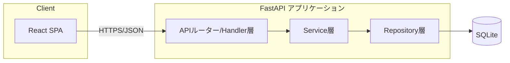
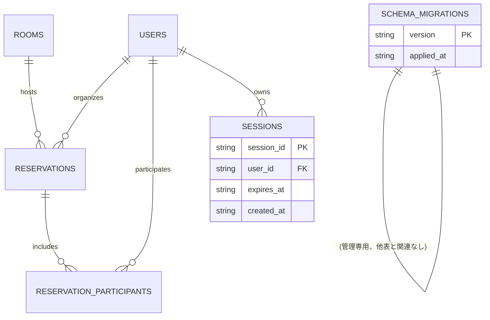

# システム詳細設計書 — 会議室予約システム

> 本書は `spec-driven-dev` Skill フェーズP003の成果物です。`docs/P001-requirement.md` のAPI一覧・`docs/P002-frontend-spec.md` の外部契約を、バックエンド内部でどう実現するかを確定します。

## 0. 技術スタックについて

* バックエンド技術スタックはP001指定どおり **Python + FastAPI**、データストアは **SQLite** とする(0章冒頭の技術代替は不要と判断した理由は `docs/P002-frontend-spec.md` 0章参照。npm/pypi双方のレジストリへの到達を確認済み)。
* この技術選定は `docs/ADR.md` の **ADR-002**(バックエンド技術スタック・データストア)として記録済みである(P021、Overview Stepで確定。旧版では「ADR-002見込み」と暫定表記していたが、P021実行によりこの表記は解消した)。
* 依存ライブラリの想定: `fastapi`, `uvicorn`, `pydantic`(v2、リクエスト/レスポンスのスキーマ検証), `passlib[bcrypt]` または標準ライブラリ `hashlib.scrypt`(1.2節参照), 標準ライブラリ `sqlite3`。テストは `pytest` を想定する。★FIXME★ 具体的なパッケージバージョン固定はP005(実装計画)で `requirements.txt`/`pyproject.toml` として確定する。

## 1. 全体アーキテクチャ

### 1.1 レイヤー構成



* **Router/Handler層**: FastAPIのpath operation関数。リクエストのパース(Pydanticモデル)、認証・認可チェック(依存性注入 `Depends`)、Service層呼び出し、レスポンス整形、例外→HTTPステータスへのマッピングを担当する。
* **Service層**: 業務ロジック(重複チェック、収容人数チェック、自己無効化禁止、最後の管理者保護など)を担当する。Repository層のみに依存し、FastAPI固有の型(Request/Response)には依存しない(単体テストを容易にするため)。
* **Repository層**: SQLiteへのCRUDを担当する。SQL文はこの層に閉じ込め、Service層はSQLを意識しない。

### 1.2 認証の内部実現

* 認証方式(Cookieベースのサーバーサイドセッション、JWT不採用)の採否は `docs/ADR.md` **ADR-003** として記録済み。以下は`docs/P002-frontend-spec.md` 2章で確定した外部契約の内部実現である。
* **パスワードハッシュ方式**: `hashlib.scrypt`(標準ライブラリ、外部依存を増やさない)を採用する。パラメータは `n=2**14, r=8, p=1`、ソルトはユーザーごとにランダムな16バイトを生成し `password_hash` カラムに `scrypt$<salt_hex>$<hash_hex>` の形式で保存する。★FIXME★ 具体的なscryptパラメータはP001に指定が無いため、一般的な推奨値を仮置きした。本番運用前にセキュリティレビューでパラメータの妥当性を確認すること。
  * 外部契約(Cookie方式であること)は `docs/P002-frontend-spec.md` 2章で確定済み。本節はその内部実現(ハッシュ方式)を担う。
* **セッションストア**: `sessions` テーブル(1.4節)にサーバー側で保存する(JWTのような自己完結トークンは使わない)。理由: ログアウト時に即座に無効化できる必要があるため(自己完結トークンは失効させるためにブラックリストが別途必要になり、DBテーブルを使うのと手間が変わらない)。★ACCEPTED★ JWT方式も検討したが、即時ログアウト・強制失効(管理者によるユーザー無効化時にそのユーザーの全セッションを失効させる、3.7節要件)を単純に実現できるDBセッション方式を採用した。不採用理由: JWTブラックリスト管理は結局DBかキャッシュが必要になり、実装が二重化するだけで単純化に寄与しない。残存リスク: セッションテーブルへの問い合わせがリクエストごとに発生する(300ユーザー・同時30接続規模では性能上の懸念は小さいと判断)。
  * `session_id` はCookie値としてブラウザに渡す、暗号学的に安全な乱数(32バイト、URL-safe base64エンコード)とする。
  * セッション有効期限は `docs/P002-frontend-spec.md` 2章のとおり固定8時間。`sessions.expires_at` で管理し、リクエストごとに現在時刻と比較する。期限切れセッションでのアクセスは `401 Unauthorized` とする。
  * ユーザーが無効化された場合(`users.is_active=false` に更新された場合)、そのユーザーに紐づく全セッションを即座に削除する(Service層でユーザー無効化と同一トランザクション内に実施)。

### 1.3 状態管理のスコープ

| 状態 | スコープ | 実現方法 |
| --- | --- | --- |
| セッション | ユーザーセッション | `sessions` テーブル(SQLite、永続化。アプリ再起動後もログイン状態を維持できる) |
| 会議室・ユーザー・予約データ | アプリケーション全体 | SQLite本体 |
| インメモリキャッシュ | なし | 本バージョンでは導入しない(想定ユーザー数300名・同時接続30程度の規模ではSQLiteへの直接問い合わせで十分と判断。★ACCEPTED★ 検討した代替: 会議室一覧のインメモリキャッシュ。不採用理由: 会議室数は10室程度でクエリコストが小さく、キャッシュ導入によるキャッシュ無効化のバグリスクの方が上回ると判断した。残存リスク: 将来ユーザー数が大幅に増えた場合は再検討が必要) |

## 2. データモデル(バックエンド追加分)

`docs/P002-frontend-spec.md` 5章のUI向けデータモデル(users/rooms/reservations/reservation_participants)に加え、以下を追加する。

### 2.1 ER図(追加分含む全体)



### 2.2 完全なテーブル定義(DDL相当)

```sql
CREATE TABLE IF NOT EXISTS users (
    user_id        TEXT PRIMARY KEY,
    name           TEXT NOT NULL,
    password_hash  TEXT NOT NULL,
    role           TEXT NOT NULL CHECK (role IN ('general', 'admin')),
    is_active      INTEGER NOT NULL DEFAULT 1,
    created_at     TEXT NOT NULL,
    updated_at     TEXT NOT NULL
);

CREATE TABLE IF NOT EXISTS rooms (
    room_id        INTEGER PRIMARY KEY AUTOINCREMENT,
    name           TEXT NOT NULL,
    capacity       INTEGER NOT NULL CHECK (capacity >= 1),
    equipment      TEXT NOT NULL DEFAULT '[]',   -- JSON配列文字列
    description    TEXT,
    is_active      INTEGER NOT NULL DEFAULT 1,
    created_at     TEXT NOT NULL,
    updated_at     TEXT NOT NULL
);

CREATE TABLE IF NOT EXISTS reservations (
    reservation_id     INTEGER PRIMARY KEY AUTOINCREMENT,
    room_id            INTEGER NOT NULL REFERENCES rooms(room_id),
    organizer_user_id  TEXT NOT NULL REFERENCES users(user_id),
    title              TEXT NOT NULL,
    start_datetime     TEXT NOT NULL,  -- ISO8601 'YYYY-MM-DDTHH:MM:SS'
    end_datetime       TEXT NOT NULL,
    attendee_count     INTEGER,
    notes              TEXT,
    created_at         TEXT NOT NULL,
    updated_at         TEXT NOT NULL,
    CHECK (end_datetime > start_datetime)
);
CREATE INDEX IF NOT EXISTS idx_reservations_room_time
    ON reservations (room_id, start_datetime, end_datetime);
CREATE INDEX IF NOT EXISTS idx_reservations_organizer
    ON reservations (organizer_user_id);
-- ※CR-001により追加。001_initial_schema.sqlの上記CREATE TABLE自体は変更せず(過去に初回起動したインストールとの整合のため)、
-- 3章に記載のマイグレーション方式に従い、追加カラムは新しいマイグレーションファイルとして別途適用する(3章参照)。
-- ALTER TABLE reservations ADD COLUMN meeting_url TEXT;  -- 任意、最大500文字、http(s)://始まり(server/migrations/003_add_reservation_meeting_url.sql)

CREATE TABLE IF NOT EXISTS reservation_participants (
    reservation_id  INTEGER NOT NULL REFERENCES reservations(reservation_id),
    user_id         TEXT NOT NULL REFERENCES users(user_id),
    PRIMARY KEY (reservation_id, user_id)
);

CREATE TABLE IF NOT EXISTS sessions (
    session_id  TEXT PRIMARY KEY,
    user_id     TEXT NOT NULL REFERENCES users(user_id),
    expires_at  TEXT NOT NULL,
    created_at  TEXT NOT NULL
);
CREATE INDEX IF NOT EXISTS idx_sessions_user ON sessions (user_id);

CREATE TABLE IF NOT EXISTS schema_migrations (
    version      TEXT PRIMARY KEY,
    applied_at   TEXT NOT NULL
);
```

## 3. マイグレーション方式(★重要★ `SKILL-P003-backend-spec.md` 必須記載事項)

* このマイグレーション方式の採否は `docs/ADR.md` **ADR-004** として記録済み。
* **適用のタイミングと方式**: アプリケーション起動時に、`migrations/` ディレクトリ配下の `NNN_description.sql` ファイルを番号順に確認し、`schema_migrations` テーブルに未記録(未適用)のものだけを1件ずつ適用してからサーバーを起動する(「適用済みバージョンを管理テーブルで記録して差分のみ適用する」方式)。
* **冪等性**: 上記方式は冪等である。`schema_migrations` テーブルを唯一の適用済み記録として扱い、同じマイグレーションファイルが2回実行されることはない(既に `version` が記録されていればスキップする)。各マイグレーション適用と `schema_migrations` へのINSERTは同一トランザクション内で行い、適用済みなのに未記録(またはその逆)という不整合が起きないようにする。
* **初回構築時の注意**: `001_initial_schema.sql` は2.2節のDDL(すべて `CREATE TABLE IF NOT EXISTS`)とする。`CREATE TABLE IF NOT EXISTS` 自体は繰り返し実行しても失敗しないが、これは「たまたま冪等に見える」だけであり、冪等性の担保は上記の `schema_migrations` によるバージョン管理そのものに置く(`IF NOT EXISTS` に依存しない)。将来のCRで `002_add_xxx_column.sql` のような `ALTER TABLE ... ADD COLUMN`(SQLiteは `IF NOT EXISTS` 相当の構文を持たない)が追加されても、`schema_migrations` によって「未適用のときだけ実行」されるため、2回目の起動で `duplicate column name` エラーになることはない。
* **アプリケーション停止・再起動時の確認**: `docs/P006-test-plan.md` の運用観点(再起動耐性)に、「アプリケーションを2回連続で起動し、2回目の起動が正常に完了すること」を確認するテストを含めること(本書からP006への申し送り)。
* **CR-001での実地確認(※CR-001により追加)**: 上記の想定どおり、`ALTER TABLE ... ADD COLUMN` を含む `server/migrations/003_add_reservation_meeting_url.sql` を追加した際、`apply_pending_migrations()` を同一の永続SQLiteファイルに対して3回実行し(1回目、同一コネクションでの2回目、新規コネクションでの3回目)、1回目は3件(`001`・`002`・`003`)適用、2回目・3回目はいずれも0件(全件スキップ、`duplicate column name` 等のエラーなし)で正常終了することを実際に確認した(必須の「2回連続実行」の基準は満たしたうえで、プロセス再起動を模した3回目も追加で確認した。`docs/P903-cr-records/CR-001.md` のスコープ決定節・対処内容節を参照)。想定どおり冪等に機能しており、冪等化のための追加対応は不要だった。

## 4. 各APIの内部仕様

以下、`docs/P002-frontend-spec.md` 4章のAPI外部仕様それぞれについて、内部実現を記載する。番号はP002の節番号に対応させる。

### 4.1 `POST /api/auth/login`

1. Repository層で `users` テーブルから `user_id = employee_id AND is_active = 1` を検索。該当なしなら `INVALID_CREDENTIALS`(401)。
2. `password_hash` を1.2節の方式で検証(scryptで再計算し定数時間比較 `hmac.compare_digest` を使う。タイミング攻撃対策)。不一致なら `INVALID_CREDENTIALS`(401)。
3. `sessions` テーブルに新規セッションを作成(`session_id` 生成、`expires_at = now + 8h`)。
4. `Set-Cookie` ヘッダーを付与してレスポンスを返す(Cookie属性は `docs/P002-frontend-spec.md` 2章のとおり)。開発環境(HTTP)では `Secure` 属性を付けないモードを環境変数 `COOKIE_SECURE=false` で切り替え可能にする。★FIXME★ 開発/本番の切り替え方法の詳細はP005(実装計画)のスプリント構成・環境変数設計で確定する。

### 4.2 `POST /api/auth/logout`

* リクエストCookieの `session_id` に対応する `sessions` 行を削除する。該当行が無くても200を返す(P002 4.2節の冪等性方針のとおり)。

### 4.3 `GET /api/me`

* リクエストCookieの `session_id` を `sessions` テーブルで検証(期限切れ・存在しない場合401)。有効なら `users` テーブルから対応ユーザーを取得して返す。
* この検証ロジックはFastAPIの依存性注入(`Depends(get_current_user)`)として実装し、認証が必要な全エンドポイントで共通利用する(横断的関心事)。

### 4.4〜4.5.2 `/api/rooms` 系

* 一般ユーザー向け `GET /api/rooms` は `WHERE is_active = 1` を強制する。管理者が `include_inactive=true` を指定した場合のみ全件返す。
* `equipment` はDB上JSON文字列で保持し、Repository層でPythonの `list[str]` にデコード/エンコードする。
* `PUT`/`DELETE` で対象 `room_id` が存在しない場合、Repository層は `None` を返し、Service層が `NOT_FOUND` 例外に変換、Router層が404にマッピングする。

### 4.6〜4.9.2 `/api/reservations` 系

* **時刻表現の変換(★P010初回レビューで発見された不足を補うため追記)**: `docs/P002-frontend-spec.md` 4章冒頭に記載のとおり、外部契約上は `date`/`start_time`/`end_time`(フォーム系)と `start_datetime`/`end_datetime`(カレンダー一覧)の2形式を使い分ける。DB(2.2節)は常に結合形式の `start_datetime`/`end_datetime` で保持するため、フォーム系エンドポイント(`POST`/`PUT`/`GET .../mine`/`GET .../{id}`)ではAPIハンドラ層で `date`+`start_time` → `start_datetime` の結合、および逆方向の分割を行う。この変換ロジックは全フォーム系エンドポイントで共通のヘルパー関数(`server/app/utils/datetime_format.py` を想定)にまとめ、エンドポイントごとに重複実装しない。

* **重複チェックの排他制御**: SQLiteはデフォルトで複数プロセス間の書き込みをファイルロックで直列化するが、アプリケーションプロセス内の並行リクエスト(async)間でも「重複チェックSELECT」と「INSERT」の間に別リクエストが割り込む競合状態(race condition)を防ぐため、予約の作成・更新トランザクションは `BEGIN IMMEDIATE` で開始し、書き込みロックを最初に確保してから重複チェックSELECTとINSERT/UPDATEを行う。これにより「2つのリクエストが同時に重複チェックを通過してどちらも成功する」二重予約を防ぐ。
  * 実装上、FastAPIは非同期(async def)だが `sqlite3` は同期APIのため、DBアクセスは同期関数として実装しスレッドプール経由(`run_in_threadpool`または`sqlite3`のWALモード+専用コネクション)で呼び出す。★FIXME★ 具体的な非同期化の方式(スレッドプール vs `aiosqlite` 導入)はP005実装計画で確定する。本書では「排他制御としてBEGIN IMMEDIATEを使う」という方針のみを確定する。
* **重複判定クエリ**: `SELECT reservation_id FROM reservations WHERE room_id = ? AND start_datetime < ? AND end_datetime > ? [AND reservation_id != ?]`(更新時は自分自身を除外。P002 4.9.1節の方針に対応)。
* **収容人数チェック**: Service層で `rooms.capacity` を取得し、`attendee_count` が指定されていればその場で比較する(P002 3.3節)。
* **オンライン会議URLのバリデーション(※CR-001により追加)**: `meeting_url` が指定され、かつ空文字列でない場合のみ、次を検証する(いずれかに違反すれば `VALIDATION_ERROR`、`fields.meeting_url` にメッセージを設定。P002 3.3/4.7節)。未指定・空文字列・`null` はすべて「値なし」として扱い、DBには `NULL` を保存する(空文字列をそのまま保存しない。表示側で「未設定」と「空文字列」を区別する必要が無いよう統一する)。
  * `http://` または `https://` で始まること
  * 500文字以内であること
  * Service層のバリデーション関数(`reservation_service.py` に既存の `title`/`notes` 検証と並べて実装する想定)で行い、Repository層ではSQLレベルの追加制約(`CHECK`)は課さない(既存の `notes`・`title` の文字数制限も同様にアプリケーション層で検証しており、方針を統一する)。
* **参加者の保存**: `reservation_participants` への一括INSERTは、予約本体のINSERT/UPDATEと同一トランザクション内で行う(部分的な保存を防ぐ)。更新時は既存の参加者行を全削除してから再INSERTする(差分更新はしない。★ACCEPTED★ 参加者リストは通常数名程度であり、差分検出の複雑さに見合わないため全削除・再INSERTで単純化した。残存リスクは無し(参加者数が小さいため性能影響は無視できる))。
* **カレンダー表示API(`GET /api/reservations`)のJOIN**: `rooms.name`・`users.name` をJOINして返す(P002 4.6節のレスポンス形式に対応)。無効化された会議室であっても、既存予約からの参照では `room_name` を表示する(P002 3.6節の要件に対応。`rooms.is_active` によるフィルタは一覧取得APIのみに適用し、予約に紐づく会議室名の表示には適用しない)。

### 4.10 一般ユーザー向け参加者候補API(内部実現)

* 外部契約(エンドポイントパス・リクエスト・レスポンス形式)は `docs/P002-frontend-spec.md` 4.10.1節(★P010初回レビューでP002側に移設済み)を参照。本節では内部実現のみを記載する。
* 認可判定の内部実現: `Depends(get_current_user)`(U001-T3で実装済みの認証依存性)のみを要求し、`role`による分岐は行わない(管理者専用の `GET /api/users` とは異なるミドルウェア構成になる)。
* Repository層は `user_repository.find_active_for_directory()`(氏名・社員IDのみをSELECTする軽量クエリ、`password_hash`・`role`・`is_active`はSELECT句に含めない)を新設し、レスポンス生成時に取得列を絞ることで、万一のフィールド漏洩(管理者専用情報の意図しない返却)を型レベルでも防ぐ。

### 4.11〜4.11.2 `/api/users` 系

* パスワードは1.2節の方式でハッシュ化してから保存する。平文パスワードは応答・ログいずれにも含めない。
* 自己無効化禁止・最後の管理者保護(P002 3.7節)は、Service層で以下の順に検証する。
  1. 対象が自分自身かつ `is_active=false` への変更 → `SELF_DEACTIVATION_FORBIDDEN`
  2. 対象が管理者かつ `is_active=false` への変更 → 更新後に有効な管理者が0人になるかを `SELECT COUNT(*) FROM users WHERE role='admin' AND is_active=1` で確認し、0人になるなら `LAST_ADMIN_PROTECTED`
* ユーザー無効化成功時、1.2節のとおり該当ユーザーの全セッションを同一トランザクションで削除する。

## 5. 非機能要件のうちインフラ寄りの項目の担当フェーズ

`docs/P001-requirement.md` の非機能要件のうち、以下はアプリケーションコードの範囲を超え実行環境・インフラ構成に依存するため、本書(P003)では確定せず担当フェーズへ委譲する。P003ではアプリケーションコード側が前提とする内容のみを明記する。

| 非機能要件 | P003での前提 | 確定を委譲するフェーズ |
| --- | --- | --- |
| 可用性(平日日中99%以上) | アプリケーション側は単一プロセスのステートレス起動(セッションはDB永続化のため再起動しても失われない、3章参照)を前提とし、冗長化・ヘルスチェック・オートリスタート等のインフラ構成には関与しない | `docs/P005-impl-plan.md`(インフラ関連スプリントが必要なら)、`docs/P302-deliver.md`(配布トポロジー) |
| セキュリティ(HTTPS化) | アプリケーションはTLS終端をリバースプロキシ/ロードバランサ側で行われる前提とし、アプリ自体はHTTPで待ち受ける(1.2節のCookie `Secure` 属性は本番配置時に有効化する前提)。★FIXME★ TLS終端の具体的な構成(ALB/nginx等)はP001に明記が無いため一般的な前提を仮置きした。 | `docs/P302-deliver.md` |
| スケーラビリティ(将来の多拠点展開) | 単一SQLiteファイルは複数プロセス・複数ホストでの水平スケールに適さない(書き込みロックが単一ファイル単位のため)。本バージョンでは想定同時接続30程度のため単一プロセス構成で十分と判断し、水平スケール対応は行わない | `docs/P005-impl-plan.md`、将来のCR |
| ログ集約基盤(CloudWatch Logs等) | アプリケーションは標準出力(stdout)へ構造化ログ(JSON Lines)を出力するところまでを担当し、収集基盤側の設定はアプリケーションコードの範囲外とする | `docs/P302-deliver.md` |

* この委譲の明記により、`docs/P004-traceability-matrix.md`・`docs/P010-design-review.md` は、これらの非機能要件の充足確認を本節および `docs/P005-impl-plan.md`・`docs/P302-deliver.md` の記載箇所で行う(`SKILL-P003-backend-spec.md` 該当節の指示のとおり)。

## 6. ログ出力方針(アプリケーションコード範囲)

* 構造化ログ(JSON Lines、1行1イベント)を標準出力に出力する。最低限のフィールド: `timestamp`, `level`, `event`(例: `login_failed`, `reservation_conflict`, `unhandled_exception`), `user_id`(取得できる場合), `request_id`。
* エラーレベル(`ERROR`)で出力するもの: 未処理例外(500応答)、マイグレーション失敗。
* 警告レベル(`WARNING`)で出力するもの: 認証失敗の連続発生(★FIXME★ 具体的なしきい値・アカウントロック機能はP001に明記が無くスコープ外とする。ログ出力のみ行い、自動ロックは実装しない。★ACCEPTED★ ブルートフォース対策としてのアカウントロックは検討したが、P001に要求が無く、誤ロックによる正規ユーザーの業務影響リスクの方が大きいと判断し本バージョンでは見送った。残存リスク: 総当たり攻撃への耐性はレート制限等の追加対策無しでは限定的。将来必要になればCRとして起票する)。
