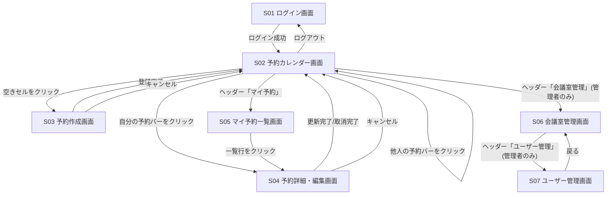
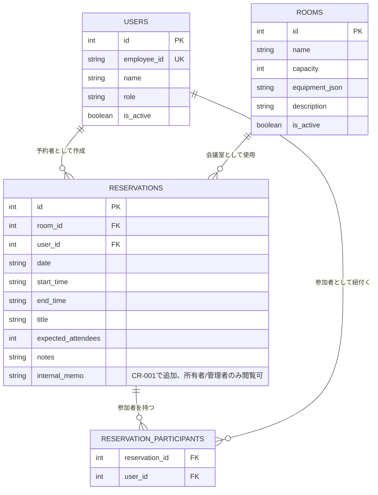
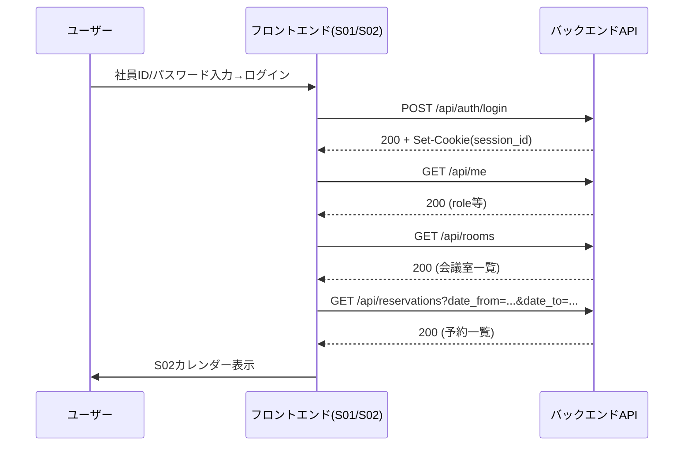
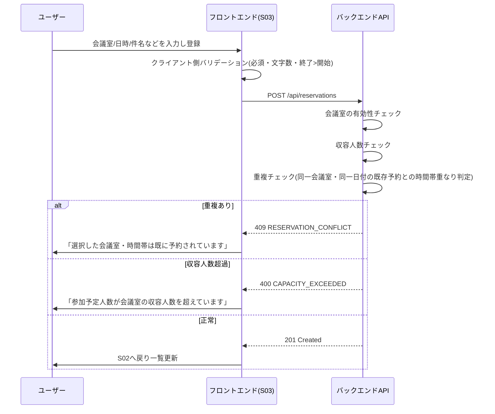
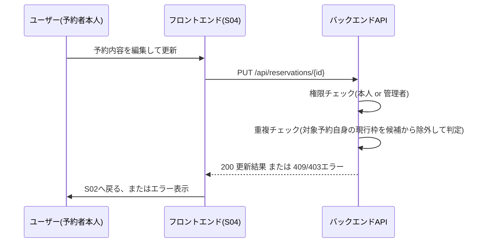

# ユーザインタフェース設計書 — 会議室予約システム

> 本書は `spec-driven-dev` Skill フェーズP002の成果物。`docs/P001-requirement.md` の画面一覧・API一覧を詳細化し、フロントエンドの外部仕様(バリデーション、API外部契約、画面が成立するために必要なデータモデル)を確定する。

## 0. 本書の役割とP003との分担

* 外部から見える契約(Cookie/トークンの別、レスポンス形式、クライアントが認識できるエラーコード・メッセージ)は本書P002で確定する。
* その内部実現方法(パスワードのハッシュ方式、セッションの保存先・有効期限の内部実装)は `docs/P003-backend-spec.md` で確定する。該当箇所には相互参照を付す。
* 非機能要件のうちインフラ寄りの項目(可用性・TLS・スケーラビリティ・ログ集約基盤)は本書では確定しない。`docs/P003-backend-spec.md` が委譲先(P005/P302)を明記する。

## 1. 認証方式の外部契約

* ログイン成功時、サーバーは `Set-Cookie: session_id=<opaque-token>; HttpOnly; Secure; SameSite=Lax; Max-Age=28800` を返す。フロントエンドはトークンの中身を扱わず、以降のAPI呼び出しはブラウザが自動送出するCookieに委ねる(`fetch` は `credentials: "include"` を指定する)。
* セッションの内部実現(トークン生成方式、保存先、有効期限管理)は `docs/P003-backend-spec.md` §2.1 を参照。
* 未認証で保護APIを呼んだ場合、すべて `401 Unauthorized` + `{"error_code":"UNAUTHENTICATED","message":"ログインが必要です"}` を返す。フロントエンドはこれを受けたらS01ログイン画面へリダイレクトする。
* 管理者専用API/画面に一般ユーザーがアクセスした場合、`403 Forbidden` + `{"error_code":"FORBIDDEN","message":"この操作には管理者権限が必要です"}` を返す。フロントエンドはエラーメッセージを表示し遷移しない。

## 2. 共通エラーレスポンス形式

すべてのAPIエラーは次の形式に従う(HTTPステータスコードは各API個別に定義)。

```json
{
  "error_code": "VALIDATION_ERROR",
  "message": "人間可読なエラーメッセージ(日本語)",
  "details": [
    { "field": "end_time", "reason": "終了時刻は開始時刻より後の時刻を指定してください" }
  ]
}
```

* `details` はフィールド単位のバリデーションエラーがある場合のみ付与する(任意項目)。単一の業務ルール違反(重複・収容人数超過など)の場合は `details` を省略してよい。
* `error_code` の一覧は本書中の各API定義に分散して記載する(一覧表は §9 にまとめる)。

## 3. 画面ごとの入出力項目とバリデーションルール

### S01 ログイン画面

| 項目名 | 種別 | バリデーション |
| --- | --- | --- |
| ユーザーID(社員ID) | 入力 | 必須。半角英数字、最大20文字。未入力の場合「社員IDを入力してください」を表示し送信を抑止する。 |
| パスワード | 入力 | 必須。マスク表示(`type=password`)。未入力の場合「パスワードを入力してください」を表示し送信を抑止する。 |
| エラーメッセージ | 表示 | 認証失敗時(社員ID・パスワードいずれの誤りでも同一文言)「社員IDまたはパスワードが正しくありません」を表示する。ユーザー列挙(社員IDの存在有無の推測)を防ぐため、原因を区別した文言にしない。 |

* ログイン成功後はS02(予約カレンダー画面)へ遷移する。
* 送信中は二重送信防止のためボタンを無効化する。

### S02 予約カレンダー画面(トップ)

| 項目名 | 種別 | バリデーション |
| --- | --- | --- |
| 表示日付/週 | 入力 | 週表示。初期値は本日を含む週。前後の週への移動ボタンで±1週。範囲制限なし(過去・未来とも自由に移動可)。 |
| 会議室フィルタ | 入力 | 任意。未選択時は全会議室(有効な会議室のみ)を表示する。無効化(論理削除)された会議室はフィルタの選択肢に出さない。 |
| 会議室×時間帯グリッド | 表示 | 列=会議室、行=30分刻みの時間帯(09:00〜18:00を既定表示範囲とし、それ以外の時間帯の予約が存在する場合は自動的に表示範囲を拡張する)。空きセルはクリック可能、予約済みセルは自分の予約のみクリック可能(S04へ)。他人の予約セルは詳細を開けない(予約者名・件名の表示のみ)。 |
| 予約サマリ(予約者名・件名) | 表示 | 予約済みセルに `{予約者名} / {件名}` を表示する。`GET /api/reservations` のレスポンスには参加予定人数(`expected_attendees`)も含まれるが、要件定義(`docs/P001-requirement.md` S02)のとおりカレンダーセルには表示しない。フロントエンド側で意図的に描画しないだけであり、APIから値自体を削るものではない。 |

* 空きセルをクリックするとS03(予約作成画面)へ遷移し、クリックした会議室・日付・時間帯が初期値として引き継がれる。
* ヘッダー(ナビゲーション領域)には、ログイン中ユーザーの氏名表示、および「ログアウト」ボタン(押下で `POST /api/auth/logout` を呼びS01へ遷移する)を含める。※P202 F001にもとづき追記(画面遷移図のS02→S01のログアウト導線、および§1の認証方式に対応する画面要素が本節に明記されていなかったための明確化)。

### S03 予約作成画面

| 項目名 | 種別 | バリデーション |
| --- | --- | --- |
| 会議室 | 入力 | プルダウン選択、必須。無効化された会議室は選択肢に出さない。 |
| 日付 | 入力 | 必須。過去日付でも入力自体は許可する(業務上、過去分の記録目的の登録を妨げないため)。★FIXME★ 要件定義に過去日付予約の可否の明記がないため、Agentの想定で「許可」とした。運用上禁止したい場合はCRで指定されたい。 |
| 開始時刻/終了時刻 | 入力 | 必須。10分単位。終了時刻は開始時刻より**厳密に後**でなければならない(`終了時刻 > 開始時刻`。等しい場合はエラー)。違反時「終了時刻は開始時刻より後の時刻を指定してください」を表示し送信を抑止する(`error_code: INVALID_TIME_RANGE`)。 |
| 終日チェックボックス | 入力 | 任意。チェック時、開始時刻に09:00、終了時刻に18:00を自動入力する。自動入力後も両時刻は手動で上書き可能(上書き後にチェックを外しても値は保持する)。 |
| 件名 | 入力 | 必須、最大100文字。未入力または101文字以上でエラー「件名を入力してください(100文字以内)」。 |
| 参加者(社員) | 入力 | 任意、複数選択(有効なユーザーのみ選択肢に出す)。自分自身を参加者として重複選択してもエラーにはしない(サーバー側で予約者は自動的に参加者扱いとする。§5 データモデル参照)。 |
| 参加予定人数 | 入力 | 任意。1以上の整数。選択した会議室の収容人数(`capacity`)を超える値はエラー「参加予定人数が会議室の収容人数を超えています」(`error_code: CAPACITY_EXCEEDED`)。未入力時はサーバー側チェックを行わない。 |
| 備考 | 入力 | 任意、最大500文字。501文字以上でエラー「備考は500文字以内で入力してください」。 |
| 備考(社内向けメモ) | 入力 | 任意、最大300文字。301文字以上でエラー「備考(社内向けメモ)は300文字以内で入力してください」。**閲覧・編集は予約の作成者本人・管理者のみ可能**(他の利用者には入力欄自体を表示しない)。既存の「備考」とは別項目であり、閲覧範囲が異なる(下記§6・§9参照)。※CR-001により追加 |
| 重複エラーメッセージ | 表示 | 選択した会議室・時間帯が既存予約と重なる場合「選択した会議室・時間帯は既に予約されています」(`error_code: RESERVATION_CONFLICT`、HTTP 409)。重複判定の厳密なルール(境界値の扱いを含む)は `docs/P003-backend-spec.md` §3.2 で確定する。P002側の外部契約としては「重複がある場合は409、無い場合は201」という結果のみを規定する。 |
| 収容人数超過エラーメッセージ | 表示 | 上記「参加予定人数」の行を参照。 |

* 「登録」ボタン押下で `POST /api/reservations` を呼ぶ。成功(201)でS02へ戻る。「キャンセル」ボタンで確認なしにS02へ戻る(入力内容は破棄。★FIXME★ 要件定義に確認ダイアログの要否の明記がないため、Agentの想定で「確認なし」とした)。

### S04 予約詳細・編集画面

| 項目名 | 種別 | バリデーション |
| --- | --- | --- |
| 予約内容(会議室/日時/件名/参加者/参加予定人数/備考/予約者) | 表示 | `GET /api/reservations/{reservation_id}` の内容を表示する。S03と同項目。 |
| 備考(社内向けメモ) | 表示・入力 | 予約の作成者本人・管理者が開いた場合のみ表示・編集できる(それ以外の利用者が開いた場合、`GET /api/reservations/{reservation_id}` のレスポンス自体に値が含まれないため、UI側で分岐する以前にAPIレベルで保護される。`docs/P003-backend-spec.md` §5.9参照)。任意、最大300文字。※CR-001により追加 |
| 編集用の各項目 | 入力 | 予約者本人または管理者のみ編集可(他ユーザーの場合は編集フォームを表示せず閲覧のみにする)。バリデーションルールはS03と同一(終了>開始、件名必須100文字以内、参加予定人数と収容人数の関係、備考500文字以内、備考(社内向けメモ)300文字以内)。 |
| 取消ボタン | 操作 | 予約者本人または管理者のみ表示・押下可。押下で確認ダイアログ(「この予約を取り消しますか?」)を出し、確定で `DELETE /api/reservations/{reservation_id}` を呼ぶ。成功(204)でS02へ戻る。 |
| 更新ボタン | 操作 | 予約者本人または管理者のみ表示。押下で `PUT /api/reservations/{reservation_id}` を呼ぶ。編集時の重複チェックは自分自身の現在の予約枠を除外して行う(§7 シーケンス図参照)。成功(200)でS02へ戻る。 |

* 権限がない場合(他ユーザーの予約を一般ユーザーが開いた場合)、編集・取消操作は行えず「表示のみ」であることを画面上に明示する。

### S05 マイ予約一覧画面

| 項目名 | 種別 | バリデーション |
| --- | --- | --- |
| 期間フィルタ(今後の予約/過去の予約) | 入力 | 任意。未選択時は「今後の予約」を初期表示する。`GET /api/reservations/mine?period=upcoming|past` のクエリパラメータに対応する。「今後」は現在時刻以降に**終了時刻**を迎える予約、「過去」はそれ以外とする。 |
| 予約一覧(日付/会議室/時間帯/件名) | 表示 | ログインユーザー自身の予約のみ表示(`user_id` が自分と一致するもの)。一覧行をクリックするとS04へ遷移する。 |

### S06 会議室管理画面(管理者用)

| 項目名 | 種別 | バリデーション |
| --- | --- | --- |
| 会議室一覧(会議室名/収容人数/設備/説明文/有効・無効) | 表示 | 一般ユーザーがアクセスした場合は403エラー画面を表示し遷移させない(ルーティングガードで制御。§6参照)。 |
| 会議室名 | 入力 | 必須、最大50文字。 |
| 収容人数 | 入力 | 必須、1以上の整数。 |
| 設備 | 入力 | 任意、複数選択可のタグ入力(自由記述の配列)。最大20項目。 |
| 説明文 | 入力 | 任意、最大200文字。 |
| 有効フラグ | 入力 | 新規登録時の初期値は有効。編集で無効化できる(=削除ボタンと同じ内部動作)。 |
| 削除ボタン | 操作 | 押下で確認ダイアログ後、論理削除(`is_active=false`)する。無効化された会議室は将来の予約作成の選択肢に出なくなるが、既存の予約データは削除されない(履歴として残す)。★ACCEPTED★ 会議室無効化時に既存の未来予約をどう扱うか(自動キャンセルする案も検討したが、無断キャンセルは業務影響が大きいため採用しなかった)。残存リスク: 無効化後も既存予約はカレンダー上に残り続けるため、運用上は「無効化前に既存予約が無いことを確認する」運用ルールが別途必要になる。この運用ルール自体はアプリケーションの範囲外とし、`docs/P302-deliver.md` の利用者向け説明に記載する。 |

### S07 ユーザー管理画面(管理者用)

| 項目名 | 種別 | バリデーション |
| --- | --- | --- |
| ユーザー一覧(社員ID/氏名/権限/有効・無効) | 表示 | 一般ユーザーがアクセスした場合は403エラー画面を表示し遷移させない。 |
| 社員ID | 入力 | 新規登録時必須、最大20文字、半角英数字、一意(重複時「この社員IDは既に登録されています」`error_code: DUPLICATE_EMPLOYEE_ID`、HTTP 409)。編集時は変更不可(読み取り専用表示)。 |
| 氏名 | 入力 | 必須、最大50文字。 |
| 権限(一般/管理者) | 入力 | 必須、いずれか選択。 |
| 有効フラグ | 入力 | 新規登録時の初期値は有効。 |
| 初期パスワード | 入力 | 新規登録時のみ必須、8文字以上。★FIXME★ `docs/P001-requirement.md` にはパスワード発行・再設定フローの明記がないため、Agentの想定で「管理者が新規登録時に初期パスワードを直接入力する」方式とした。パスワード再発行(本人による変更、管理者によるリセット)は本バージョンのスコープ外とし、`docs/P010-design-review.md` でトレーサビリティ上の扱いを確認する。 |
| 削除ボタン | 操作 | 押下で確認ダイアログ後、論理削除(`is_active=false`)する。自分自身のアカウントを無効化しようとした場合はボタンを無効化し「自分自身のアカウントは無効化できません」を表示する(`error_code: CANNOT_DEACTIVATE_SELF`、HTTP 400)。★FIXME★ 要件定義に自己無効化の可否の明記がないため、運用上の事故防止としてAgentの想定で禁止とした。 |

## 4. 画面遷移図(要件定義からの引用+補足)



* 要件定義の図に対する補足として「他人の予約バーをクリックしてもS02に留まる(遷移しない)」の分岐を追加した。この補足は本文§3(S02バリデーション)の記述と整合させている。

## 5. データモデル(UI成立に必要な範囲)

### 5.1 ER図



* 内部実現(型・制約の厳密な定義、インデックス、セッション用テーブルなど)は `docs/P003-backend-spec.md` §3 のテーブル定義書を正とする。本節はUIが必要とする論理的な項目の一覧にとどめる。
* `equipment_json` はUI上は文字列配列(タグ入力)として扱うが、実際のDBカラム型は `docs/P003-backend-spec.md` で確定する。

### 5.2 テーブル定義(UI観点の要約)

| テーブル | 主要カラム | UIとの対応 |
| --- | --- | --- |
| USERS | id, employee_id, name, role, is_active | S01ログイン、S07ユーザー管理、S02〜S05の予約者/参加者表示 |
| ROOMS | id, name, capacity, equipment, description, is_active | S02カレンダー、S03/S04の会議室選択、S06会議室管理 |
| RESERVATIONS | id, room_id, user_id, date, start_time, end_time, title, expected_attendees, notes, internal_memo(CR-001) | S02〜S05全般 |
| RESERVATION_PARTICIPANTS | reservation_id, user_id | S03/S04の参加者選択・表示 |

## 6. 認可(画面アクセス制御)の外部契約

| 画面/操作 | 一般ユーザー | 管理者 |
| --- | --- | --- |
| S01〜S05 | 可 | 可 |
| S06 会議室管理 | 不可(403) | 可 |
| S07 ユーザー管理 | 不可(403) | 可 |
| 他人の予約の編集・取消 | 不可(403) | 可 |
| 自分の予約の編集・取消 | 可(本人) | 可 |
| 他人の予約の「備考(社内向けメモ)」の閲覧 | 不可(APIレスポンスに値が含まれない) | 可 |

* フロントエンドはログイン後 `GET /api/me` で取得した `role` にもとづき、S06/S07へのルーティングをクライアント側でもガードする(URL直打ちで一瞬表示されることを防ぐ)。ただし最終的な認可判定はサーバー側API(403応答)が権威を持つ。クライアント側ガードはUX目的の補助であり、セキュリティ上の唯一の防御線ではない。
* 「備考(社内向けメモ)」の閲覧制限は、403で操作自体を拒否する方式ではなく、**200レスポンスのうち当該フィールドの値だけをサーバー側でマスキング(`null`化)する**方式を採る(※CR-001により追加)。予約の閲覧自体(会議室・日時・件名など)は同一ユーザーが引き続き行える前提のため、レスポンス全体を403にはしない。内部実現方法は `docs/P003-backend-spec.md` §5.9参照。

## 7. シーケンス図(複数画面/APIをまたぐ処理)

### 7.1 ログイン〜カレンダー初期表示



### 7.2 予約作成(重複チェックを含む)



### 7.3 予約編集(自分自身の枠を除外した重複チェック)



## 8. 未解決事項・要確認事項

* パスワード再発行(本人変更・管理者リセット)フローは要件定義に明記がなく、本書ではスコープ外とした(§3 S07参照)。人間による確認が必要。
* 過去日付での予約作成可否について、要件定義に明記がなく「許可」とAgentが仮決めした(§3 S03参照)。運用要件次第では禁止に変更されうる。

## 9. エラーコード一覧(参照用)

| error_code | HTTPステータス | 発生箇所 |
| --- | --- | --- |
| VALIDATION_ERROR | 400 | 全API共通、入力形式不正 |
| AUTH_FAILED | 401 | ログイン失敗 |
| UNAUTHENTICATED | 401 | 未ログインで保護APIにアクセス |
| FORBIDDEN | 403 | 権限不足 |
| NOT_FOUND | 404 | 対象リソースが存在しない |
| INVALID_TIME_RANGE | 400 | 終了時刻が開始時刻以下 |
| CAPACITY_EXCEEDED | 400 | 参加予定人数が収容人数超過 |
| ROOM_INACTIVE | 400 | 無効化された会議室への予約 |
| RESERVATION_CONFLICT | 409 | 予約時間帯の重複 |
| DUPLICATE_EMPLOYEE_ID | 409 | 社員IDの重複登録 |
| CANNOT_DEACTIVATE_SELF | 400 | 自分自身のユーザー無効化 |

内部実現(バリデーションの実行順序、DBレベルの制約との対応)は `docs/P003-backend-spec.md` を参照。

## 10. 性能に関する設計方針(※P004トレーサビリティマトリクス1回目実行の指摘 REQ-NFR-001 にもとづき追記)

* `docs/P001-requirement.md` の非機能要件「カレンダー画面の表示は3秒以内」を満たすため、フロントエンド側は次の方針を採る。
  * S02の初期表示では、表示中の週(既定7日分)の予約のみを `GET /api/reservations?date_from=&date_to=` で取得し、全期間の予約を一括取得しない。
  * 会議室×時間帯グリッドはReactの再レンダリングをセル単位に限定する(週送り操作で全セルを作り直さない)。
  * 想定データ量(会議室10室×週7日×時間帯18枠 = 最大1,260セル程度)では仮想スクロール等の追加最適化は不要と判断する。★ACCEPTED★ 仮想スクロールライブラリの導入も検討したが、想定規模(300名・10会議室)ではオーバーエンジニアリングと判断し不採用とした。残存リスク: 将来会議室数が大幅に増えた場合は再検討が必要。
* API側の応答時間目標(参考値)とインデックス設計は `docs/P003-backend-spec.md` §7 を参照。
