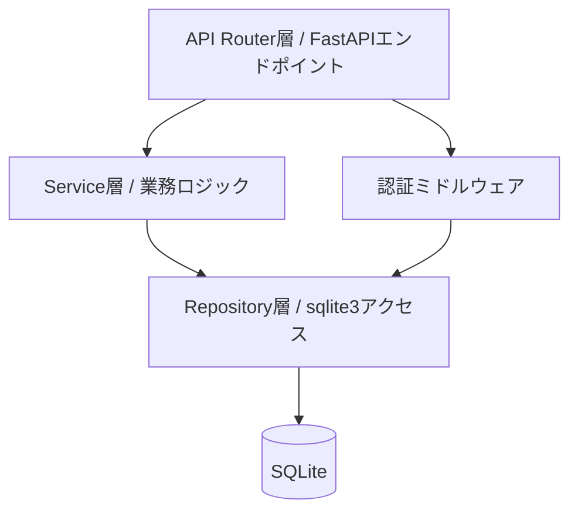
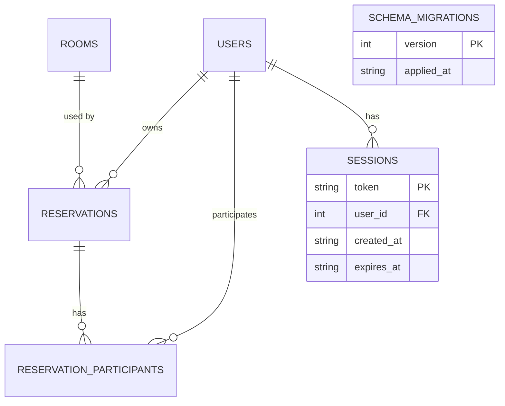

# システム詳細設計書 — 会議室予約システム

> 本書は `spec-driven-dev` Skill フェーズP003の成果物。`docs/P001-requirement.md` のAPI一覧と `docs/P002-frontend-spec.md` の外部契約を、内部実現方式まで確定する。

## 0. 使用技術(ADR参照)

※P021初回実行時に、本節の暫定ADR番号(見込み表記)を確定番号に更新した。決定内容自体の変更はない。

* バックエンド: Python + FastAPI(要件定義どおり。ADR-002)。
* データアクセス: ORMを介さず標準ライブラリ `sqlite3` を直接使用する(小規模データ量・単純なクエリ中心のため、ORMの抽象化コストより素のSQLの見通しやすさを優先した判断。ADR-003)。
* パスワードハッシュ: `bcrypt`(PyPI配布パッケージ。本セッションはpypi.orgへの接続に成功したため、要件定義のPython実行環境上に素直にインストールする。ADR-004)。
* データストア: SQLite(要件定義どおり)、ファイルパスは環境変数 `DATABASE_PATH` で指定(既定値 `./data/app.db`)。
* フロントエンド技術(React + TypeScript + Vite)の採用理由はADR-001を参照(詳細は `docs/P002-frontend-spec.md` の対象外、フロントエンド実装指示 `docs/P007-impl-direction.md` 側の管轄)。

## 1. レイヤ構成



* Router層: リクエスト/レスポンスのスキーマ変換(Pydantic v2)、HTTPステータスコードの決定。
* Service層: バリデーション(重複チェック・収容人数チェックなど業務ルール)、権限判定。
* Repository層: SQL発行のみ。業務ロジックを持たない。**現在時刻・現在日付を関数内部で取得しない**(§6参照)。

## 2. 認証・セッション管理(内部実現)

### 2.1 セッションの内部実現

* 外部契約(Cookie名 `session_id`、`HttpOnly`/`Secure`/`SameSite=Lax`、有効期限8時間)は `docs/P002-frontend-spec.md` §1 で確定済み。
* トークン生成: `secrets.token_hex(32)`(暗号学的に安全な乱数、64文字の16進文字列)。
* 保存先: SQLiteの `sessions` テーブル(スコープ=永続化されたアプリケーションストレージ全体で共有。プロセス再起動やサーバー水平スケール時にもセッションが失われないことを優先し、インメモリ保存は採用しなかった。この決定はADR-005)。★ACCEPTED★ インメモリ(プロセス内Dict)保存も検討したが、再起動のたびに全ユーザーが強制ログアウトされる(本アプリは300名規模の社内ツールで、デプロイ頻度に対してログアウトの利用者影響が大きい)ため不採用とした。残存リスク: セッションテーブルの行数はログイン頻度に比例して増加するため、期限切れセッションの掃除(バッチ削除)が将来的に必要になる可能性がある。本バージョンでは有効期限切れセッションは参照時に無効判定するのみで物理削除しない(実害が出るデータ量に達するまでは許容する簡略化)。
* 有効期限: `expires_at = created_at + 8時間`。スライディング延長(アクセスの都度延長)は行わない固定期限とする。★FIXME★ 要件定義に有効期限延長方式の明記がないため、Agentの想定で固定期限とした。
* ログアウト時: 該当セッション行を物理削除する。
* API保護ミドルウェアは、リクエストCookieの `session_id` を `sessions` テーブルで照合し、`expires_at` が現在時刻以前なら無効(401 UNAUTHENTICATED)とする。この「現在時刻」の取得は認証ミドルウェア(Service層に準ずる)が行い、Repository関数へは比較対象の日時を明示的な引数として渡す(§6参照)。

### 2.2 パスワードハッシュ

* `bcrypt.hashpw(password.encode(), bcrypt.gensalt())` を用いる。ソルトはハッシュ値に埋め込まれるため別カラムを持たない。
* 検証は `bcrypt.checkpw(password.encode(), stored_hash)`。

## 3. データモデル(内部)

### 3.1 ER図(P002からの追加分を含む全体)



* `USERS`/`ROOMS`/`RESERVATIONS`/`RESERVATION_PARTICIPANTS` の論理構造は `docs/P002-frontend-spec.md` §5.1 のとおり。本節はUIに現れない `SESSIONS`・`SCHEMA_MIGRATIONS` を追加する。

### 3.2 テーブル定義書

#### users

| カラム | 型 | 制約 | 説明 |
| --- | --- | --- | --- |
| id | INTEGER | PK, AUTOINCREMENT | |
| employee_id | TEXT | UNIQUE, NOT NULL | 社員ID、半角英数字20文字以内 |
| name | TEXT | NOT NULL | 氏名、50文字以内 |
| password_hash | TEXT | NOT NULL | bcryptハッシュ |
| role | TEXT | NOT NULL, CHECK(role IN ('general','admin')) | |
| is_active | INTEGER | NOT NULL, DEFAULT 1 | 0/1のブール代替(SQLiteにBOOLEAN型は無いためINTEGERで代替) |
| created_at | TEXT | NOT NULL | ISO8601文字列(UTC) |
| updated_at | TEXT | NOT NULL | ISO8601文字列(UTC) |

#### rooms

| カラム | 型 | 制約 | 説明 |
| --- | --- | --- | --- |
| id | INTEGER | PK, AUTOINCREMENT | |
| name | TEXT | NOT NULL | 50文字以内 |
| capacity | INTEGER | NOT NULL, CHECK(capacity >= 1) | |
| equipment_json | TEXT | NOT NULL, DEFAULT '[]' | JSON配列文字列(例: `["プロジェクタ","ホワイトボード"]`) |
| description | TEXT | NULL | 200文字以内 |
| is_active | INTEGER | NOT NULL, DEFAULT 1 | |
| created_at | TEXT | NOT NULL | |
| updated_at | TEXT | NOT NULL | |

#### reservations

| カラム | 型 | 制約 | 説明 |
| --- | --- | --- | --- |
| id | INTEGER | PK, AUTOINCREMENT | |
| room_id | INTEGER | NOT NULL, FK→rooms.id | |
| user_id | INTEGER | NOT NULL, FK→users.id | 予約者(作成者) |
| date | TEXT | NOT NULL | `YYYY-MM-DD` |
| start_time | TEXT | NOT NULL | `HH:MM`(24時間表記) |
| end_time | TEXT | NOT NULL, CHECK(end_time > start_time) | |
| title | TEXT | NOT NULL | 100文字以内 |
| expected_attendees | INTEGER | NULL | 1以上 |
| notes | TEXT | NULL | 500文字以内 |
| internal_memo | TEXT | NULL | 300文字以内。所有者(`user_id`)・管理者のみ閲覧可(§5.9参照)。※CR-001により追加(`004_add_reservation_internal_memo.sql`) |
| created_at | TEXT | NOT NULL | |
| updated_at | TEXT | NOT NULL | |

* インデックス: `CREATE INDEX idx_reservations_room_date ON reservations(room_id, date);`(重複チェック・カレンダー表示のクエリで多用するため)。

#### reservation_participants

| カラム | 型 | 制約 | 説明 |
| --- | --- | --- | --- |
| reservation_id | INTEGER | NOT NULL, FK→reservations.id, PK(複合) | |
| user_id | INTEGER | NOT NULL, FK→users.id, PK(複合) | |

* 予約者自身は参加者テーブルに自動登録しない(予約者は `reservations.user_id` で判別できるため冗長化しない)。フロントエンドが参加者一覧を表示する際は `reservations.user_id` の氏名も別途合成して表示する。

#### sessions

| カラム | 型 | 制約 | 説明 |
| --- | --- | --- | --- |
| token | TEXT | PK | §2.1参照 |
| user_id | INTEGER | NOT NULL, FK→users.id | |
| created_at | TEXT | NOT NULL | |
| expires_at | TEXT | NOT NULL | |

#### schema_migrations

| カラム | 型 | 制約 | 説明 |
| --- | --- | --- | --- |
| version | INTEGER | PK | マイグレーションファイルの連番 |
| applied_at | TEXT | NOT NULL | 適用日時 |

## 4. マイグレーション方式

* **適用のタイミングと方式**: アプリケーション起動時(FastAPIの `lifespan` イベント内)に、`server/migrations/` 配下の `NNN_description.sql` ファイルを連番順に走査し、`schema_migrations` テーブルに未記録のバージョンのみを実行する(差分適用方式)。全件再実行方式は採らない。
* **冪等かどうか**: 冪等である。`schema_migrations` テーブルで適用済みバージョンを記録し、起動のたびに「未適用のマイグレーションだけ」を実行するため、同一マイグレーションが2回以上実行されることはない。
* **冪等でない場合の担保**: 該当なし(差分適用方式のため原理的に非冪等にならない)。ただし `schema_migrations` テーブル自体の作成(`CREATE TABLE IF NOT EXISTS schema_migrations (...)`)は起動のたびに実行してよい(`IF NOT EXISTS` により冪等)。
* 個々のマイグレーションSQL自体の内容(例: `ALTER TABLE ... ADD COLUMN`)は、バージョン管理テーブルによって「そのバージョンが1回しか実行されない」ことが保証されるため、SQL自体に `IF NOT EXISTS` 相当の条件分岐を持たせる必要はない。
* **アプリケーションを停止・再起動しても正常に起動すること**を確認する観点は、単体テスト・スプリント内結合テスト(P007/P008、テストごとに新しい一時DBを使うため常に初回起動と同じ状態になる)では検出できない。この観点は永続化されたデータストアに対して実際に2回以上起動して確認する必要があるため、**受け入れ結合テスト(`docs/P009-acceptance-direction.md`)が担当する**。`docs/P006-test-plan.md` の運用観点にもこの旨を明記する。
* ※CR-001により追加: `004_add_reservation_internal_memo.sql`(`ALTER TABLE reservations ADD COLUMN internal_memo TEXT`)を追加した。差分適用方式により本バージョンが2回以上実行されることはなく、冪等性は維持される(`docs/P903-cr-records/CR-001.md` のマイグレーション方式の確認、および実際に初期化処理を2回連続実行して確認した結果を参照)。

## 5. APIエンドポイント内部仕様

以下は `docs/P002-frontend-spec.md` で確定した外部契約を、どう内部実現するかを記載する。外部契約(リクエスト/レスポンスの形、エラーコード文言)自体はP002を正とし、ここでは重複させず内部処理のみ記載する。

### 5.1 POST /api/auth/login

1. リクエストボディの `employee_id`/`password` を必須チェック(Pydantic)。
2. `SELECT * FROM users WHERE employee_id = ? AND is_active = 1`。該当なしなら `AUTH_FAILED`(401)。
3. `bcrypt.checkpw` でパスワード照合。不一致なら `AUTH_FAILED`(401)。ステップ2・3のどちらの失敗でも同一エラーメッセージ(ユーザー列挙防止、P002§3 S01参照)。
4. 成功時、`sessions` にトークンを1行作成し、`Set-Cookie` ヘッダーを付与して200を返す。

### 5.2 POST /api/auth/logout

* 認証ミドルウェアで有効なセッションと判定できた場合、該当 `sessions` 行を削除し204。無効/未認証なら401。

### 5.3 GET /api/me

* 認証ミドルウェアが解決した `user_id` から `users` を1件取得して返す。

### 5.4 GET /api/rooms

* 一般ユーザー・管理者とも `is_active = 1` の会議室のみ返す。S06(会議室管理画面)専用に `include_inactive=true` のクエリパラメータを受け付け、管理者かつこのパラメータが真の場合のみ無効化済み会議室も含める(一般ユーザーが `include_inactive=true` を付けても無視し、有効な会議室のみ返す。パラメータの悪用によるデータ漏えいを防ぐ)。

### 5.5 POST /rooms, PUT /api/rooms/{id}, DELETE /api/rooms/{id}

* 認可: `role == 'admin'` でなければ403。
* DELETEは物理削除ではなく `UPDATE rooms SET is_active = 0, updated_at = ? WHERE id = ?`(Service層が現在時刻を計算しRepositoryへ渡す。§6参照)。

### 5.6 GET /api/reservations

* クエリパラメータ `room_id`(任意)・`date_from`・`date_to`(必須、カレンダー表示範囲)。`SELECT ... FROM reservations JOIN users ... JOIN rooms ... WHERE date BETWEEN ? AND ? [AND room_id = ?]`。
* ※CR-001により追加: レスポンスの各予約について、§5.9末尾「`internal_memo`のマスキング」のルールを適用する(閲覧者が所有者・管理者でない予約は `internal_memo` を `null` にする)。

### 5.7 GET /api/reservations/mine

* `period=upcoming|past` に応じ、Service層が呼び出し時点の現在日時を1回計算し、Repository関数へ明示的な引数として渡す。「今後」は `(date > 当日) OR (date = 当日 AND end_time > 現在時刻)`、「過去」はその否定。
* 本エンドポイントは常にログインユーザー自身の予約のみを返すため、`internal_memo` は常に閲覧者=所有者であり、マスキング対象外(常に実際の値を返す)。

### 5.8 GET /api/reservations/{id}

* 単純な主キー検索。無ければ404。
* ※CR-001により追加: §5.9末尾「`internal_memo`のマスキング」のルールを適用する。

### 5.9 POST /api/reservations, PUT /api/reservations/{id}

Service層のバリデーション順序(この順で判定し、最初に該当したエラーを返す。複数該当してもまとめて返さない):

1. 必須項目・形式チェック(`VALIDATION_ERROR`。※CR-001により、`internal_memo` が指定されている場合は300文字以内かをここで確認する)
2. `end_time > start_time` チェック(`INVALID_TIME_RANGE`)
3. 対象会議室が `is_active = 1` か(`ROOM_INACTIVE`)
4. `expected_attendees` が指定されている場合、`expected_attendees <= room.capacity` か(`CAPACITY_EXCEEDED`)
5. 重複チェック(`RESERVATION_CONFLICT`、詳細は§3.2の下記「重複判定ロジック」)

**重複判定ロジック**:

* 予約の時間帯は `[start_time, end_time)` の半開区間として扱う。
* 同一 `room_id` かつ同一 `date` の既存予約(PUT時は自分自身の現在の行をID一致で候補から除外する)について、次の条件を満たすものが1件でも存在すれば重複と判定する。

```text
NOT (new.end_time <= existing.start_time OR new.start_time >= existing.end_time)
```

* この判定式の性質上、`new.start_time == existing.end_time` または `new.end_time == existing.start_time`(前後の予約と時刻がぴったり接する、いわゆる背中合わせの予約)は**重複とみなさない**。例: 会議室Xに10:00-11:00の予約が既にある場合、同じ会議室Xに11:00-12:00の予約を新規作成することは重複エラーにならず成立する。この境界仕様は意図的な設計判断であり(半開区間モデルの自然な帰結)、実装・テストの双方でこの通りに扱うこと。
* SQLでの実装例:

```sql
SELECT COUNT(*) FROM reservations
WHERE room_id = :room_id AND date = :date
  AND id != :exclude_id  -- PUT時のみ、POST時は -1 など存在しないIDを渡す
  AND NOT (:end_time <= start_time OR :start_time >= end_time)
```

**`internal_memo` のマスキング(※CR-001により追加)**:

* `internal_memo` は「所有者(`reservation.user_id == 閲覧者.id`)または管理者(`閲覧者.role == 'admin'`)にのみ実際の値を返し、それ以外の閲覧者には `null` を返す」というルールを、レスポンスを組み立てるRouter層で一律に適用する(Repository層はマスキングを行わず、常に実際の値をSELECTする。マスキングは「閲覧者が誰か」というリクエストごとの文脈に依存する関心事であり、DBアクセス層の責務ではないため)。
* この処理は403(操作自体の拒否)ではなく、200レスポンスの該当フィールドのみを`null`にする方式である。予約自体の閲覧(会議室・日時・件名等)は本人以外にも許可されている(カレンダー機能上必要)ため、レスポンス全体を拒否すると既存機能を壊すことになる。
* 作成(POST)・更新(PUT)のレスポンスは、操作の実行者が直後に自分の入力内容を確認する用途であるため、常に実際の値を返してよい(操作の実行者は必ず所有者本人または管理者のいずれかであり、§5.9の認可チェック(所有者または管理者でなければ403)を既に通過しているため)。

### 5.10 DELETE /api/reservations/{id}

* 認可: `user_id == 予約者` または `role == 'admin'` でなければ403。物理削除する(予約取消は履歴保持の要件が要件定義に無いため物理削除とした)。★FIXME★ 取消履歴の保持要否は要件定義に明記がなく、Agentの想定で「物理削除・履歴なし」とした。監査要件が生じた場合はCRで見直す。

### 5.11 GET /api/users, POST /api/users, PUT /api/users/{id}, DELETE /api/users/{id}

* 認可: 全操作 `role == 'admin'` 必須。
* POST時、`employee_id` の一意制約違反(SQLiteの `UNIQUE` 制約エラー)を捕捉し `DUPLICATE_EMPLOYEE_ID`(409)に変換する。
* DELETE時、対象 `id` が認証ミドルウェアで解決した自分自身の `user_id` と一致する場合は `CANNOT_DEACTIVATE_SELF`(400)。一致しなければ論理削除。

## 6. Repository層の時刻引数ルール

* Repository層(`server/app/repositories/*.py`)の関数は、現在時刻・現在日付を必要とする場合、**内部で `datetime.now()`等のシステム時計を呼び出さない**。呼び出し元(Service層)が計算した具体的な日時オブジェクトを、明示的な引数として受け取るシグネチャにする。
  * 例: `find_upcoming_by_user(conn, user_id: int, now: datetime) -> list[Reservation]` のように `now` を引数化する。`find_upcoming_by_user(conn, user_id: int) -> list[Reservation]`(内部で `datetime.now()` を呼ぶ)は禁止。
  * 目的: 単体テストで日時を固定し、期限判定・「今後/過去」判定などを決定的に検証できるようにするため。この方針は `docs/P007-impl-direction.md` の各Repository/DAO関連タスクの【実装内容】に明記する(P007側の指示として反映する)。
* 同様に、`created_at`/`updated_at`/`sessions.expires_at` の計算もService層(またはRouter層)が行い、Repositoryへは計算済みの文字列を渡す。

## 7. 非機能要件の担当フェーズ委譲

`docs/P001-requirement.md` の非機能要件のうち、インフラ・実行環境に依存する以下の項目は、アプリケーションコードの範囲を超えるため、P003では前提条件のみを明記し、実際の構成決定は委譲する。

| 非機能要件 | P003側の前提 | 決定を委譲するフェーズ |
| --- | --- | --- |
| 可用性(平日日中99%以上) | アプリケーションはステートレスなプロセスとして起動でき、複数プロセス/複数ホストでの稼働を妨げる設計(プロセス内メモリのみのセッション等)を持たない(§2.1のセッションDB化はこの前提を満たすための設計判断でもある) | `docs/P005-impl-plan.md`(インフラスプリントの要否)、`docs/P302-deliver.md`(実際の配布トポロジー) |
| セキュリティ(HTTPS化) | アプリケーションコード自体はHTTP/HTTPSを区別しない(TLS終端はリバースプロキシ/ロードバランサ側で行われる前提とする)。Cookieの `Secure` 属性はTLS終端後のプロキシ配下での利用を前提に有効化する | `docs/P302-deliver.md` |
| スケーラビリティ | 単一プロセス・単一SQLiteファイルを前提とした設計だが、§2.1のとおりセッションを外部化しているためアプリケーションプロセス自体の水平スケールは妨げない。ただしSQLiteは書き込みを1プロセスに集約する必要がある制約があり、書き込みスケールアウトは本バージョンの対象外とする | `docs/P005-impl-plan.md`、`docs/P302-deliver.md` |
| ログ集約基盤(CloudWatch Logs等) | アプリケーションは標準出力へ構造化ログ(JSON Lines)を出力するのみとし、集約先への転送設定は行わない | `docs/P302-deliver.md` |
| 性能(カレンダー表示3秒以内) | §5.6 `GET /api/reservations` は §3.2 の複合インデックス `idx_reservations_room_date` を利用し、想定データ量(会議室10室×通年でも数万行規模)ではインデックス経由の範囲検索で応答時間はミリ秒〜数十ミリ秒程度に収まる見込み(参考値であり、SLAとして保証するものではない)。フロントエンド側の描画方針は `docs/P002-frontend-spec.md` §10 を参照。実測にもとづく性能検証(負荷試験)は `docs/P009-acceptance-direction.md` の非機能テスト観点、または本番相当環境の整備を待つ `docs/P302-deliver.md` に委譲する。 | `docs/P009-acceptance-direction.md`(実行可能な範囲)、`docs/P302-deliver.md`(本番相当の負荷試験) |
| 想定同時利用者数(ピーク時30接続) | アプリケーションプロセスは§2.1のとおりセッションを外部化しているため、複数プロセスでの水平スケールを妨げない。ただしSQLiteは書き込みロックを1ファイルに対して直列化する制約があるため、書き込み系API(POST/PUT/DELETE)のピーク同時実行数が30を超える場合は待機が発生しうる。本バージョンでは300名規模・ピーク30接続という想定に対しては単一プロセス・単一SQLiteファイルで許容範囲と判断するが、実際のプロセス数・コネクション設定(`sqlite3` の `timeout` パラメータ等)の決定は委譲する。 | `docs/P005-impl-plan.md`(インフラスプリントの要否)、`docs/P302-deliver.md`(実際の配布トポロジー) |

上記の委譲先記載により、`docs/P004-traceability-matrix.md`・`docs/P010-design-review.md` は、これらの非機能要件の充足確認を委譲先(P005/P302)の記載箇所で行う。

## 8. 未解決事項

* §3.2 `reservations.notes` 削除(取消)時に履歴を残さない方針とした点は、監査要件が発生した場合に見直しが必要(§5.10参照)。
