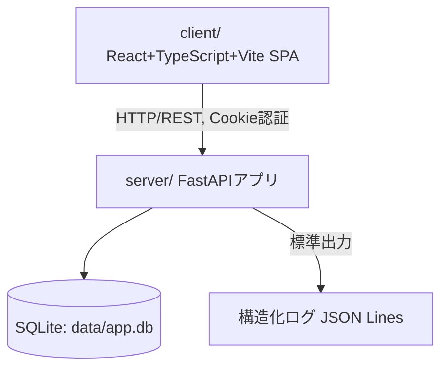

# ArchitectureHandbook.md

このドキュメントはP022フェーズで作成した。目的は、後続のAgent(Executor・Reviewer Loop・Refactor)が `docs/P001-requirement.md` 〜 `docs/P009-acceptance-direction.md` を毎回読み直さなくても、アプリケーションの技術的側面を短時間で把握できるようにすることである。詳細な仕様そのものはここに書かず、要約と原本への参照リンクにとどめる。矛盾が出た場合は原本(`docs/P00N-*.md`)を正とする。

## 1. アプリケーション概要

* アプリケーション名: 会議室予約システム(社内向け)
* 一言で言うと何のアプリか: 社内の会議室予約を一元管理し、空き状況の確認から予約・変更・取消までをオンラインで完結させるWebアプリケーション。
* 参照元: `docs/P001-requirement.md`

## 2. 全体構成図

* クライアント・サーバ型構成。外部サービス連携は無い(Googleカレンダー/Outlookカレンダー連携は本バージョン対象外)。
* TLS終端はアプリケーション外(リバースプロキシ/ロードバランサ側)を前提とする(`docs/P003-backend-spec.md` §7)。

## 3. 技術スタック

| レイヤ | 技術 | バージョン | 選定理由の参照先 |
| --- | --- | --- | --- |
| フロントエンド | React + TypeScript + Vite | React 18 | ADR-001 |
| バックエンド | Python + FastAPI | 要件定義上のバージョン指定なし、Python 3.12系を想定 | ADR-002 |
| データアクセス | 標準ライブラリ`sqlite3`(ORM不使用) | 言語処理系に同梱 | ADR-003 |
| データベース | SQLite | 言語処理系に同梱(サーバー別体プロセス無し) | (要件定義で直接指定、ADR無し) |
| パスワードハッシュ | bcrypt | PyPI最新版を想定 | ADR-004 |
| セッション管理 | SQLite永続化 + HttpOnly Cookie | - | ADR-005 |
| インフラ/デプロイ | 未確定(`docs/P302-deliver.md` で確定) | - | - |

## 4. ディレクトリ構成の方針

* コード格納先: クライアント・サーバ型のため `client/`(フロントエンド)・`server/`(バックエンド)。
* 各ソースツリー配下の `INDEX.md`(`client/INDEX.md`・`server/INDEX.md`)がそのツリーの目次を担う。本フェーズ(P020)実行時点では実装未着手のため、いずれも「(実装前)」のプレースホルダである。
* ビルドツール: フロントエンドはnpm、バックエンドはuv。
* `server/` 内の想定レイヤ構成(`docs/P003-backend-spec.md` §1): `app/api/routers/`(APIハンドラ)→ `app/services/`(業務ロジック)→ `app/repositories/`(データアクセス)→ SQLite。横断的に `app/api/deps.py`(認証ミドルウェア)、`app/schemas/`(Pydanticスキーマ)、`app/validation/`(純粋なバリデーション関数)、`migrations/`(マイグレーションSQL)。
* `client/` 内の想定構成(`docs/P007-impl-direction/U00N-*.md` 各タスク): `src/pages/`(画面)、`src/components/`(共通コンポーネント)、`src/api/`(APIクライアント)、`src/router.tsx`(ルーティング)。

## 5. データモデルの要点

* 主要テーブル: `users`・`rooms`・`reservations`・`reservation_participants`(UIから見えるデータモデル、詳細は `docs/P002-frontend-spec.md` §5)、`sessions`・`schema_migrations`(内部専用データモデル、詳細は `docs/P003-backend-spec.md` §3)。
* 状態を持つ範囲とスコープ: 業務データ(予約・会議室・ユーザー)はSQLiteに永続化。セッションもSQLiteに永続化しアプリケーションプロセス全体で共有する(ADR-005)。インメモリキャッシュ等の追加の状態は持たない。
* マイグレーション: 起動時に差分適用方式で実行、`schema_migrations` テーブルで適用済みバージョンを管理し冪等性を確保する(`docs/P003-backend-spec.md` §4)。

## 6. API/画面構成の要点

* 画面7つ(S01〜S07)、API17本。詳細は `docs/P001-requirement.md`(一覧)、`docs/P002-frontend-spec.md`(外部仕様)、`docs/P003-backend-spec.md`(内部仕様)を参照。
* P002/P003の役割分担で相互参照が必要な箇所: 認証方式(Cookie/セッションの外部契約はP002§1、内部実現はP003§2)。

## 7. 実装・テストの単位

* スプリント構成(詳細は `docs/P005-impl-plan.md`): U001(foundation-and-auth)→U002(reservation-core)→U003(reservation-management-and-rooms)→U004(user-administration)の4スプリント。インフラ専用スプリントは無い(`docs/P302-deliver.md` に委譲)。
* テストレベル(詳細は `docs/P006-test-plan.md`): 単体テスト(`docs/P007-impl-direction.md`)→スプリント内結合テスト(`docs/P008-test-direction.md`、9ケース)→スプリント横断・システム・受け入れテスト(`docs/P009-acceptance-direction.md`、9ケース)。
* 再起動耐性の確認は `docs/P009-acceptance-direction/A005-restart-resilience.md` が担当する(単体テスト・スプリント内結合テストでは検出できないため、`docs/P006-test-plan.md` §4で明示的にP009へ委譲)。

## 8. 横断的関心事

* 認証・認可: Cookieベースのセッション認証(ADR-005)。管理者専用操作は `require_admin` 依存で一律403 `FORBIDDEN`。未認証は一律401 `UNAUTHENTICATED`。詳細は `docs/P002-frontend-spec.md` §1・§6、`docs/P003-backend-spec.md` §2。
* エラーハンドリング: 全APIエラーを `{error_code, message, details?}` の共通形式で返す(`docs/P002-frontend-spec.md` §2・§9のエラーコード一覧)。
* ログ出力・監視: 標準出力へJSON Lines形式の構造化ログを出力する。実際のログ集約基盤(CloudWatch Logs等)への転送は `docs/P302-deliver.md` に委譲(`docs/P003-backend-spec.md` §7)。
* 設定値・環境変数: `DATABASE_PATH`(SQLiteファイルパス、既定値 `./data/app.db`)。他の環境変数は本バージョン時点では無い。

## 9. 既知の制約・技術的負債

* ★ACCEPTED★ 会議室を無効化(論理削除)しても既存の未来予約は自動キャンセルされず残る。検討: 自動キャンセル案も検討したが、無断キャンセルの業務影響が大きいため不採用。残存リスク: 無効化前に既存予約が無いことを確認する運用ルールが別途必要(`docs/P002-frontend-spec.md` §3 S06)。
* ★ACCEPTED★ セッションテーブルの期限切れ行を物理削除するバッチ処理は本バージョンに含まない。検討: 定期削除ジョブも検討したが、想定データ量(300名規模)では実害が出るまで許容できると判断。残存リスク: 長期運用でテーブルサイズが増加し続ける(`docs/P003-backend-spec.md` §2.1、ADR-005)。
* ★ACCEPTED★ データアクセスにORMを使わず素のSQLを直接記述する。検討: SQLAlchemy導入も検討したが、想定規模では素のSQLの見通しの良さを優先。残存リスク: テーブル数・クエリが将来大幅に増えた場合、保守コストが相対的に上がる(ADR-003)。
### 実行環境側の制約(アプリケーションの欠陥ではないもの)

* **本実行環境(Node.js v24.12.0 / Windows)では `fs.rmSync()` がネイティブクラッシュする。** 対象ファイルの存在有無にかかわらず、呼び出した時点でプロセスが `STATUS_STACK_BUFFER_OVERRUN`(終了コード `-1073740791` / `3221226505`)で停止する。
  * 最小再現: `import fs from "node:fs"; fs.rmSync("nonexistent-xyz.db", { force: true });` の2行のみでクラッシュする。`fs.unlinkSync()` を `try/catch`(`ENOENT` を無視)で用いる方式は正常に動作する。
  * **影響1**: E2Eテストのデータストア復元スクリプト(`client/scripts/reset-e2e-db.mjs`)は、この理由により `fs.rmSync` ではなく `fs.unlinkSync` + `try/catch` を用いている(同ファイルのコメント参照)。
  * **影響2**: `npm run build`(`vite build`)が、ソース内容によらず同じ終了コードでクラッシュする。`vite build` は出力先ディレクトリの掃除に `fs.rmSync(outDir, { recursive: true, force: true })` を用いるため、同じ不具合を踏んでいると考えられる。この事象は `V0.9_testbed` の時点では原因不明として記録されていたが、V1.0_testbedでの最小再現により説明がついた。
  * **回避策**: 本番ビルドの検証は、`npx tsc -b`(型検査)・`npx vitest run`(単体)・`npx playwright test`(E2E、開発サーバ経由)で代替する。Node.jsのバージョンを上げる/下げることで解消する可能性があるが、本バージョンでは検証していない。
  * **これはアプリケーションコードの欠陥ではなく、実行環境の問題である。** アプリケーション側を、この不具合に合わせて書き換えてはならない(`fs.rmSync` を使わないのはテスト補助スクリプトのみで足りる)。詳細な切り分け経緯は `docs/test-records/20260820-test-rerunnability-record.md` を参照。

* 将来的に見直しが必要な点(CR起票候補):
  * パスワード再発行(本人変更・管理者リセット)フローが未定義(`docs/P002-frontend-spec.md` §8)。
  * 過去日付での予約作成可否が要件定義に未記載で、暫定的に「許可」としている(`docs/P002-frontend-spec.md` §3 S03)。
  * Googleカレンダー/Outlookカレンダー連携(要件定義で明示的に本バージョン対象外、将来検討)。

## 10. 関連ドキュメントへのリンク

* `docs/P001-requirement.md` 〜 `docs/P009-acceptance-direction.md`
* `docs/ADR.md`
* `client/INDEX.md` / `server/INDEX.md` / `./INDEX.md`(`./INDEX.md` はP301で作成、本フェーズ時点では未作成)
